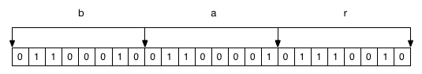
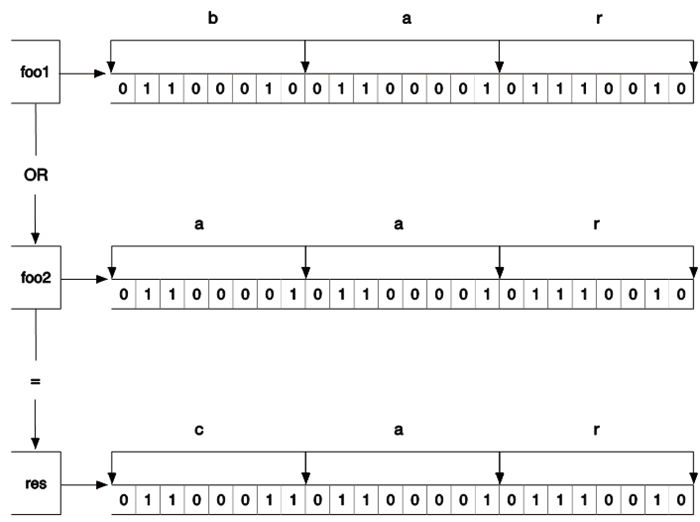

### 3.2.4　命令拾遗

#### 1．增加指定的整数

```shell
INCRBY key increment
```

`INCRBY` 命令与 `INCR` 命令基本一样，只不过前者可以通过 `increment` 参数指定一次增加的数值，如：

```shell
redis>INCRBY bar 2
(integer) 2
redis>INCRBY bar 3
(integer) 5
```

#### 2．减少指定的整数

```shell
DECR key
DECRBY key decrement
```

`DECR` 命令与 `INCR` 命令用法相同，只不过是让键值递减，例如：

```shell
redis>DECR bar
(integer) 4
```

而 `DECRBY` 命令的作用不用介绍想必读者就可以猜到， `DECRBY key 5` 相当于 `INCRBY key –5` 。

#### 3．增加指定浮点数

```shell
INCRBYFLOAT key increment
```

`INCRBYFLOAT` 命令类似 `INCRBY` 命令，差别是前者可以递增一个双精度浮点数，如：

```shell
redis>INCRBYFLOAT bar 2.7
"6.7"
redis>INCRBYFLOAT bar 5E+4
"50006.69999999999999929"
```

#### 4．向尾部追加值

```shell
APPEND key value
```

`APPEND` 作用是向键值的末尾追加 `value` 。如果键不存在则将该键的值设置为 `value` ，即相当于 `SET key value` 。返回值是追加后字符串的总长度。如：

```shell
redis>SET key hello
OK
redis>APPEND key " world!"
(integer) 12
```

此时 `key` 的值是 `"hello world!"` 。 `APPEND` 命令的第二个参数加了双引号，原因是该参数包含空格，在redis-cli中输入需要双引号以示区分。

#### 5．获取字符串长度

```shell
STRLEN key
```

`STRLEN` 命令返回键值的长度，如果键不存在则返回0。例如：

```shell
redis>STRLEN key
(integer) 12
redis>SET key 你好
OK
redis>STRLEN key
(integer) 6
```

前面提到了字符串类型可以存储二进制数据，所以它可以存储任何编码的字符串。例子中Redis接收到的是使用UTF-8编码的中文，由于“你”和“好”两个字的UTF-8编码的长度都是3，所以此例中会返回6。

#### 6．同时获得/设置多个键值

```shell
MGET key [key …]
MSET key value [key value …]
```

`MGET/MSET` 与 `GET/SET` 相似，不过 `MGET/MSET` 可以同时获得/设置多个键的键值。例如：

```shell
redis>MSET key1 v1 key2 v2 key3 v3
OK
redis>GET key2
"v2"
redis>MGET key1 key3
1) "v1"
2) "v3"
```

#### 7．位操作

```shell
GETBIT key offset
SETBIT key offset value
BITCOUNT key [start] [end]
BITOP operation destkey key [key …]
```

一个字节由8个二进制位组成，Redis提供了4个命令可以直接对二进制位进行操作。为了演示，我们首先将 `foo` 键赋值为 `bar` ：

```shell
redis>SET foo bar
OK
```

`bar` 的3个字母“b”“a”和“r”对应的ASCII码分别为98、97和114，转换成二进制后分别为1100010、1100001和1110010，所以 `foo` 键中的二进制位结构如图3-3所示。


<center class="my_markdown"><b class="my_markdown">图3-3　 `bar` 的二进制存储结构</b></center>

`GETBIT` 命令可以获得一个字符串类型键指定位置的二进制位的值（0或1），索引从0开始：

```shell
redis>GETBIT foo 0
(integer) 0
redis>GETBIT foo 6
(integer) 1
```

如果需要获取的二进制位的索引超出了键值的二进制位的实际长度则默认位值是0：

```shell
redis>GETBIT foo 100000
(integer) 0
```

`SETBIT` 命令可以设置字符串类型键指定位置的二进制位的值，返回值是该位置的旧值。如我们要将 `foo` 键值设置为 `aar` ，可以通过位操作将 `foo` 键的二进制位的索引第6位设为0，第7位设为1：

```shell
redis>SETBIT foo 6 0
(integer) 1
redis>SETBIT foo 7 1
(integer) 0
redis>GET foo
"aar"
```

如果要设置的位置超过了键值的二进制位的长度，SETBIT命令会自动将中间的二进制位设置为0，同理设置一个不存在的键的指定二进制位的值会自动将其前面的位赋值为0：

```shell
redis>SETBIT nofoo 10 1
(integer) 0
redis>GETBIT nofoo 5
(integer) 0
```

`BITCOUNT` 命令可以获得字符串类型键中值是1的二进制位个数，例如：

```shell
redis>BITCOUNT foo
(integer) 10
```

可以通过参数来限制统计的字节范围，如我们只希望统计前两个字节（即" `aa` "）：

```shell
redis>BITCOUNT foo 0 1
(integer) 6
```

`BITOP` 命令可以对多个字符串类型键进行位运算，并将结果存储在 `destkey` 参数指定的键中。 `BITOP` 命令支持的运算操作有 `AND` 、 `OR` 、 `XOR` 和 `NOT` 。如我们可以对 `bar` 和 `aar` 进行 `OR` 运算：

```shell
redis>SET foo1 bar
OK
redis>SET foo2 aar
OK
redis>BITOP OR res foo1 foo2
(integer) 3
redis> GET res
"car"
```

运算过程如图3-4所示。


<center class="my_markdown"><b class="my_markdown">图3-4　 `OR` 运算过程示意</b></center>

Redis 2.8.7引入了 `BITPOS` 命令，可以获得指定键的第一个位值是0或者1的位置。还是以“bar”这个键值为例，如果想获取键值中的第一个二进制位为1的偏移量，则可以执行：

```shell
redis>SET foo bar
OK
redis>BITPOS foo 1
(integer) 1
```

结合图3-3可以看出，正如 `BITPOS命令的` 结果所示，“bar”中的第一个值为1的二进制位的偏移量为1（同其他命令一样， `BITPO` S命令的索引也是从 `0` 开始算起）。那么有没有可能指定二进制位的查询范围呢？ `BITPOS` 命令的第二个和第三个参数分别可以用来指定要查询的起始字节（同样从0开始算起）和结束字节。注意这里的单位不再是二进制位，而是字节。如果我们想查询第二个字节到第三个字节之间（即“a”和“r”）出现的第一个值为1的二进制位的偏移量，则可以执行：

```shell
redis>BITPOS foo 1 1 2
(integer) 9
```

这里的返回结果的偏移量是从头开始算起的，与起始字节无关。另外要特别说明的一个有趣的现象是如果不设置结束字节且键值的所有二进制位都是1，则当要查询值为0的二进制位偏移量时，返回结果会是键值长度的下一个字位的偏移量。这是因为Redis会认为键值长度之后的二进制位都是0。

利用位操作命令可以非常紧凑地存储布尔值。比如如果网站的每个用户都有一个递增的整数ID，如果使用一个字符串类型键配合位操作来记录每个用户的性别（用户ID作为索引，二进制位值1和0表示男性和女性），那么记录100万个用户的性别只需占用100 KB多的空间，而且由于 `GETBIT` 和 `SETBIT` 的时间复杂度都是O(1)，所以读取二进制位值性能很高。

注意

> 使用SETBIT命令时，如果当前键的键值长度小于要设置的二进制位的偏移量时，Redis会自动分配内存并将键值的当前长度到指定的偏移量之间的二进制位都设置为0。如果要分配的内存过大，则很可能会造成服务器的暂时阻塞而无法接收同一时间的其他请求。举例而言，在一台2014年的MacBook Pro笔记本上，设置偏移量232-1的值（即分配500 MB的内存）需要耗费将近1秒的时间。分配过大的偏移量除了会造成服务器阻塞，还会造成空间浪费。还是举刚才存储网站用户性别的例子，如果这个网站的用户ID是从100000001开始的，那么会造成10多MB的浪费，正确的做法是给每个用户的ID减去100000000再进行存储。

