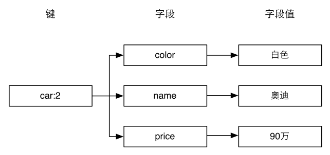

### 3.3.1　介绍

我们现在已经知道Redis是采用字典结构以键值对的形式存储数据的，而散列类型（hash）的键值也是一种字典结构，其存储了字段（field）和字段值的映射，但字段值只能是字符串，不支持其他数据类型，换句话说，散列类型不能嵌套其他的数据类型。一个散列类型键可以包含至多232−1个字段。

提示

> 除了散列类型，Redis 的其他数据类型同样不支持数据类型嵌套。比如集合类型的每个元素都只能是字符串，不能是另一个集合或散列表等。

散列类型适合存储对象：使用对象类别和ID构成键名，使用字段表示对象的属性，而字段值则存储属性值。例如要存储ID为2的汽车对象，可以分别使用名为 `color` 、 `name` 和 `price` 的3个字段来存储该辆汽车的颜色、名称和价格。存储结构如图3-5所示。

<b class="my_markdown">图3-5　使用散列类型存储汽车对象的结构图</b>

回想在关系数据库中如果要存储汽车对象，存储结构如表3-2所示。

<b class="my_markdown">表3-2　关系数据库存储汽车资料的表结构</b>

| ID | color | name | price |
| :-----  | :-----  | :-----  | :-----  | :-----  | :-----  |
| 1 | 黑色 | 宝马 | 100万 |
| 2 | 白色 | 奥迪 | 90万 |
| 3 | 蓝色 | 宾利 | 600万 |

数据是以二维表的形式存储的，这就要求所有的记录都拥有同样的属性，无法单独为某条记录增减属性。如果想为ID为1的汽车增加生产日期属性，就需要把数据表更改为如表3-3所示的结构。

<b class="my_markdown">表3-3　为其中一辆汽车增加一个“属性”</b>

| ID | color | name | price | date |
| :-----  | :-----  | :-----  | :-----  | :-----  | :-----  | :-----  |
| 1 | 黑色 | 宝马 | 100万 | 2012年12月21日 |
| 2 | 白色 | 奥迪 | 90万 |
| 3 | 蓝色 | 宾利 | 600万 |

对于ID为2和3的两条记录而言 `date` 字段是冗余的。可想而知当不同的记录需要不同的属性时，表的字段数量会越来越多以至于难以维护。而且当使用ORM8将关系数据库中的对象实体映射成程序中的实体时，修改表的结构往往意味着要中断服务（重启网站程序）。为了防止这些问题，在关系数据库中存储这种半结构化数据还需要额外的表才行。

8即Object-Relational Mapping（对象关系映射）。

而Redis的散列类型则不存在这个问题。虽然我们在图3-5中描述了汽车对象的存储结构，但是这个结构只是人为的约定，Redis并不要求每个键都依据此结构存储，我们完全可以自由地为任何键增减字段而不影响其他键。

