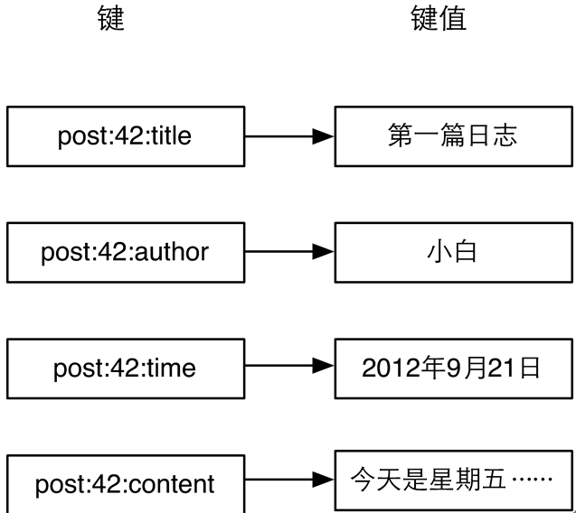
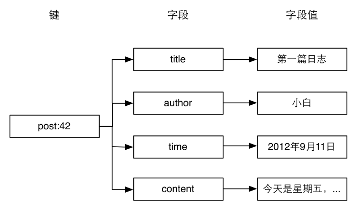

### 3.3.3　实践

#### 1．存储文章数据

3.2.3节介绍了可以将文章对象序列化后使用一个字符串类型键存储，可是这种方法无法提供对单个字段的原子读写操作支持，从而产生竞态条件，如两个客户端同时获得并反序列化某个文章的数据，然后分别修改不同的属性后存入，显然后存入的数据会覆盖之前的数据，最后只会有一个属性被修改。另外如小白所说，即使只需要文章标题，程序也不得不将包括文章内容在内的所有文章数据取出并反序列化，比较消耗资源。

除此之外，还有一种方法是组合使用多个字符串类型键来存储一篇文章的数据，如图3-6所示。


图3-6 使用多个字符串类型键存储一个对象

使用这种方法的好处在于无论获取还是修改文章数据，都可以只对某一属性进行操作，十分方便。而本章介绍的散列类型则更适合此场景，使用散列类型的存储结构如图3-7所示。

从图3-7可以看出使用散列类型存储文章数据比图3-6所示的方法看起来更加直观，也更容易维护（比如可以使用 `HGETALL` 命令获得一个对象的所有字段，删除一个对象时只需要删除一个键），另外存储同样的数据散列类型往往比字符串类型更加节约空间，具体的细节会在4.6节中介绍。

#### 2．存储文章缩略名

使用过WordPress的读者可能会知道发布文章时一般需要指定一个缩略名（slug）来构成该篇文章的网址的一部分，缩略名必须符合网址规范且最好可以与文章标题含义相似，如“This Is A Great Post!”的缩略名可以为“this-is-a-great-post”。每个文章的缩略名必须是唯一的，所以在发布文章时程序需要验证用户输入的缩略名是否存在，同时也需要通过缩略名获得文章的ID。


<center class="my_markdown"><b class="my_markdown">图3-7　使用一个散列类型键存储一个对象</b></center>

我们可以使用一个散列类型的键 `slug.to.id` 来存储文章缩略名和ID之间的映射关系。其中字段用来记录缩略名，字段值用来记录缩略名对应的ID。这样就可以使用 `HEXISTS` 命令来判断缩略名是否存在，使用 `HGET` 命令来获得缩略名对应的文章ID了。

现在发布文章可以修改成如下代码：

```shell
$postID =INCR posts:count
# 判断用户输入的slug是否可用，如果可用则记录
$isSlugAvailable =HSETNX slug.to.id, $slug, $postID
if $isSlugAvailable is 0
　　# slug已经用过了，需要提示用户更换slug,
　　# 这里为了演示方便直接退出。
　　exit
HMSET post:$postID, title, $title, content, $content, slug, $slug,...
```

这段代码使用了 `HSETNX` 命令原子地实现了 `HEXISTS` 和 `HSET` 两个命令以避免竞态条件。当用户访问文章时，我们从网址中得到文章的缩略名，并查询 `slug.to.id` 键来获取文章ID：

```shell
$postID =HGET slug.to.id, $slug
if not $postID
　　print 文章不存在
　　exit
$post =HGETALL post:$postID
print 文章标题：$post.title
```

需要注意的是如果要修改文章的缩略名一定不能忘了修改 `slug.to.id` 键对应的字段。如要修改ID为42的文章的缩略名为 `newSlug` 变量的值：

```shell
# 判断新的slug是否可用，如果可用则记录
$isSlugAvailable =HSETNX slug.to.id, $newSlug, 42
if $isSlugAvailable is 0
　　exit
# 获得旧的缩略名
$oldSlug =HGET post:42, slug
# 设置新的缩略名
HSET post:42, slug, $newSlug
# 删除旧的缩略名
HDEL slug.to.id, $oldSlug
```

