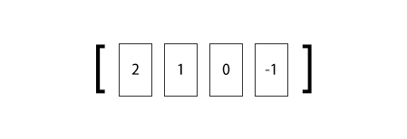
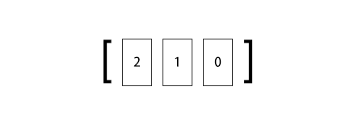

### 3.4.2　命令

#### 1．向列表两端增加元素

```shell
LPUSH key value [value …]
RPUSH key value [value …]
```

`LPUSH` 命令用来向列表左边增加元素，返回值表示增加元素后列表的长度。

```shell
redis>LPUSH numbers 1
(integer) 1
```

这时 `numbers` 键中的数据如图3-8所示。 `LPUSH` 命令还支持同时增加多个元素，例如：

```shell
redis>LPUSH numbers 2 3
(integer) 3
```

`LPUSH` 会先向列表左边加入 `"2"` ，然后再加入 `"3"` ，所以此时 `numbers` 键中的数据如图3-9所示。


图3-8　加入元素1后 `numbers` 键中的数据


图3-9　加入元素2，3后 `numbers` 键中的数据

向列表右边增加元素的话则使用 `RPUSH` 命令，其用法和 `LPUSH` 命令一样：

```shell
redis>RPUSH numbers 0 −1
(integer) 5
```

此时numbers键中的数据如图3-10所示。


<center class="my_markdown"><b class="my_markdown">图3-10　使用 `RPUSH` 命令加入元素0，-1后 `numbers` 键中的数据</b></center>

#### 2．从列表两端弹出元素

```shell
LPOP key
RPOP key
```

有进有出， `LPOP` 命令可以从列表左边弹出一个元素。 `LPOP` 命令执行两步操作：第一步是将列表左边的元素从列表中移除，第二步是返回被移除的元素值。例如，从numbers列表左边弹出一个元素（也就是 `"3"` ）：

```shell
redis>LPOP numbers
"3"
```

此时 `numbers` 键中的数据如图3-11所示。

同样， `RPOP命令` 可以从列表右边弹出一个元素：

```shell
redis>RPOP numbers
"-1"
```

此时 `numbers` 键中的数据如图3-12所示。

结合上面提到的4个命令可以使用列表类型来模拟栈和队列的操作：如果想把列表当作栈，则搭配使用 `LPUSH` 和 `LPOP` 或 `RPUSH` 和 `RPOP` ，如果想当成队列，则搭配使用 `LPUSH` 和 `RPOP` 或 `RPUSH` 和 `LPOP` 。


图3-11　从左侧弹出元素后numbers键中的数据


图3-12　从右侧弹出元素后numbers键中的数据

#### 3．获取列表中元素的个数

```shell
LLEN key
```

当键不存在时 `LLEN` 会返回0：

```shell
redis>LLEN numbers
(integer) 3
```

`LLEN` 命令的功能类似SQL语句 `SELECT COUNT(*) FROM table_name` ，但是 `LLEN` 的时间复杂度为O(1)，使用时Redis会直接读取现成的值，而不需要像部分关系数据库（如使用InnoDB存储引擎的MySQL表）那样需要遍历一遍数据表来统计条目数量。

#### 4．获得列表片段

```shell
LRANGE key start stop
```

`LRANGE` 命令是列表类型最常用的命令之一，它能够获得列表中的某一片段。 `LRANGE` 命令将返回索引从 `start` 到 `stop` 之间的所有元素（包含两端的元素）。与大多数人的直觉相同，Redis的列表起始索引为0：

```shell
redis>LRANGE numbers 0 2
1) "2"
2) "1"
3) "0"
```

`LRANGE` 命令在取得列表片段的同时不会像 `LPOP` 一样删除该片段，另外 `LRANGE` 命令与很多语言中用来截取数组片段的方法 `slice` 有一点区别是 `LRANGE` 返回的值包含最右边的元素，如在JavaScript中：

```shell
var numbers = [2, 1, 0];
console.log(numbers.slice(0, 2));　// 返回数组：[2, 1]
```

`LRANGE` 命令也支持负索引，表示从右边开始计算序数，如 `"−1"` 表示最右边第一个元素， `"-2"` 表示最右边第二个元素，依次类推：

```shell
redis>LRANGE numbers -2 -1
1) "1"
2) "0"
```

显然， `LRANGE numbers 0 -1` 可以获取列表中的所有元素。另外一些特殊情况如下。

1．如果 `start` 的索引位置比 `stop` 的索引位置靠后，则会返回空列表。

2．如果 `stop` 大于实际的索引范围，则会返回到列表最右边的元素：

```shell
redis>LRANGE numbers 1 999
1) "1"
2) "0"
```

#### 5．删除列表中指定的值

```shell
LREM key count value
```

`LREM` 命令会删除列表中前 `count` 个值为 `value` 的元素，返回值是实际删除的元素个数。根据 `count` 值的不同， `LREM` 命令的执行方式会略有差异。

（1）当 `count > 0` 时 `LREM` 命令会从列表左边开始删除前 `count` 个值为 `value` 的元素。

（2）当 `count < 0` 时 `LREM` 命令会从列表右边开始删除前 `|count|` 个值为 `value` 的元素。

（3）当 `count = 0` 是 `LREM` 命令会删除所有值为 `value` 的元素。例如：

```shell
redis>RPUSH numbers 2
(integer) 4
redis>LRANGE numbers 0 -1
1) "2"
2) "1"
3) "0"
4) "2"
# 从右边开始删除第一个值为"2"的元素
redis>LREM numbers -1 2
(integer) 1
redis>LRANGE numbers 0 -1
1) "2"
2) "1"
3) "0"
```

