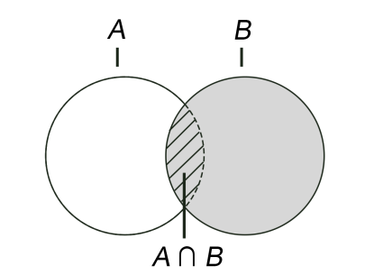
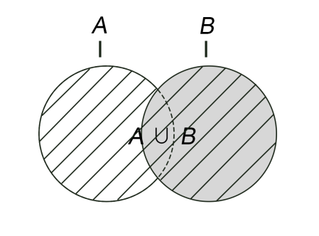

### 3.5.2　命令

#### 1．增加/删除元素

```shell
SADD key member [member …]
SREM key member [member …]
```

`SADD` 命令用来向集合中增加一个或多个元素，如果键不存在则会自动创建。因为在一个集合中不能有相同的元素，所以如果要加入的元素已经存在于集合中就会忽略这个元素。本命令的返回值是成功加入的元素数量（忽略的元素不计算在内）。例如：

```shell
redis>SADD letters a　 
(integer) 1
redis>SADD letters a b c
(integer) 2
```

第二条 `SADD` 命令的返回值为2是因为元素“a”已经存在，所以实际上只加入了两个元素。

`SREM` 命令用来从集合中删除一个或多个元素，并返回删除成功的个数，例如：

```shell
redis>SREM letters c d
(integer) 1
```

由于元素“d”在集合中不存在，所以只删除了一个元素，返回值为1。

#### 2．获得集合中的所有元素

```shell
SMEMBERS key
```

`SMEMBERS` 命令会返回集合中的所有元素，例如：

```shell
redis>SMEMBERS letters
1) "b"
2) "a"
```

#### 3．判断元素是否在集合中

```shell
SISMEMBER key member
```

判断一个元素是否在集合中是一个时间复杂度为O(1)的操作，无论集合中有多少个元素， `SISMEMBER` 命令始终可以极快地返回结果。当值存在时 `SISMEMBER` 命令返回1，当值不存在或键不存在时返回0，例如：

```shell
redis>SISMEMBER letters a
(integer) 1
redis>SISMEMBER letters d
(integer) 0
```

#### 4．集合间运算

```shell
SDIFF key [key …]
SINTER key [key …]
SUNION key [key …]
```

接下来要介绍的3个命令都是用来进行多个集合间运算的。

（1） `SDIFF` 命令用来对多个集合执行差集运算。集合A与集合B的差集表示为A−B，代表所有属于A且不属于B的元素构成的集合（如图3-13所示），即A−B = {x | x∈A且x∈B}。例如：

```shell
{1, 2, 3} - {2, 3, 4} = {1}
{2, 3, 4} - {1, 2, 3} = {4}
```

`SDIFF` 命令的使用方法如下：

```shell
redis>SADD setA 1 2 3
(integer) 3
redis>SADD setB 2 3 4
(integer) 3
redis> SDIFF setA setB
1) "1"
redis>SDIFF setB setA
1) "4"
```

`SDIFF` 命令支持同时传入多个键，例如：

```shell
redis>SADD setC 2 3
(integer) 2
redis>SDIFF setA setB setC
1) "1"
```

计算顺序是先计算 `setA - setB` ，再计算结果与 `setC` 的差集。

（2） `SINTER` 命令用来对多个集合执行交集运算。集合A与集合B的交集表示为A ∩ B，代表所有属于A且属于B的元素构成的集合（如图3-14所示），即A ∩ B = {x | x ∈ A且x ∈B}。例如：

```shell
{1, 2, 3} ∩ {2, 3, 4} = {2, 3}
```

`SINTER` 命令的使用方法如下：

```shell
redis>SINTER setA setB
1) "2"
2) "3"
```

`SINTER` 命令同样支持同时传入多个键，如：

```shell
redis>SINTER setA setB setC
1) "2"
2) "3"
```

（3） `SUNION` 命令用来对多个集合执行并集运算。集合A与集合B的并集表示为A∪B，代表所有属于A或属于B的元素构成的集合（如图3-15所示）即A∪B = {x | x∈A或x ∈B}。例如：

```shell
{1, 2, 3} ∪ {2, 3, 4} = {1, 2, 3, 4}
```


图3-14　图中斜线部分表示A ∩ B


图3-15　图中斜线部分表示A ∪ B

`SUNION` 命令的使用方法如下：

```shell
redis>SUNION setA setB
1) "1"
2) "2"
3) "3"
4) "4"
```

`SUNION` 命令同样支持同时传入多个键，例如：

```shell
redis>SUNION setA setB setC
1) "1"
2) "2"
3) "3"
4) "4"
```

