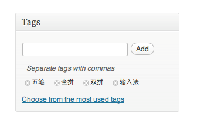
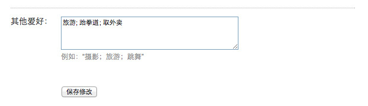
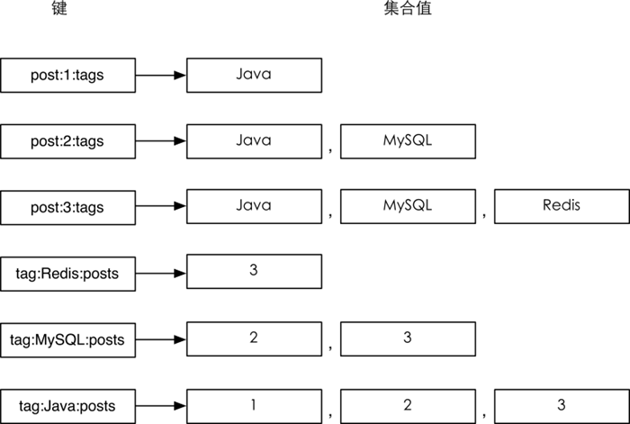

### 3.5.3　实践

#### 1．存储文章标签

考虑到一个文章的所有标签都是互不相同的，而且展示时对这些标签的排列顺序并没有要求，我们可以使用集合类型键存储文章标签。

对每篇文章使用键名为 `post:文章ID:tags` 的键存储该篇文章的标签。具体操作如伪代码：

```shell
# 给ID为42的文章增加标签：
SADD post:42:tags, 闲言碎语, 技术文章, Java
# 删除标签：
SREM post:42:tags, 闲言碎语
# 显示所有的标签:
$tags =SMEMBERS post:42:tags
print $tags
```

使用集合类型键存储标签适合需要单独增加或删除标签的场合。如在WordPress博客程序中无论是添加还是删除标签都是针对单个标签的（如图3-16所示），可以直观地使用 `SADD` 和 `SREM` 命令完成操作。

另一方面，有些地方需要用户直接设置所有标签后一起上传修改，图3-17所示是某网站的个人资料编辑页面，用户编辑自己的爱好后提交，程序直接覆盖原来的标签数据，整个过程没有针对单个标签的操作，并未利用到集合类型的优势，所以此时也可以直接使用字符串类型键存储标签数据。


图3-16　在WordPress中设置文章标签


图3-17　在百度中设置个人爱好

之所以特意提到这个在实践中的差别是想说明对于Redis存储方式的选择并没有绝对的规则，比如3.4节介绍过使用列表类型存储访客评论，但是在一些特定的场合下散列类型甚至字符串类型可能更适合。

#### 2．通过标签搜索文章

有时我们还需要列出某个标签下的所有文章，甚至需要获得同时属于某几个标签的文章列表，这种需求在传统关系数据库中实现起来比较复杂，下面举一个例子。

现有3张表，即 `posts` 、 `tags` 和 `posts_tags` ，分别存储文章数据、标签、文章与标签的对应关系。结构分别如表3-5、表3-6、表3-7所示。

<center class="my_markdown"><b class="my_markdown">表3-5　 `posts` 表结构</b></center>

| 字　段　名 | 说　　明 |
| :-----  | :-----  | :-----  | :-----  |
| `post_id` | 文章ID |
| `post_title` | 文章标题 |

<center class="my_markdown"><b class="my_markdown">表3-6　 `tags` 表结构</b></center>

| 字　段　名 | 说　　明 |
| :-----  | :-----  | :-----  | :-----  |
| `tag_id` | 标签ID |
| `tag_name` | 标签名称 |

<center class="my_markdown"><b class="my_markdown">表3-7　 `posts_tags` 表结构</b></center>

| 字　段　名 | 说　　明 |
| :-----  | :-----  | :-----  | :-----  |
| `post_id` | 对应的文章ID |
| `tag_id` | 对应的标签ID |

为了找到同时属于“Java”、“MySQL”和“Redis”这3个标签的文章，需要使用如下的SQL语句：

```shell
SELECT p.post_title
FROM posts_tags pt,
　　 posts p,
　　 tags t
WHERE pt.tag_id = t.tag_id
　AND (t.tag_name IN ('Java', 'MySQL', 'Redis'))
　AND p.post_id = pt.post_id
GROUP BY p.post_id HAVING COUNT(p.post_id)=3;
```

可以很明显看到这样的 SQL 语句不仅效率相对较低，而且不易阅读和维护。而使用Redis可以很简单直接地实现这一需求。

具体做法是为每个标签使用一个名为 `tag:标签名称:posts` 的集合类型键存储标有该标签的文章ID列表。假设现在有3篇文章，ID分别为1、2、3，其中ID为1的文章标签是“Java”，ID为2的文章标签是“Java”、“MySQL”，ID为3的文章标签是“Java”、　“MySQL”和“Redis”，则有关标签部分的存储结构如图3-18所示12。

12集合类型键中元素是无序的，图3-18中为了便于读者阅读将元素按照大小顺序进行了排列。


<center class="my_markdown"><b class="my_markdown">图3-18　和标签有关部分的存储结构</b></center>

最简单的，当需要获取标记“MySQL”标签的文章时只需要使用命令  `SMEMBERS tag:MySQL:posts` 即可。如果要实现找到同时属于Java、MySQL和Redis 3个标签的文章，只需要将 `tag:Java:posts` 、 `tag:MySQL:posts` 和 `tag:Redis:posts` 这3个键取交集，借助 `SINTER` 命令即可轻松完成。

