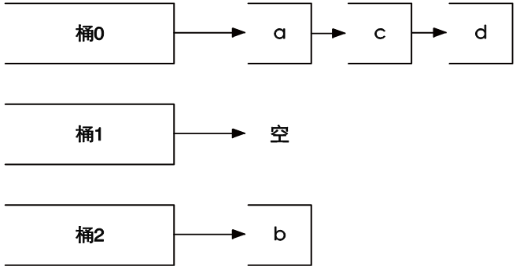

### 3.5.4　命令拾遗

#### 1．获得集合中元素个数

```shell
SCARD key
```

`SCARD` 命令用来获得集合中的元素个数，例如：

```shell
redis>SMEMBERS letters
1) "b"
2) "a"
redis>SCARD letters
(integer) 2
```

#### 2．进行集合运算并将结果存储

```shell
SDIFFSTORE destination key [key …]
SINTERSTORE destination key [key …]
SUNIONSTORE destination key [key …]
```

`SDIFFSTORE` 命令和 `SDIFF` 命令功能一样，唯一的区别就是前者不会直接返回运算结果，而是将结果存储在 `destination` 键中。

`SDIFFSTORE` 命令常用于需要进行多步集合运算的场景中，如需要先计算差集再将结果和其他键计算交集。

`SINTERSTORE` 和 `SUNIONSTORE` 命令与之类似，不再赘述。

#### 3．随机获得集合中的元素

```shell
SRANDMEMBER key [count]
```

`SRANDMEMBER` 命令用来随机从集合中获取一个元素，如：

```shell
redis>SRANDMEMBER letters
"a"
redis>SRANDMEMBER letters
"b"
redis>SRANDMEMBER letters
"a"
```

还可以传递 `count` 参数来一次随机获得多个元素，根据 `count` 的正负不同，具体表现也不同。

（1）当 `count` 为正数时， `SRANDMEMBER` 会随机从集合里获得 `count` 个不重复的元素。如果 `count` 的值大于集合中的元素个数，则 `SRANDMEMBER` 会返回集合中的全部元素。

（2）当 `count` 为负数时， `SRANDMEMBER` 会随机从集合里获得 `|count|` 个的元素，这些元素有可能相同。

为了示例，我们先在 `letters` 集合中加入两个元素：

```shell
redis>SADD letters c d
(integer) 2
```

目前 letters 集合中共有“a”、“b”、“c”、“d”4个元素，下面使用不同的参数对 `SRANDMEMBER` 命令进行测试：

```shell
redis>SRANDMEMBER letters 2
1) "a"
2) "c"
redis>SRANDMEMBER letters 2
1) "a"
2) "b"
redis>SRANDMEMBER letters 100
1) "b"
2) "a"
3) "c"
4) "d"
redis>SRANDMEMBER letters -2
1) "b"
2) "b"
redis>SRANDMEMBER letters -10
1) "b"
2) "b"
3) "c"
4) "c"
5) "b"
6) "a"
7) "b"
8) "d"
9) "b"
10) "b"
```

细心的读者可能会发现 `SRANDMEMBER` 命令返回的数据似乎并不是非常的随机，从 `SRANDMEMBER letters -10` 这个结果中可以很明显地看出这个问题（b元素出现的次数相对较多13），出现这种情况是由集合类型采用的存储结构（散列表）造成的。散列表使用散列函数将元素映射到不同的存储位置（桶）上以实现O(1)时间复杂度的元素查找，举个例子，当使用散列表存储元素b时，使用散列函数计算出b的散列值是0，所以将b存入编号为0的桶（bucket）中，下次要查找b时就可以用同样的散列函数再次计算b的散列值并直接到相应的桶中找到b。当两个不同的元素的散列值相同时会出现冲突，Redis使用拉链法来解决冲突，即将散列值冲突的元素以链表的形式存入同一桶中，查找元素时先找到元素对应的桶，然后再从桶中的链表中找到对应的元素。使用 `SRANDMEMBER` 命令从集合中获得一个随机元素时，Redis首先会从所有桶中随机选择一个桶，然后再从桶中的所有元素中随机选择一个元素，所以元素所在的桶中的元素数量越少，其被随机选中的可能性就越大，如图3-19所示。

13如果你亲自跟着输入了命令可能会发现得到的结果与书中的结果并不相同，这是正常现象，见后文描述。


图3-19　Redis会先从3个桶中随机挑一个非空的桶，然后再从桶中随机选择

一个元素，所以选中元素b的概率会大一些

#### 4．从集合中弹出一个元素

```shell
SPOP key
```

3.4节中我们学习过 `LPOP` 命令，作用是从列表左边弹出一个元素（即返回元素的值并删除它）。 `SPOP` 命令的作用与之类似，但由于集合类型的元素是无序的，所以 `SPOP` 命令会从集合中随机选择一个元素弹出。例如：

```shell
redis>SPOP letters
"b"
redis> SMEMBERS letters
1) "a"
2) "c"
3) "d"
```

