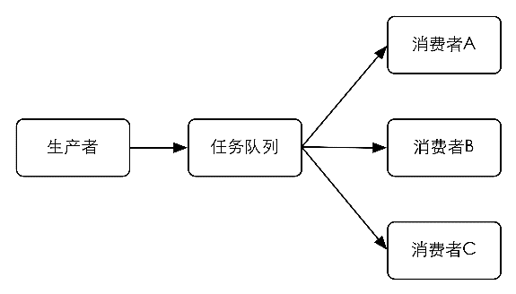

### 4.4.1　任务队列

小白的问题在网站开发中十分常见，当页面需要进行如发送邮件、复杂数据运算等耗时较长的操作时会阻塞页面的渲染。为了避免用户等待太久，应该使用独立的线程来完成这类操作。不过一些编程语言或框架不易实现多线程，这时很容易就会想到通过其他进程来实现。就小白的例子来说，设想有一个进程能够完成发邮件的功能，那么在页面中只需要想办法通知这个进程向指定的地址发送邮件就可以了。

通知的过程可以借助任务队列来实现。任务队列顾名思义，就是“传递任务的队列”。与任务队列进行交互的实体有两类，一类是生产者（producer），另一类是消费者（consumer）。生产者会将需要处理的任务放入任务队列中，而消费者则不断地从任务队列中读入任务信息并执行。

对于发邮件这个操作来说页面程序就是生产者，而发邮件的进程就是消费者。当需要发送邮件时，页面程序会将收件地址、邮件主题和邮件正文组装成一个任务后存入任务队列中。同时发邮件的进程会不断检查任务队列，一旦发现有新的任务便会将其从队列中取出并执行。由此实现了进程间的通信。

使用任务队列有如下好处。

#### 1．松耦合

生产者和消费者无须知道彼此的实现细节，只需要约定好任务的描述格式。这使得生产者和消费者可以由不同的团队使用不同的编程语言编写。

#### 2．易于扩展

消费者可以有多个，而且可以分布在不同的服务器中，如图4-1所示。借此可以轻易地降低单台服务器的负载。

<b class="my_markdown">图4-1 可以有多个消费者分配任务队列中的任务</b>

