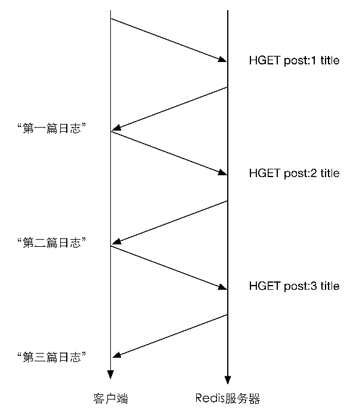
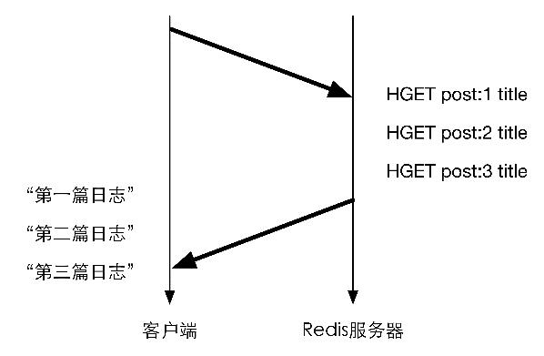

### 4.5　管道

客户端和Redis使用TCP协议连接。不论是客户端向Redis发送命令还是Redis向客户端返回命令的执行结果，都需要经过网络传输，这两个部分的总耗时称为往返时延。根据网络性能不同，往返时延也不同，大致来说到本地回环地址（loop back address）的往返时延在数量级上相当于Redis处理一条简单命令（如 `LPUSH list 1 2 3` ）的时间。如果执行较多的命令，每个命令的往返时延累加起来对性能还是有一定影响的。

在执行多个命令时每条命令都需要等待上一条命令执行完（即收到Redis的返回结果）才能执行，即使命令不需要上一条命令的执行结果。如要获得 `post:1 、 post:2` 和 `post:3` 这3个键中的 `title` 字段，需要执行3条命令，示意图如图4-2所示。

Redis 的底层通信协议对管道（pipelining）提供了支持。通过管道可以一次性发送多条命令并在执行完后一次性将结果返回，当一组命令中每条命令都不依赖于之前命令的执行结果时就可以将这组命令一起通过管道发出。管道通过减少客户端与Redis的通信次数来实现降低往返时延累计值的目的，如图4-3所示。

第5章会结合不同的编程语言介绍如何在开发的时候使用管道技术。

<b class="my_markdown">图4-2 不使用管道时的命令执行示意图（纵向表示时间）</b>

<b class="my_markdown">图4-3 使用管道时的命令执行示意</b>

