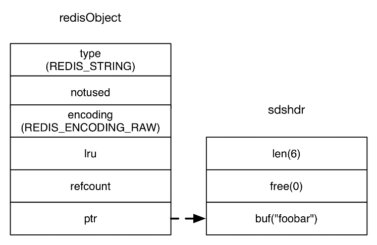
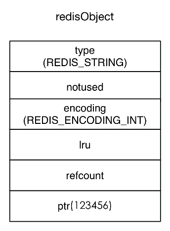
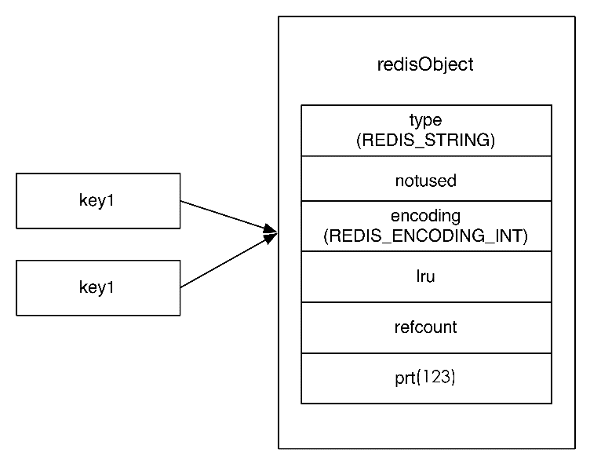
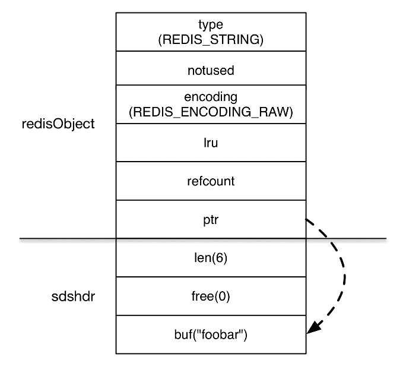
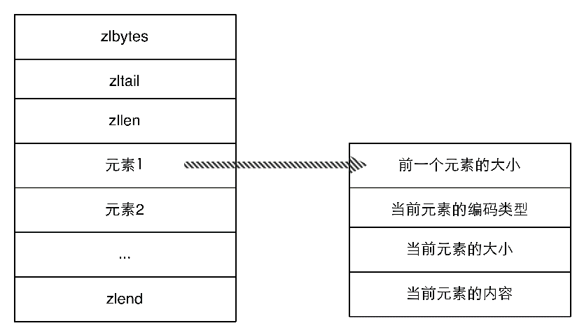
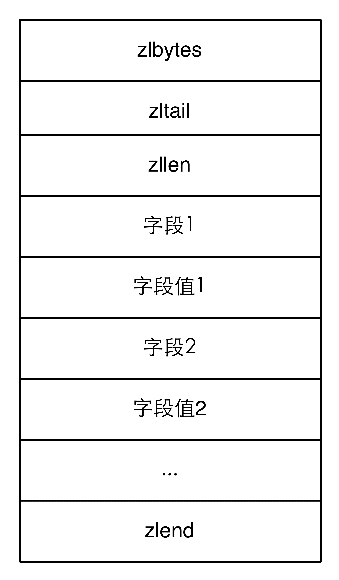
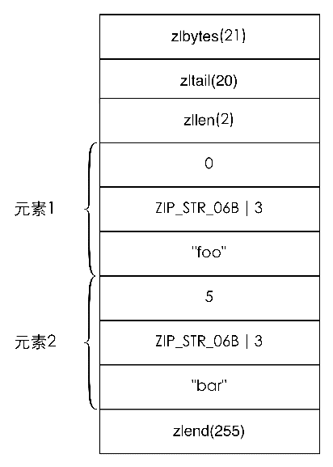

### 4.6.2　内部编码优化

> Redis支持多数据库，每个数据库中的数据都是通过结构体 `redisDb` 存储的。 `redisDb` 的定义如下：
> `dict` 类型就是散列表结构， `expires` 存储的是数据的过期时间。当Redis启动时会根据配置文件中 `databases` 参数指定的数量创建若干个 `redisDb` 类型变量存储不同数据库中的数据。

有时候仅凭精简键名和键值所减少的空间并不足以满足需求，这时就需要根据Redis内部编码规则来节省更多的空间。Redis为每种数据类型都提供了两种内部编码方式，以散列类型为例，散列类型是通过散列表实现的，这样就可以实现O(1)时间复杂度的查找、赋值操作，然而当键中元素很少的时候，O(1)的操作并不会比O(*n*)有明显的性能提高，所以这种情况下Redis会采用一种更为紧凑但性能稍差（获取元素的时间复杂度为O(*n*)）的内部编码方式。内部编码方式的选择对于开发者来说是透明的，Redis会根据实际情况自动调整。当键中元素变多时Redis会自动将该键的内部编码方式转换成散列表。如果想查看一个键的内部编码方式可以使用  `OBJECT ENCODING` 命令，例如：

```shell
typedef struct redisDb {
　　dict *dict;　　　　　　　　  /* The keyspace for this DB */
　　dict *expires;　　　　　　  /* Timeout of keys with a timeout set */
　　dict *blocking_keys;　　   /* Keys with clients waiting for data (BLPOP) */
　　dict *ready_keys;　　　　  /* Blocked keys that received a PUSH */
　　dict *watched_keys;　　　　/* WATCHED keys for MULTI/EXEC CAS */
　　int id;
} redisDb;

```

```shell
redis> SET foo bar OK
redis> OBJECT ENCODING foo "raw"

```

Redis的每个键值都是使用一个 `redisObject` 结构体保存的， `redisObject` 的定义如下：

```shell
typedef struct redisObject {
　　 unsigned type:4;
　　 unsigned notused:2;　　 /* Not used */
　　 unsigned encoding:4;
　　 unsigned lru:22;　　　　/* lru time (relative to server.lruclock) */
　　 int refcount;
　　 void *ptr;
} robj;

```

其中 `type` 字段表示的是键值的数据类型，取值可以是如下内容：

```shell
#define REDIS_STRING 0
#define REDIS_LIST 1
#define REDIS_SET 2
#define REDIS_ZSET 3
#define REDIS_HASH 4

```

`encoding` 字段表示的就是Redis键值的内部编码方式，取值可以是：

```shell
#define REDIS_ENCODING_RAW 0　　 /* Raw representation */
#define REDIS_ENCODING_INT 1　　 /* Encoded as integer */
#define REDIS_ENCODING_HT 2　　  /* Encoded as hash table */
#define REDIS_ENCODING_ZIPMAP 3  /* Encoded as zipmap */
#define REDIS_ENCODING_LINKEDLIST 4 /* Encoded as regular linked list */
#define REDIS_ENCODING_ZIPLIST 5 /* Encoded as ziplist */
#define REDIS_ENCODING_INTSET 6  /* Encoded as intset */
#define REDIS_ENCODING_SKIPLIST 7  /* Encoded as skiplist */
#define REDIS_ENCODING_EMBSTR 8  /* Embedded sds string encoding */

```

各个数据类型可能采用的内部编码方式以及相应的 `OBJECT ENCODING` 命令执行结果如表4-2所示。

<center class="my_markdown"><b class="my_markdown">表4-2 每个数据类型都可能采用两种内部编码方式之一来存储</b></center>

| 数 据 类 型 | 内部编码方式 | OBJECT ENCODING命令结果 |
| :-----  | :-----  | :-----  | :-----  | :-----  |
| 字符串类型 | `REDIS_ENCODING_RAW` | `"raw"` |
| `REDIS_ENCODING_INT` | `"int"` |
| `REDIS_ENCODING_EMBSTR` | `"embstr"` |
| 散列类型 | `REDIS_ENCODING_HT` | `"hashtable"` |
| `REDIS_ENCODING_ZIPLIST` | `"ziplist"` |
| 列表类型 | `REDIS_ENCODING_LINKEDLIST` | `"linkedlist"` |
| `REDIS_ENCODING_ZIPLIST` | `"ziplist"` |
| 集合类型 | `REDIS_ENCODING_HT` | `"hashtable"` |
| `REDIS_ENCODING_INTSET` | `"intset"` |
| 有序集合类型 | `REDIS_ENCODING_SKIPLIST` | `"skiplist"` |
| `REDIS_ENCODING_ZIPLIST` | `"ziplist"` |

下面针对每种数据类型分别介绍其内部编码规则及优化方式。

#### 1．字符串类型

Redis使用一个 `sdshdr` 类型的变量来存储字符串，而 `redisObject` 的 `ptr` 字段指向的是该变量的地址。 `sdshdr` 的定义如下：

```shell
struct sdshdr {
　　 int len;
　　 int free;
　　 char buf[];
};

```

其中 `len` 字段表示的是字符串的长度， `free` 字段表示 `buf` 中的剩余空间，而 `buf` 字段存储的才是字符串的内容。

所以当执行 `SET key foobar` 时，存储键值需要占用的空间是 `sizeof(redisObject) + sizeof(sdshdr) + strlen("foobar")` = 30字节7，如图4-4所示。

7本节所说的字节数以64位Linux系统为前提。

而当键值内容可以用一个64位有符号整数表示时，Redis会将键值转换成 `long` 类型来存储。如 `SET key 123456` ，实际占用的空间是 `sizeof(redisObject)`  = 16字节，比存储 `"foobar"` 节省了一半的存储空间，如图4-5所示。


<center class="my_markdown"><b class="my_markdown">图4-4 字符串键值"foobar"使用RAW编码时的存储结构</b></center>


<center class="my_markdown"><b class="my_markdown">图4-5 字符串键值"123456"的内存结构</b></center>

`redisObject` 中的 `refcount` 字段存储的是该键值被引用数量，即一个键值可以被多个键引用。Redis启动后会预先建立10000个分别存储从0到9999这些数字的 `redisObject` 类型变量作为共享对象，如果要设置的字符串键值在这10000个数字内（如 `SET key1 123` ）则可以直接引用共享对象而不用再建立一个 `redisObject` 了，也就是说存储键值占用的空间是0字节，如图4-6所示。

由此可见，使用字符串类型键存储对象ID这种小数字是非常节省存储空间的，Redis只需存储键名和一个对共享对象的引用即可。


<center class="my_markdown"><b class="my_markdown">图4-6 当执行了SET key1 123和SET key2 123后，key1和key2 两个键都直接引用了一个已经建立好的共享对象，节省了存储空间</b></center>

提示

> 当通过配置文件参数 `maxmemory` 设置了Redis可用的最大空间大小时，Redis不会使用共享对象，因为对于每一个键值都需要使用一个  `redisObject`  来记录其LRU信息。

此外Redis 3.0新加入了 `REDIS_ENCODING_EMBSTR` 的字符串编码方式，该编码方式与 `REDIS_ENCODING_RAW` 类似，都是基于 `sdshdr` 实现的，只不过 `sdshdr` 的结构体与其对应的分配在同一块连续的内存空间中，如图4-7所示。


<center class="my_markdown"><b class="my_markdown">图4-7 字符串键值"foobar"使用EMBSTR编码时的存储结构</b></center>

使用 `REDIS_ENCODING_EMBSTR` 编码存储字符串后，不论是分配内存还是释放内存，所需要的操作都从两次减少为一次。而且由于内存连续，操作系统缓存可以更好地发挥作用。当键值内容不超过39字节时，Redis会采用 `REDIS_ENCODING_EMBSTR` 编码，同时当对使用 `REDIS_ENCODING_EMBSTR` 编码的键值进行任何修改操作时（如 `APPEND` 命令），Redis会将其转换成 `REDIS_ENCODING_RAW` 编码。

#### 2．散列类型

散列类型的内部编码方式可能是 `REDIS_ENCODING_HT` 或 `REDIS_ENCODING_ ZIPLIST`  1。在配置文件中可以定义使用 `REDIS_ENCODING_ZIPLIST` 方式编码散列类型的时机：

1在Redis 2.4及以前的版本中散列类型的键采用 `REDIS_ENCODING_HT` 或 `REDIS_ENCODING_ZIPMAP` 的编码方式。

```shell
hash-max-ziplist-entries 512
hash-max-ziplist-value 64

```

当散列类型键的字段个数少于 `hash-max-ziplist-entries` 参数值且每个字段名和字段值的长度都小于 `hash-max-ziplist-value` 参数值（单位为字节）时，Redis就会使用 `REDIS_ ENCODING_ZIPLIST` 来存储该键，否则就会使用 `REDIS_ENCODING_HT` 。转换过程是透明的，每当键值变更后Redis都会自动判断是否满足条件来完成转换。

`REDIS_ENCODING_HT` 编码即散列表，可以实现O(1)时间复杂度的赋值取值等操作，其字段和字段值都是使用 `redisObject` 存储的，所以前面讲到的字符串类型键值的优化方法同样适用于散列类型键的字段和字段值。

提示

> Redis的键值对存储也是通过散列表实现的，与 `REDIS_ENCODING_HT` 编码方式类似，但键名并非使用  `redisObject`  存储，所以键名 `"123456"` 并不会比 `"abcdef"` 占用更少的空间。之所以不对键名进行优化是因为绝大多数情况下键名都不会是纯数字。


补充知识

`REDIS_ENCODING_ZIPLIST` 编码类型是一种紧凑的编码格式，它牺牲了部分读取性能以换取极高的空间利用率，适合在元素较少时使用。该编码类型同样还在列表类型和有序集合类型中使用。 `REDIS_ENCODING_ZIPLIST`  编码结构如图4-8所示，其中 `zlbytes` 是 `uint32_t` 类型，表示整个结构占用的空间。 `zltail` 也是 `uint32_t` 类型，表示到最后一个元素的偏移，记录 `zltail` 使得程序可以直接定位到尾部元素而无须遍历整个结构，执行从尾部弹出（对列表类型而言）等操作时速度更快。 `zllen` 是 `uint16_t` 类型，存储的是元素的数量。 `zlend` 是一个单字节标识，标记结构的末尾，值永远是255。


<center class="my_markdown"><b class="my_markdown">图4-8 REDIS_ENCODING_ZIPLIST编码的内存结构</b></center>

在 `REDIS_ENCODING_ZIPLIST` 中每个元素由4个部分组成。

第一个部分用来存储前一个元素的大小以实现倒序查找，当前一个元素的大小小于254字节时第一个部分占用1个字节，否则会占用5个字节。

第二、三个部分分别是元素的编码类型和元素的大小，当元素的大小小于或等于 63个字节时，元素的编码类型是 `ZIP_STR_06B` （即 `0<<6` ），同时第三个部分用6个二进制位来记录元素的长度，所以第二、三个部分总占用空间是1字节。当元素的大小大于63且小于或等于16383字节时，第二、三个部分总占用空间是2字节。当元素的大小大于16383字节时，第二、三个部分总占用空间是5字节。

第四个部分是元素的实际内容，如果元素可以转换成数字的话Redis会使用相应的数字类型来存储以节省空间，并用第二、三个部分来表示数字的类型（ `int16_t、int32_t` 等）。

使用 `REDIS_ENCODING_ZIPLIST` 编码存储散列类型时元素的排列方式是：元素1存储字段1，元素2存储字段值1，依次类推，如图4-9所示。

例如，当执行命令 `HSET hkey foo bar` 命令后， `hkey` 键值的内存结构如图4-10所示。


<center class="my_markdown"><b class="my_markdown">图4-9 使用REDIS_ENCODING_ZIPLIST编码存储散列类型的内存结构</b></center>


<center class="my_markdown"><b class="my_markdown">图4-10 hkey键值的内存结构</b></center>

下次需要执行 `HSET hkey foo anothervalue` 时Redis需要从头开始找到值为 `foo` 的元素（查找时每次都会跳过一个元素以保证只查找字段名），找到后删除其下一个元素，并将新值 `anothervalue` 插入。删除和插入都需要移动后面的内存数据，而且查找操作也需要遍历才能完成，可想而知当散列键中数据多时性能将很低，所以不宜将 `hash-max- ziplist-entries` 和 `hash-max-ziplist-value` 两个参数设置得很大。

#### 3．列表类型

列表类型的内部编码方式可能是  `REDIS_ENCODING_LINKEDLIST` 或 `REDIS ENCODING_ ZIPLIST` 。同样在配置文件中可以定义使用 `REDIS_ENCODING_ZIPLIST` 方式编码的时机：

```shell
list-max-ziplist-entries 512
list-max-ziplist-value 64

```

具体转换方式和散列类型一样，这里不再赘述。

`REDIS_ENCODING_LINKEDLIST` 编码方式即双向链表，链表中的每个元素是用 `redis Object`  存储的，所以此种编码方式下元素值的优化方法与字符串类型的键值相同。

而使用  `REDIS_ENCODING_ZIPLIST`  编码方式时具体的表现和散列类型一样，由于 `REDIS_ENCODING_ZIPLIST` 编码方式同样支持倒序访问，所以采用此种编码方式时获取两端的数据依然较快。

Redis最新的开发版本新增了 `REDIS_ENCODING_QUICKLIST` 编码方式，该编码方式是 `REDIS_ENCODING_LINKEDLIST` 和 `REDIS_ENCODING_ZIPLIST` 的结合，其原理是将一个长列表分成若干个以链表形式组织的 `ziplist` ，从而达到减少空间占用的同时提升 `REDIS_ENCODING_ZIPLIST` 编码的性能的效果。

#### 4．集合类型

集合类型的内部编码方式可能是 `REDIS_ENCODING_HT` 或 `REDIS_ENCODING_ INTSET` 。当集合中的所有元素都是整数且元素的个数小于配置文件中的 `set-max-intset-entries` 参数指定值（默认是512）时Redis会使用 `REDIS_ENCODING_ INTSET` 编码存储该集合，否则会使用 `REDIS_ENCODING_HT` 来存储。

`REDIS_ENCODING_INTSET` 编码存储结构体 `intset` 的定义是：

```shell
typedef struct intset {
　　uint32_t encoding;
　　uint32_t length;
　　int8_t contents[];
} intset;

```

其中 `contents` 存储的就是集合中的元素值，根据 `encoding` 的不同，每个元素占用的字节大小不同。默认的 `encoding` 是 `INTSET_ENC_INT16` （即2字节），当新增加的整数元素无法使用 2 字节表示时，Redis会将该集合的 `encoding` 升级为 `INTSET_ ENC_INT32` （即4字节）并调整之前所有元素的位置和长度，同样集合的 `encoding` 还可升级为 `INTSET_ENC_INT64` （即8字节）。

`REDIS_ENCODING_INTSET` 编码以有序的方式存储元素（所以使用 `SMEMBERS` 命令获得的结果是有序的），使得可以使用二分算法查找元素。然而无论是添加还是删除元素，Redis 都需要调整后面元素的内存位置，所以当集合中的元素太多时性能较差。

当新增加的元素不是整数或集合中的元素数量超过了 `set-max-intset-entries` 参数指定值时，Redis会自动将该集合的存储结构转换成 `REDIS_ENCODING_HT` 。

注意

> 当集合的存储结构转换成 `REDIS_ENCODING_HT` 后，即使将集合中的所有非整数元素删除，Redis也不会自动将存储结构转换回 `REDIS_ENCODING_INTSET` 。因为如果要支持自动回转，就意味着Redis在每次删除元素时都需要遍历集合中的键来判断是否可以转换回原来的编码，这会使得删除元素变成了时间复杂度为O(*n*)的操作。

#### 5．有序集合类型

有序集合类型的内部编码方式可能是  `REDIS_ENCODING_SKIPLIST` 或 `REDIS_ ENCODING_ZIPLIST` 。同样在配置文件中可以定义使用 `REDIS_ENCODING_ZIPLIST` 方式编码的时机：

```shell
zset-max-ziplist-entries 128
zset-max-ziplist-value 64

```

具体规则和散列类型及列表类型一样，不再赘述。

当编码方式是 `REDIS_ENCODING_SKIPLIST` 时，Redis使用散列表和跳跃列表（skip list）两种数据结构来存储有序集合类型键值，其中散列表用来存储元素值与元素分数的映射关系以实现O(1)时间复杂度的  `ZSCORE`  等命令。跳跃列表用来存储元素的分数及其到元素值的映射以实现排序的功能。Redis对跳跃列表的实现进行了几点修改，其中包括允许跳跃列表中的元素（即分数）相同，还有为跳跃链表每个节点增加了指向前一个元素的指针以实现倒序查找。

采用此种编码方式时，元素值是使用 `redisObject` 存储的，所以可以使用字符串类型键值的优化方式优化元素值，而元素的分数是使用 `double` 类型存储的。

使用 `REDIS_ENCODING_ZIPLIST` 编码时有序集合存储的方式按照“元素1的值，元素1的分数，元素2的值，元素2的分数”的顺序排列，并且分数是有序的。


