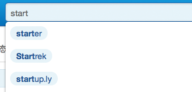
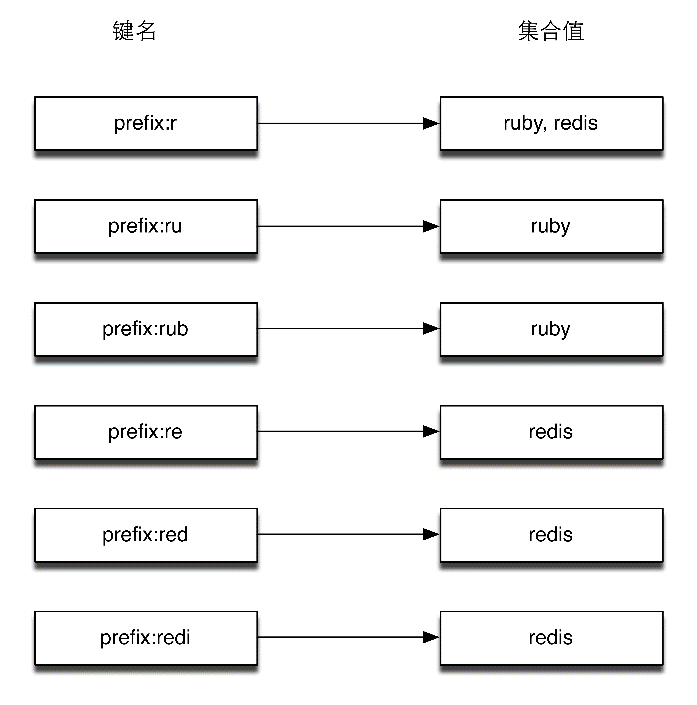
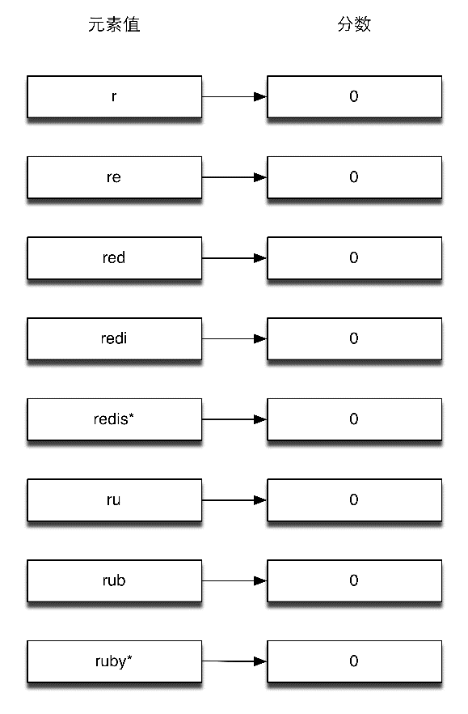

### 5.2.4 实践：自动完成

现在很多网站都有标签功能，用户可以给某个项目（如文章、图书等）添加标签，也可以通过标签查询项目。在很多时候，我们都希望在用户输入标签时网站可以自动帮助用户补全要输入的标签，如图5-1所示。


<center class="my_markdown"><b class="my_markdown">图5-1 输入“start”后网站会列出以“start”开头的标签</b></center>

这样做一是可以节约用户的输入时间，二是在创建标签时可以起到规范标签的作用，避免用户输入标签时可能出现的拼写错误。

下面介绍两种在Redis中实现补全提示的方法，并会挑选一种用Ruby来实现。

第一种方法：为每个标签的每个前缀都使用一个集合类型键来存储该前缀对应的标签名。如“ruby”的所有前缀分别是“r”“ru”和“rub”，我们为这3个前缀对应的集合类型键都加入元素“ruby”。

当有“ruby”和“redis”两个标签时，Redis中存储的内容如图5-2所示，用户输入“r”时就可以通过读取键“prefix:r”来获知以“r”开头的标签有“ruby”和“redis”两个。


<center class="my_markdown"><b class="my_markdown">图5-2 “ruby”和“redis”两个标签的索引存储结构</b></center>

这时就可以将这两个标签提示给用户了。更进一步，我们还可以存储每个标签的访问量，使得我们可以利用 `SORT` 命令配合 `BY` 参数把最热门的标签排在前面。

第二种方法通过有序集合实现，该方法是由Redis的作者Salvatore Sanfilippo介绍的。

3.6节介绍过有序集合类型有一个特性是当元素的分数一样时会按照元素值的字典顺序排序。利用这一特性只使用一个有序集合类型键就能实现标签的补全功能，准备过程如下。

（1）首先把每个标签名的所有前缀作为元素存入键中，分数均为0。

（2）将每个标签名后面都加上“*”符号并存入键中，分数也为0。

准备过后的存储情况如图5-3所示。


<center class="my_markdown"><b class="my_markdown">图5-3 “ruby”和“redis”两个标签的索引存储结构</b></center>

由于所有元素的分数都相同，所以该有序集合键中的项目相当于全部按照字典顺序排序（即图5-3所示的顺序）。这样当用户输入“r”时就可以按照如下流程获取要提示给用户的标签。

（1）获取“r”的排名： `ZRANK autocomplete r` ，在这里的返回值是0。

（2）获取“r”之后的N个元素，如当N=100时： `ZRANGE autocomplete 1 101``。`  N的取值与标签的平均长度和需要获得的标签数量有关，可以根据实际情况自由调整。

（3）遍历返回的结果，找出其中以""结尾的且以“r”开头的元素。此时将“”去掉后就是我们需要的结果了。

下面我们写一个小程序来作为示例，程序启动时会从一个文本文件中读取所有标签列表，然后接收用户输入并返回相应的补全结果。

文本文件的样例内容如下：

```shell
我的中国心
我的中国话
你好吗
我和你
你一路走来
你从哪里来

```

当用户输入“我的”时程序会打印如下内容：

```shell
我的中国心
我的中国话

```

具体的实现方法是，首先我们定义一个函数来获得标签的前缀（包括标签加上星号）：

```shell
# 获得标签的所有前缀
#
# @example
#　　get_prefixes('word')
#　　  # => ['w', 'wo', 'wor', 'word*']
def get_prefixes(word)
  Array.new(word.length) do |i|
　　if i == word.length - 1
　　  "#{word}*"
　　else
　　  word[0..i]
　　end
  end
end

```

接着我们加载redis-rb，并建立到Redis的连接：

```shell
require 'redis'
# 建立到默认地址和端口的Redis的连接
redis = Redis.new

```

为了保证可以重复运行此程序，我们需要删除之前建立的键以免影响本次的结果：

```shell
redis.del('autocomplete')

```

下面是准备阶段，程序从words.txt文件读取标签列表，并获得每个标签的前缀加入到有序集合键中：

```shell
argv = []
File.open('words.txt').each_line do |word|
   get_prefixes(word.chomp).each do |prefix|
　　 argv << [0, prefix]
   end
end
redis.zadd('autocomplete', argv)

```

redis-rb 的  `zadd`  函数支持两种方式的参数：当只加入一个元素时使用  `redis.zadd (key, score, member)` ，当同时加入多个元素时使用 `redis.zadd(key, [[score1, member1], [score2, member2], …])` 上面的代码使用的是后一种方式。

最后一步我们通过循环来接收用户的输入并查询对应的标签：

```shell
while prefix = gets.chomp do
   result = []
   if (rank = redis.zrank('autocomplete', prefix))
　　 # 存在以用户输入的内容为前缀的标签
　　 redis.zrange('autocomplete', rank + 1, rank + 100).each do |words|
　　　　# 获得该前缀后的100个元素
　　　　if words[-1] == '*' && prefix == words[0..prefix.length - 1]
　　　　  # 如果以"*"结尾并以用户输入的内容为前缀则加入结果中
　　　　  result << words[0..-2]
　　　　end
　　 end
   end
   # 打印结果
   puts result
end

```

