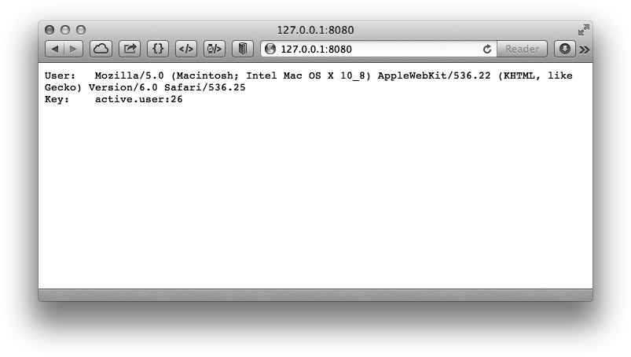
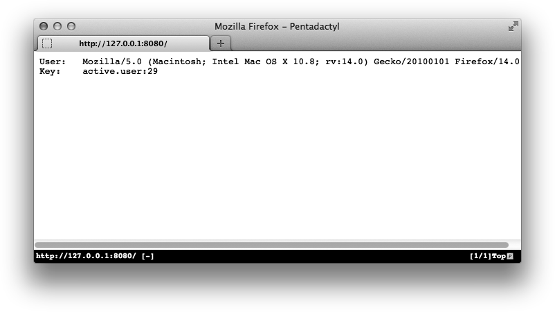
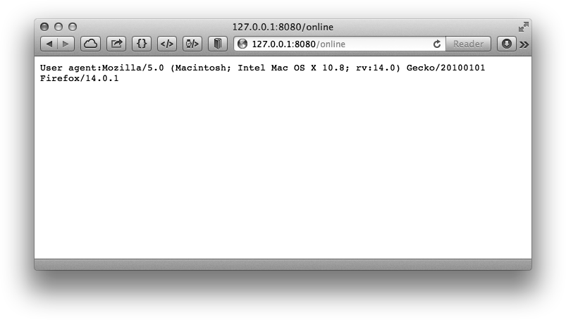

### 5.3.4 实践：在线的好友

一般的社交网站上都可以看到用户在线的好友列表，如图5-4所示。在Redis中可以很容易地实现这个功能。


<center class="my_markdown"><b class="my_markdown">图5-4 某网站上用户的在线好友列表</b></center>

在线好友其实就是全站在线用户的集合和某个用户所有好友的集合取交集的结果。如果现在我们的网站就是使用集合类型键来存储用户的好友ID的，那么只需要一个存储在线用户列表的集合即可。如何判定一个用户是否在线呢？通常的方法是每当用户发送HTTP 请求时都记录下请求发生的时间，所有指定时间内发送过请求的用户就算作在线用户。这段时间根据场景不同取值也不同，以10分钟为例：某个用户发送了一个HTTP请求，9分钟后系统仍然认为他是在线的，但到了第11分钟就不算作他在线了。

在Redis中我们可以每隔10分钟就使用一个键来存储该10分钟内发送过请求的用户ID列表。如12点20分到12点29分的用户ID存储在 `active.users:2` 中，12点30分到12点39分的用户ID存储在 `active.users:3` 中，以此类推（注意每次调用 `SADD` 命令增加用户ID时需要同时设置键的生存时间在50分钟内以防止命名冲突）。这样需要获得当前在线用户只需要读取当前分钟数对应的键即可。不过这种方案会造成较大的误差，比如某个用户在29分访问了一个页面，他的ID被记录在 `active.users:2` 键中，而在30分时系统会读取 `active.users:3` 键来获取在线用户列表，即该用户的在线状态只持续了1分钟而不是预想的10分钟。

这时就需要粒度更小的记录方案来解决这个问题。我们可以将原先每10分钟记录一个键改为每1分钟记录一个键，即在12点29分访问的用户的ID将会被记录在 `active.users: 29` 中。而判断一个用户是否在最近10分钟在线只需要判断其在最近的10个集合键中是否出现过至少一次即可，这一过程可以通过 `SUNION` 命令实现。

下面介绍使用Python来实现这一过程。我们这里使用了web.py框架，web.py是一个易于使用的Python网站开发框架，可以通过 `sudo pip install web.py` 来安装它。

代码如下：

```shell
# -*- coding: utf-8 -*-
import web
import time
import redis
r = redis.StrictRedis()
""" 配置路由规则
'/':　　   模拟用户的访问
'/online': 查看在线用户
"""
urls = (
　　 '/', 'visit',
　　 '/online', 'online'
)
app = web.application(urls, globals())
""" 返回当前时间对应的键名
如28分对应的键名是active.users:28
"""
def time_to_key(current_time):
　　 return 'active.users:' + time.strftime('%M', time.localtime(current_time))
""" 返回最近10分钟的键名
结果是列表类型
"""
def keys_in_last_10_minutes():
　　 now = time.time()
　　 result = []
　　 for i in range(10):
　　　　  result.append(time_to_key(now - i * 60))
　　 return result
class visit:
　　 """ 模拟用户访问
　　 将用户的User agent作为用户的ID加入到当前时间对应的键中
　　 """
　　 def GET(self):
　　　　  user_id = web.ctx.env['HTTP_USER_AGENT']
　　　　  current_key = time_to_key(time.time())
　　　　  pipe = r.pipeline()
　　　　  pipe.sadd(current_key, user_id)
　　　　  # 设置键的生存时间为10分钟
　　　　  pipe.expire(current_key, 10 * 60)
　　　　  pipe.execute()
　　　　  return 'User:\t' + user_id + '\r\nKey:\t' + current_key
class online:
　　 """ 查看当前在线的用户列表
　　 """
　　 def GET(self):
　　　　  online_users = r.sunion(keys_in_last_10_minutes())
　　　　  result = ''
　　　　  for user in online_users:
　　　　　　 result += 'User agent:' + user + '\r\n'
　　　　  return result
if __name__ == "__main__":
　　 app.run()

```

在代码中我们建立了两个页面。首先我们打开<a class="my_markdown" href="['http://127.0.0.1:8080']">http://127.0.0.1:8080</a>，该页面对应 `visit` 类，每次访问该页面都会将用户的浏览器User agent存储在记录当前分钟在线用户的键中，并将User agent和键名显示出来，如图5-5所示。


<center class="my_markdown"><b class="my_markdown">图5-5 使用Safari访问<a class="my_markdown" href="['http://127.0.0.1:8080']">http://127.0.0.1:8080</a></b></center>

从键名可知该次访问是在某时26分钟的时候发生的。然后使用另一个浏览器打开该页面，如图5-6所示。


<center class="my_markdown"><b class="my_markdown">图5-6 使用Firefox访问<a class="my_markdown" href="['http://127.0.0.1:8080']">http://127.0.0.1:8080</a></b></center>

该次访问发生在29分钟。最后我们在37分钟时访问<a class="my_markdown" href="['http://127.0.0.1:8080/online']">http://127.0.0.1:8080/online</a>来查看当前在线用户列表，如图5-7所示。


<center class="my_markdown"><b class="my_markdown">图5-7 查看在线用户结果</b></center>

结果与预期一样，在线列表中只有在29分钟访问的用户。

##### 另一种方法：有序集合

有时网站本来就要记录全站用户的最后访问时间（如图5-8所示），这时就可以直接利用此数据获得最后一次访问发生在10分钟内的用户列表（即在线用户）。


<center class="my_markdown"><b class="my_markdown">图5-8 Stack Overflow网站的个人资料页面记录了用户上次访问的时间</b></center>

我们使用一个有序集合来记录用户的最后访问时间，元素值为用户的ID，分数为最后一次访问的Unix时间。要获得最近10分钟访问过的用户列表可以使用 `ZRANGEBYSCORE` 命令：

```shell
ten_minutes_ago = time.time() - 10 * 60
online_users = r.zrangebyscore('last.seen', ten_minutes_ago, '+inf')

```

那么如何获取在线的好友列表呢（与上一个例子一样，此时依然使用集合类型存储用户的好友列表）？最直接的方法就是将上面存储在线用户列表的 `online_users` 变量存入Redis的一个集合类型的键中然后和用户的好友列表取交集。然而这种方法需要在服务端和客户端之间传输数据，如果在线用户多的话会有较大的网络开销，而且这种方法也不能通过Redis的事务功能实现原子操作。为了解决这些问题，我们希望实现一个方法将 `ZRANGEBYSCORE` 命令的结果直接存入一个新键中而不返回到客户端。思路如下：

有序集合只有 `ZINTERSTORE` 和 `ZUNIONSTORE` 两个命令支持直接将运算结果存入键中，然而这两个命令都不能实现我们要的操作。所以只能换种思路：既然没办法直接把有序集合中某一分数段的元素存入新键中，那何不干脆复制一个新建，并使用 `ZREMRANGEBYSCORE` 命令将我们不需要的分数段的元素删除？

有了这一思路后下面的实现方法就很简单了，步骤如下。

（1）复制一个 `last.seen` 键的副本 `temp.last.seen` ，方法为 `ZUNIONSTORE temp. last.seen 1 last.seen` 。在这里我们巧妙地借助了 `ZUNIONSTORE` 命令实现了对有序集合类型键的复制过程，即参加求并集操作的元素只有一个，结果自然就是它本身。

（2）将不在线的用户（即10分钟以前的用户）删除。方法为 `ZREMRANGEBYSCORE temp.last.seen 0`  * `10` *分钟前的* `Unix` *时间。

（3）现在temp.last.seen键中存储的就是当前的在线用户了。我们将其和用户的好友列表做交集： `ZINTERSTORE online.friends 2 temp.last.seen user:42:friends` 。这里我们以ID为42的用户举例， `user:42:friends` 是存储其好友的集合类型键6。

6 `ZINTERSTORE` 命令的参数除了有序集合类型外还可以是集合类型，此时的集合类型会被作为分数为1的有序集合类型处理。

（4）使用 `ZRANGE` 命令获取 `online.friends` 键的值。

（5）收尾工作，删除 `temp.last.seen` 和 `online.friends` 键。因为 `temp.last. seen` 键可以被所有用户共用，所以可以根据情况将其缓存一段时间，在下次需要生成时先判断是否有该键，如果有则直接使用。

以上5步需要使用事务或脚本实现以保证每个步骤的原子性。

有的时候我们会使用有序集合键来存储用户的好友列表以记录成为好友的时间，此时第3步依然奏效。

虽然以上的步骤有些复杂，但是实现起来并不难，有兴趣的读者可以自己完成。

