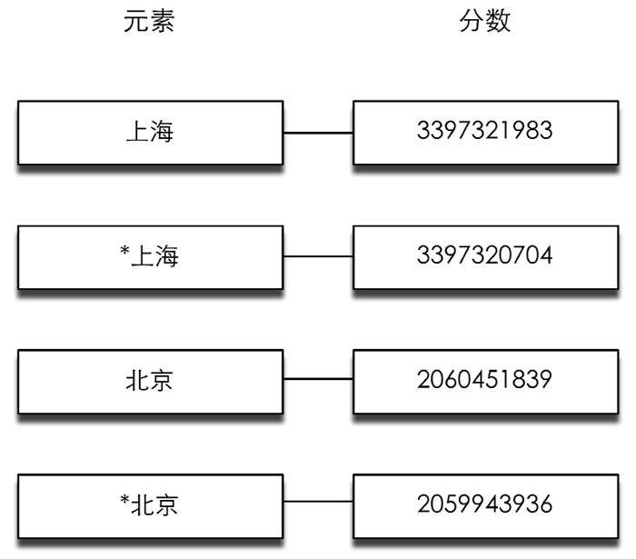

### 5.4.4 实践：IP地址查询

很多场合下网站都需要根据访客的IP地址判断访客所在地。假设我们有一个地名和IP地址段的对应表13：

13该表只用于演示用途，其中的数据并不准确。

```shell
上海: 202.127.0.0 ~ 202.127.4.255
北京: 122.200.64.0 ~ 122.207.255.255

```

如果用户的IP地址为122.202.2.0，我们就能根据这个表知道他的地址位于北京。Redis可以使用一个有序集合类型的键来存储这个表。

首先将表中的IP地址转换成十进制数字：

```shell
上海: 3397320704 ~ 3397321983
北京: 2059943936 ~ 2060451839

```

然后使用有序集合类型记录这个表。方式为每个地点存储两条数据：一条的元素值是地点名，分数是该地点对应的最大IP地址。另一条是“*”加上地点名，分数是该地点对应的最小IP地址，如图5-9所示。


<center class="my_markdown"><b class="my_markdown">图5-9 使用有序集合键存储地点和相应IP范围的存储结构</b></center>

在查找某个IP地址属于哪个地点时先将该IP地址转换成10进制数字，然后在有序集合中找到大于该数字的最小的一个元素，如果该元素不是以“*”开头则表示找到了，如果是则表示数据库中并未记录该IP地址对应的地名。

如我们想找到“122.202.2.0”的所在地，首先将其转换成数字“2060059136”，然后在有序集合中找到第一个大于它的分数为“2060451839”，对应的元素值为“北京”，不是以“*****”开头，所以该地址的所在地是北京。

下面介绍使用Node.js实现这一过程。首先将表转换成CSV格式并存为ip.csv：

```shell
上海,202.127.0.0,202.127.4.255
北京,122.200.64.0,122.207.255.255

```

而后使用node-csv模块14加载该csv文件：

14见<a class="my_markdown" href="['https://github.com/wdavidw/node-csv']">https://github.com/wdavidw/node-csv</a>。安装方法为 `npm install csv` 。

```shell
var fs = require('fs');
var csv = require('csv');
csv.parse(fs.readFileSync('ip.csv', 'utf8'), function (err, records) {
  records.forEach(function (record) {
　　importIP(record);
  });
});

```

读取每行数据时node-csv-parser模块都会调用 `importIP` 回调函数。该函数实现如下：

```shell
var Redis = require('redis');
var redis = new Redis();
// 将IP地址数据加入Redis
// 输入格式："['上海', '202.127.0.0', '202.127.4.255']"
function importIP (data) {
   var location = data[0];
   var minIP = convertIPtoNumber(data[1]);
   var maxIP = convertIPtoNumber(data[2]);
   // 将数据加入到有序集合中，键名为'ip'
   redis.zadd('ip', minIP, '*' + location, maxIP, location);
}

```

其中`convertIPtoNumber`函数用来将IP地址转换成十进制数字，

```shell
// 将IP地址转换成10进制数字
// convertIPtoNumber('127.0.0.1') => 2130706433
function convertIPtoNumber(ip) {
   var result = '';
   ip.split('.').forEach(function (item) {
　　 item = ~~item;
　　 item = item.toString(2);
　　 item = pad(item, 8);
　　 result += item;
   });
   return parseInt(result, 2);
}

```

`pad` 函数用于将二进制数补全为8位：

```shell
// 在字符串前补'0'。
// pad('11', 3) => '011'
function pad(num, n) {
　　 var len = num.length; 
　　 while(len < n) {
　　　　  num = '0' + num;
　　　　 len++;
　　 }
　　 return num;
}

```

至此数据准备工作完成了，现在我们提供一个接口来供用户查询：

```shell
var readline = require('readline');
var rl = readline.createInterface({
   input: process.stdin,
   output: process.stdout
});
rl.setPrompt('IP> ');
rl.prompt();
rl.on('line', function (line) {
   ip = convertIPtoNumber(line);
   redis.zrangebyscore('ip', ip, '+inf', 'LIMIT', '0', '1', function (err,result) {
　　 if (!Array.isArray(result) || result.length === 0) {
　　　　// 该IP地址超出了数据库记录的最大IP地址
　　　　console.log('No data.');
　　 } else {
　　　　var location = result[0];
　　　　if (location[0] === '*') {
　　　　   // 该IP地址不属于任何一个IP地址段
　　　　   console.log('No data.');
　　　　} else {
　　　　  console.log(location);
　　　　}
　　 }
　　 rl.prompt();
   });
});

```

运行后的结果如下：

```shell
$ node ip_search.js 
IP> 127.0.0.1
No data.
IP> 122.202.23.34
北京
IP> 202.127.3.3
上海

```

上面的代码的实际查找范围是一个半开半闭区间。如果想实现闭区间查找，读者可以在比对“ `*` ”时同时比较元素的分数和查找的IP地址是否相同。


