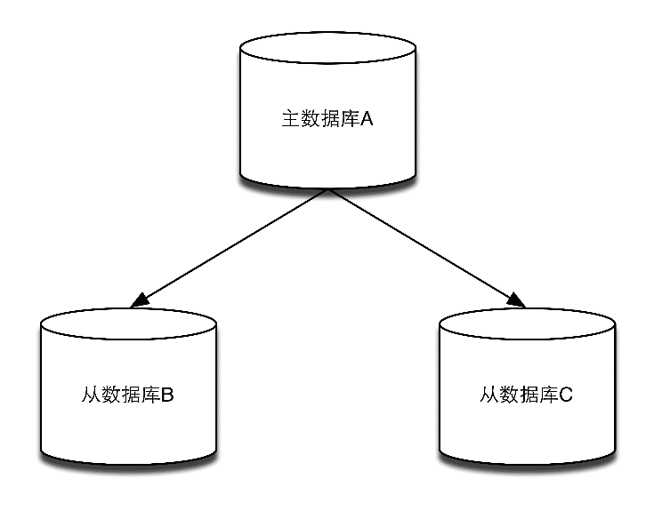

### 8.1.1 配置

在复制的概念中，数据库分为两类，一类是主数据库（master），另一类是从数据库1（slave）。主数据库可以进行读写操作，当写操作导致数据变化时会自动将数据同步给从数据库。而从数据库一般是只读的，并接受主数据库同步过来的数据。一个主数据库可以拥有多个从数据库，而一个从数据库只能拥有一个主数据库，如图8-1所示。

1这里的“数据库”泛指Redis服务器，不表示Redis的应用方式。


<center class="my_markdown"><b class="my_markdown">图8-1 一个主数据库可以拥有多个从数据库</b></center>

在Redis中使用复制功能非常容易，只需要在从数据库的配置文件中加入“ `slaveof 主数据库地址`` ``主数据库端口` ”即可，主数据库无须进行任何配置。

为了能够更直观地展示复制的流程，下面将实现一个最简化的复制系统。我们要在一台服务器上启动两个Redis实例，监听不同端口，其中一个作为主数据库，另一个作为从数据库。首先我们不加任何参数来启动一个Redis实例作为主数据库：

```shell
$ redis-server

```

该实例默认监听6379端口。然后加上 `slaveof` 参数启动另一个Redis实例作为从数据库，并让其监听6380端口：

```shell
$ redis-server --port 6380 --slaveof 127.0.0.1 6379

```

此时在主数据库中的任何数据变化都会自动地同步到从数据库中。我们打开redis-cli实例`A`并连接到主数据库：

```shell
$ redis-cli -p 6379

```

再打开redis-cli实例 `B` 并连接到从数据库：

```shell
$ redis-cli -p 6380

```

这时我们使用 `INFO` 命令来分别在实例A和实例B中获取Replication节的相关信息：

```shell
redis A> INFO replication
role:master
connected_slaves:1
slave0:ip=127.0.0.1,port=6380,state=online,offset=1,lag=1
master_repl_offset:1

```

可以看到，实例A的角色（上面输出中的 `role` ）是 `master` ，即主数据库，同时已连接的从数据库（上面输出中的 `connected_slaves` ）的个数为1。

同样在实例B中获取相应的信息为：

```shell
redis B> INFO replication
role:slave
master_host:127.0.0.1
master_port:6379

```

这里可以看到，实例B的 `role` 是 `slave` ，即从数据库，同时其主数据库的地址为127.0.0.1，端口为 6379。

在实例 `A` 中使用 `SET` 命令设置一个键的值：

```shell
redis A> SET foo bar OK

```

此时在实例B中就可以获得该值了：

```shell
redis B> GET foo
"bar"

```

默认情况下，从数据库是只读的，如果直接修改从数据库的数据会出现错误：

```shell
redis B> SET foo hi
(error) READONLY You can't write against a read only slave.

```

可以通过设置从数据库的配置文件中的 `slave-read-only` 为 `no` 以使从数据库可写，但是因为对从数据库的任何更改都不会同步给任何其他数据库，并且一旦主数据库中更新了对应的数据就会覆盖从数据库中的改动，所以通常的场景下不应该设置从数据库可写，以免导致易被忽略的潜在应用逻辑错误。

配置多台从数据库的方法也一样，在所有的从数据库的配置文件中都加上  `slaveof` 参数指向同一个主数据库即可。

除了通过配置文件或命令行参数设置 `slaveof` 参数，还可以在运行时使用 `SLAVEOF` 命令修改：

```shell
redis> SLAVEOF 127.0.0.1 6379 
```

如果该数据库已经是其他主数据库的从数据库了， `SLAVEOF` 命令会停止和原来数据库的同步转而和新数据库同步。此外对于从数据库来说，还可以使用 `SLAVEOF NO ONE` 命令来使当前数据库停止接收其他数据库的同步并转换成为主数据库。

