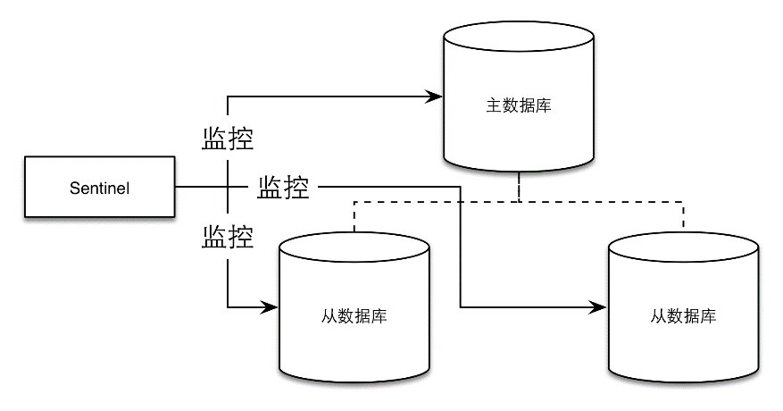
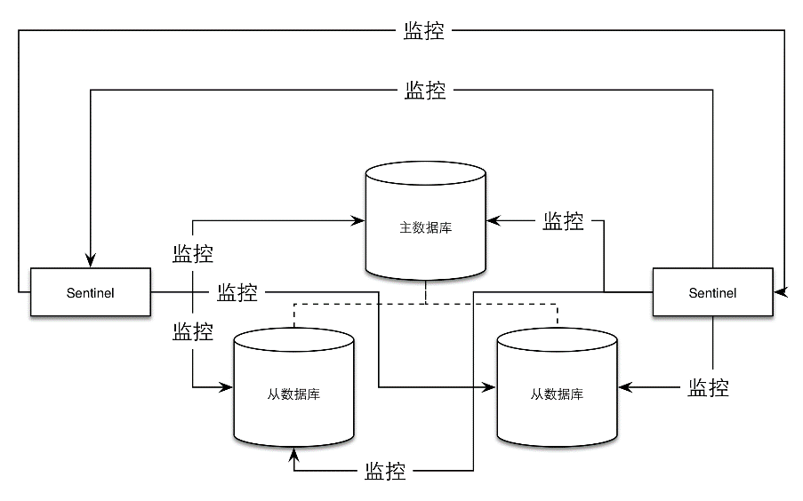

### 8.2.1 什么是哨兵

顾名思义，哨兵的作用就是监控Redis系统的运行状况。它的功能包括以下两个。

（1）监控主数据库和从数据库是否正常运行。

（2）主数据库出现故障时自动将从数据库转换为主数据库。

哨兵是一个独立的进程，使用哨兵的一个典型架构如图8-3所示。

<b class="my_markdown">图8-3 一个典型的使用哨兵的Redis架构。虚线表示主从复制
 关系，实线表示哨兵的监控路径</b>

在一个一主多从的Redis系统中，可以使用多个哨兵进行监控任务以保证系统足够稳健，如图8-4所示。注意，此时不仅哨兵会同时监控主数据库和从数据库，哨兵之间也会互相监控。

<b class="my_markdown">图8-4 一个主从系统中可以有多个哨兵同时监视整个系统</b>

