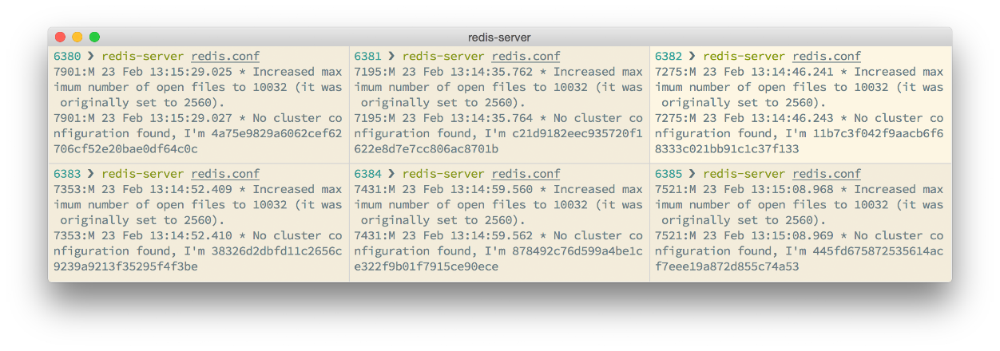

### 8.3.1 配置集群

使用集群，只需要将每个数据库节点的 `cluster-enabled` 配置选项打开即可。每个集群中至少需要3个主数据库才能正常运行。

为了演示集群的应用场景以及故障恢复等操作，这里以配置一个3主3从的集群系统为例。首先建立启动6个Redis实例，需要注意的是配置文件中应该打开 `cluster- enabled` 。一个示例配置为：

```shell
port 6380
cluster-enabled yes

```

其中 `port` 参数修改成实际的端口即可。这里假设6个实例的端口分别是6380、6381、6382、6383、6384和6385。集群会将当前节点记录的集群状态持久化地存储在指定文件中，这个文件默认为当前工作目录下的nodes.conf文件。每个节点对应的文件必须不同，否则会造成启动失败，所以启动节点时要注意最后为每个节点使用不同的工作目录，或者通过 `cluster-config-file` 选项修改持久化文件的名称：

```shell
cluster-config-file nodes.conf

```

启动后的效果如图8-5所示。


<center class="my_markdown"><b class="my_markdown">图8-5 节点启动后的输出内容</b></center>

每个节点启动后都会输出类似下面的内容：

```shell
No cluster configuration found, I'm c21d9182eec935720f1622…

```

其中 `c21d9182eec935720f1622…` 表示该节点的运行ID，运行ID是节点在集群中的唯一标识；同一个运行ID，可能地址和端口是不同的。

启动后，可以使用Redis命令行客户端连接任意一个节点使用INFO命令来判断集群是否正常启用了：

```shell
redis> INFO cluster
# Cluster
cluster_enabled:1

```

其中 `cluster_enabled` 为 `1` 表示集群正常启用了。现在每个节点都是完全独立的，要将它们加入同一个集群里还需要几个步骤。

Redis源代码中提供了一个辅助工具redis-trib.rb可以非常方便地完成这一任务。因为redis-trib.rb是用Ruby语言编写的，所以运行前需要在服务器上安装Ruby程序，具体安装方法请参阅相关文档。redis-trib.rb依赖于gem包redis，可以执行 `gem install redis` 来安装。

使用redis-trib.rb来初始化集群，只需要执行：

```shell
$ /path/to/redis-trib.rb create --replicas 1 127.0.0.1:6380 127.0.0.1:6381 127.0.0.1:6382 127.0.0.1:6383 127.0.0.1:6384 127.0.0.1:6385

```

其中 `create` 参数表示要初始化集群， `--replicas 1` 表示每个主数据库拥有的从数据库个数为1，所以整个集群共有3（ `6/2` ）个主数据库以及3个从数据库。

执行完后，redis-trib.rb会输出如下内容：

```shell
>>> Creating cluster
Connecting to node 127.0.0.1:6380: OK
Connecting to node 127.0.0.1:6381: OK
Connecting to node 127.0.0.1:6382: OK
Connecting to node 127.0.0.1:6383: OK
Connecting to node 127.0.0.1:6384: OK
Connecting to node 127.0.0.1:6385: OK
>>> Performing hash slots allocation on 6 nodes...
Using 3 masters:
127.0.0.1:6380
127.0.0.1:6381
127.0.0.1:6382
Adding replica 127.0.0.1:6383 to 127.0.0.1:6380
Adding replica 127.0.0.1:6384 to 127.0.0.1:6381
Adding replica 127.0.0.1:6385 to 127.0.0.1:6382
M: d4f906940d68714db787a60837f57fa496de5d12 127.0.0.1:6380
   slots:0-5460 (5461 slots) master
M: b547d05c9d0e188993befec4ae5ccb430343fb4b 127.0.0.1:6381
   slots:5461-10922 (5462 slots) master
M: 887fe91bf218f203194403807e0aee941e985286 127.0.0.1:6382
   slots:10923-16383 (5461 slots) master
S: e0f6559be7a121498fae80d44bf18027619d9995 127.0.0.1:6383
   replicates d4f906940d68714db787a60837f57fa496de5d12
S: a61dbf654c9d9a4d45efd425350ebf720a6660fc 127.0.0.1:6384
   replicates b547d05c9d0e188993befec4ae5ccb430343fb4b
S: 551e5094789035affc489db267c8519c3a29f35d 127.0.0.1:6385
   replicates 887fe91bf218f203194403807e0aee941e985286
Can I set the above configuration? (type 'yes' to accept):

```

内容包括集群具体的分配方案，如果觉得没问题则输入 `yes` 来开始创建。下面根据上面的输出详细介绍集群创建的过程。

首先redis-trib.rb会以客户端的形式尝试连接所有的节点，并发送 `PING` 命令以确定节点能够正常服务。如果有任何节点无法连接，则创建失败。同时发送 `INFO` 命令获取每个节点的运行ID以及是否开启了集群功能（即 `cluster_enabled` 为 `1` ）。

准备就绪后集群会向每个节点发送 `CLUSTER MEET` 命令，格式为 `CLUSTER MEET ip port` ，这个命令用来告诉当前节点指定<i>ip</i>和<i>port</i>上在运行的节点也是集群的一部分，从而使得6个节点最终可以归入一个集群。这一过程会在8.3.2节具体介绍。

然后redis-trib.rb会分配主从数据库节点，分配的原则是尽量保证每个主数据库运行在不同的IP地址上，同时每个从数据库和主数据库均不运行在同一IP地址上，以保证系统的容灾能力。分配结果如下：

```shell
Using 3 masters:
127.0.0.1:6380
127.0.0.1:6381
127.0.0.1:6382
Adding replica 127.0.0.1:6383 to 127.0.0.1:6380
Adding replica 127.0.0.1:6384 to 127.0.0.1:6381
Adding replica 127.0.0.1:6385 to 127.0.0.1:6382

```

其中主数据库是6380、6381和6382端口上的节点（以下使用端口号来指代节点），6383是6380的从数据库，6384是6381的从数据库，6385是6382的从数据库。

分配完成后，会为每个主数据库分配插槽，分配插槽的过程其实就是分配哪些键由哪些节点负责，这部分会在8.3.3节介绍。之后对每个要成为子数据库的节点发送 `CLUSTER REPLICATE` 主数据库的运行 `ID` 来将当前节点转换成从数据库并复制指定运行ID的节点（主数据库）。

此时整个集群的过程即创建完成，使用Redis命令行客户端连接任意一个节点执行 `CLUSTER NODES` 可以获得集群中的所有节点信息，如在6380执行：

```shell
redis 6380> CLUSTER NODES
551e5094789035affc489db267c8519c3a29f35d 127.0.0.1:6385 slave 
887fe91bf218f203194403807e0aee941e985286 0 1424677377448 6 connected
e0f6559be7a121498fae80d44bf18027619d9995 127.0.0.1:6383 slave 
d4f906940d68714db787a60837f57fa496de5d12 0 1424677381593 4 connected
b547d05c9d0e188993befec4ae5ccb430343fb4b 127.0.0.1:6381 master - 0 1424677379515 2 connected 5461-10922
d4f906940d68714db787a60837f57fa496de5d12 127.0.0.1:6380 myself,master - 0 0 1 connected 0-5460
a61dbf654c9d9a4d45efd425350ebf720a6660fc 127.0.0.1:6384 slave 
b547d05c9d0e188993befec4ae5ccb430343fb4b 0 1424677378481 5 connected
887fe91bf218f203194403807e0aee941e985286 127.0.0.1:6382 master - 0 1424677380554 3 connected 10923-16383

```

从上面的输出中可以看到所有节点的运行ID、地址和端口、角色、状态以及负责的插槽等信息，后文会进行解读。

redis-trib.rb是一个非常好用的辅助工具，其本质是通过执行Redis命令来实现集群管理的任务。读者如果有兴趣可以尝试不借助redis-trib.rb，手动建立一次集群。

