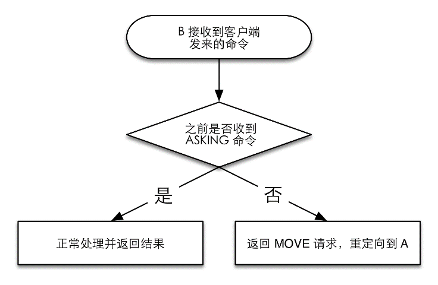
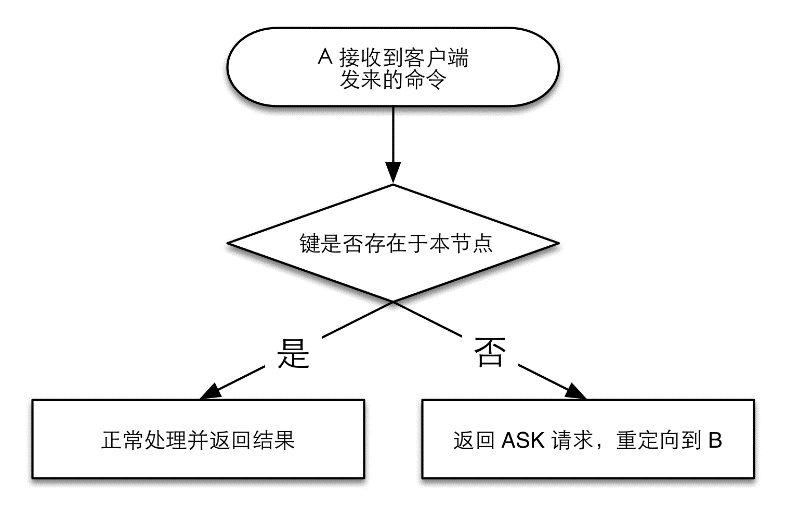

### 8.3.3 插槽的分配

新的节点加入集群后有两种选择，要么使用 `CLUSTER REPLICATE` 命令复制每个主数据库来以从数据库的形式运行，要么向集群申请分配插槽（slot）来以主数据库的形式运行。

在一个集群中，所有的键会被分配给16384个插槽，而每个主数据库会负责处理其中的一部分插槽。现在再回过头来看8.3.1节创建集群时的输出：

```shell
M: d4f906940d68714db787a60837f57fa496de5d12 127.0.0.1:6380
   slots:0-5460 (5461 slots) master
M: b547d05c9d0e188993befec4ae5ccb430343fb4b 127.0.0.1:6381
   slots:5461-10922 (5462 slots) master
M: 887fe91bf218f203194403807e0aee941e985286 127.0.0.1:6382
   slots:10923-16383 (5461 slots) master

```

上面的每一行表示一个主数据库的信息，其中可以看到6380负责处理0～5460这5461个插槽，6381负责处理5461～10922这5462个插槽，6382则负责处理10923～16383这5461个插槽。虽然redis-trib.rb初始化集群时分配给每个节点的插槽都是连续的，但是实际上Redis并没有此限制，可以将任意的几个插槽分配给任意的节点负责。

在介绍如何将插槽分配给指定的节点前，先来介绍键与插槽的对应关系。Redis将每个键的键名的有效部分使用CRC16算法计算出散列值，然后取对16384的余数。这样使得每个键都可以分配到16384个插槽中，进而分配的指定的一个节点中处理。CRC16的具体实现参见附录C。这里键名的有效部分是指：

（1）如果键名包含{符号，且在{符号后面存在}符号，并且{和}之间有至少一个字符，则有效部分是指{和}之间的内容；

（2）如果不满足上一条规则，那么整个键名为有效部分。

例如，键 `hello.world` 的有效部分为 `"hello.world"` ，键 `{user102}:last.name` 的有效部分为 `"user102"` 。如本节引言所说，如果命令涉及多个键（如 `MGET` ），只有当所有键都位于同一个节点时Redis才能正常支持。利用键的分配规则，可以将所有相关的键的有效部分设置成同样的值使得相关键都能分配到同一个节点以支持多键操作。比如， `{user102}:first.name` 和 `{user102}:last.name` 会被分配到同一个节点，所以可以使用 `MGET {user102}:first.name {user102}:last.name` 来同时获取两个键的值。

介绍完键与插槽的对应关系后，接下来再来介绍如何将插槽分配给指定节点。插槽的分配分为如下几种情况。

（1）插槽之前没有被分配过，现在想分配给指定节点。

（2）插槽之前被分配过，现在想移动到指定节点。

其中第一种情况使用 `CLUSTER ADD``SLOT S` 命令来实现，redis-trib.rb也是通过该命令在创建集群时为新节点分配插槽的。 `CLUSTER ADDSLOTS` 命令的用法为：

```shell
CLUSTER ADDSLOTS slot1 [slot2] ... [slotN]

```

如想将100和101两个插槽分配给某个节点，只需要在该节点执行： `CLUSTER ADDSLOTS 100 101` 即可。如果指定插槽已经分配过了，则会提示：

```shell
 (error) ERR Slot 100 is already busy

```

可以通过命令 `CLUSTER SLOTS` 来查看插槽的分配情况，如：

```shell
redis 6380> CLUSTER SLOTS
1) 1) (integer) 5461
   2) (integer) 10922
   3) 1) "127.0.0.1"
　　  2) (integer) 6381
   4) 1) "127.0.0.1"
　　  2) (integer) 6384
2) 1) (integer) 0
   2) (integer) 5460
   3) 1) "127.0.0.1"
　　  2) (integer) 6380
   4) 1) "127.0.0.1"
　　  2) (integer) 6383
3) 1) (integer) 10923
   2) (integer) 16383
   3) 1) "127.0.0.1"
　　  2) (integer) 6382
   4) 1) "127.0.0.1"
　　  2) (integer) 6385

```

其中返回结果的格式很容易理解，一共3条记录，每条记录的前两个值表示插槽的开始号码和结束号码，后面的值则为负责该插槽的节点，包括主数据库和所有的从数据库，主数据库始终在第一位。

对于情况2，处理起来就相对复杂一些，不过redis-trib.rb提供了比较方便的方式来对插槽进行迁移。我们首先使用redis-trib.rb将一个插槽从6380迁移到6381，然后再介绍如何不使用redis-trib.rb来完成迁移。

首先执行如下命令：

```shell
$ /path/to/redis-trib.rb reshard 127.0.0.1:6380

```

其中 `reshard` 表示告诉redis-trib.rb要重新分片， `127.0.0.1:6380` 是集群中的任意一个节点的地址和端口，redis-trib.rb会自动获取集群信息。接下来，redis-trib.rb将会询问具体如何进行重新分片，首先会询问想要迁移多少个插槽：

```shell
How many slots do you want to move (from 1 to 16384)? 

```

我们只需要迁移一个，所以输入 `1` 后回车。接下来redis-trib.rb会询问要把插槽迁移到哪个节点：

```shell
What is the receiving node ID?

```

可以通过 `CLUSTER NODES` 命令获取6381的运行ID，这里是 `b547d05c9d0e188993befec 4ae5ccb430343fb4b` ，输入并回车。接着最后一步是询问从哪个节点移出插槽：

```shell
Please enter all the source node IDs.
  Type 'all' to use all the nodes as source nodes for the hash slots.
  Type 'done' once you entered all the source nodes IDs.
Source node #1:all

```

我们输入6380对应的运行ID按回车然后输入 `done` 再按回车确认即可。

接下来输入 `yes` 来确认重新分片方案，重新分片即告成功。使用 `CLUSTER SLOTS` 命令获取当前插槽的分配情况如下：

```shell
redis 6380> CLUSTER SLOTS
1) 1) (integer) 1
   2) (integer) 5460
   3) 1) "127.0.0.1"
　　  2) (integer) 6380
   4) 1) "127.0.0.1"
　　  2) (integer) 6383
2) 1) (integer) 10923
   2) (integer) 16383
   3) 1) "127.0.0.1"
　　  2) (integer) 6382
   4) 1) "127.0.0.1"
　　  2) (integer) 6385
3) 1) (integer) 0
   2) (integer) 0
   3) 1) "127.0.0.1"
　　  2) (integer) 6381
   4) 1) "127.0.0.1"
　　  2) (integer) 6384
4) 1) (integer) 5461
   2) (integer) 10922
   3) 1) "127.0.0.1"
　　  2) (integer) 6381
   4) 1) "127.0.0.1"
　　  2) (integer) 6384

```

可以看到现在比之前多了一条记录，第0号插槽已经由6381负责，此时重新分片成功。

那么redis-trib.rb实现重新分片的原理是什么，我们如何不借助redis-trib.rb手工进行重新分片呢？使用如下命令即可：

```shell
CLUSTER SETSLOT 插槽号 NODE 新节点的运行ID</i> 
```

如想要把0号插槽迁移回6380：

```shell
redis 6381> CLUSTER SETSLOT 0 NODE d4f906940d68714db787a60837f57fa496de5d12
OK

```

此时重新使用 `CLUSTER SLOTS` 查看插槽的分配情况，可以看到已经恢复如初了。然而这样迁移插槽的前提是插槽中并没有任何键，因为使用 `CLUSTER SETSLOT` 命令迁移插槽时并不会连同相应的键一起迁移，这就造成了客户端在指定节点无法找到未迁移的键，造成这些键对客户端来说“丢失了”（8.3.4节会介绍客户端如果找到对应键的负责节点）。为此需要手工获取插槽中存在哪些键，然后将每个键迁移到新的节点中才行。

手工获取某个插槽存在哪些键的方法是：

```shell
CLUSTER GETKEYSINSLOT 插槽号 要返回的键的数量

```

之后对每个键，使用 `MIGRATE` 命令将其迁移到目标节点：

```shell
MIGRATE 目标节点地址目标节点端口 键名数据库号码超时时间 [COPY] [REPLACE]

```

其中 `COPY` 选项表示不将键从当前数据库中删除，而是复制一份副本。 `REPLACE` 表示如果目标节点存在同名键，则覆盖。因为集群模式只能使用0号数据库，所以数据库号码始终为0。如要把键 `abc` 从当前节点（如6381）迁移到6380：

```shell
redis 6381> MIGRATE 127.0.0.1 6380 abc 0 15999 REPLACE

```

至此，我们已经知道如果将插槽委派给其他节点，并同时将当前节点中插槽下所有的键迁移到目标节点中。然而还有最后一个问题是如果要迁移的数据量比较大，整个过程会花费较长时间，那么究竟在什么时候执行 `CLUSTER SETSLOT` 命令来完成插槽的交接呢？如果在键迁移未完成时执行，那么客户端就会尝试在新的节点读取键值，此时还没有迁移完成，自然有可能读不到键值，从而造成相关键的临时“丢失”。相反，如果在键迁移完成后再执行，那么在迁移时客户端会在旧的节点读取键值，然后有些键已经迁移到新的节点上了，同样也会造成键的临时“丢失”。那么redis-trib.rb工具是如何解决这个问题的呢？

Redis提供了如下两个命令用来实现在集群不下线的情况下迁移数据：

```shell
CLUSTER SETSLOT 插槽号 MIGRATING 新节点的运行ID
CLUSTER SETSLOT 插槽号 IMPORTING 原节点的运行ID

```

进行迁移时，假设要把0号插槽从A迁移到B，此时redis-trib.rb会依次执行如下操作。

（1）在B执行 `CLUSTER SETSLOT 0 IMPORTING A` 。

（2）在A执行 `CLUSTER SETSLOT 0 MIGRATING B` 。

（3）执行 `CLUSTER GETKEYSINSLOT 0` 获取0号插槽的键列表。

（4）对第3步获取的每个键执行 `MIGRATE` 命令，将其从A迁移到B。

（5）执行 `CLUSTER SETSLOT 0 NODE B` 来完成迁移。

从上面的步骤来看redis-trib.rb多了1和2两个步骤，这两个步骤就是为了解决迁移过程中键的临时“丢失”问题。首先执行完前两步后，当客户端向A请求插槽0中的键时，如果键存在（即尚未被迁移），则正常处理，如果不存在，则返回一个 `ASK` 跳转请求，告诉客户端这个键在B里，如图8-6所示。客户端接收到ASK跳转请求后，首先向B发送 `ASKING` 命令，然后再重新发送之前的命令。相反，当客户端向B请求插槽0中的键时，如果前面执行了 `ASKING` 命令，则返回键值内容，否则返回 `MOVED` 跳转请求（会在8.3.4节介绍），如图8-7所示。这样一来客户端只有能够处理 `ASK` 跳转，则可以在数据库迁移时自动从正确的节点获取到相应的键值，避免了键在迁移过程中临时“丢失”的问题。


<center class="my_markdown"><b class="my_markdown">图8-6 A的命令的处理流程</b></center>


<center class="my_markdown"><b class="my_markdown">图8-7 B的命令处理流程</b></center>

