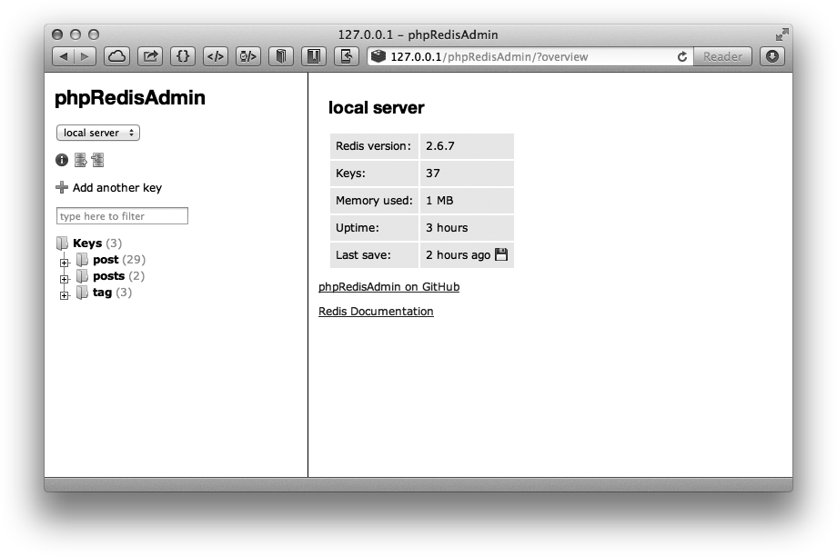
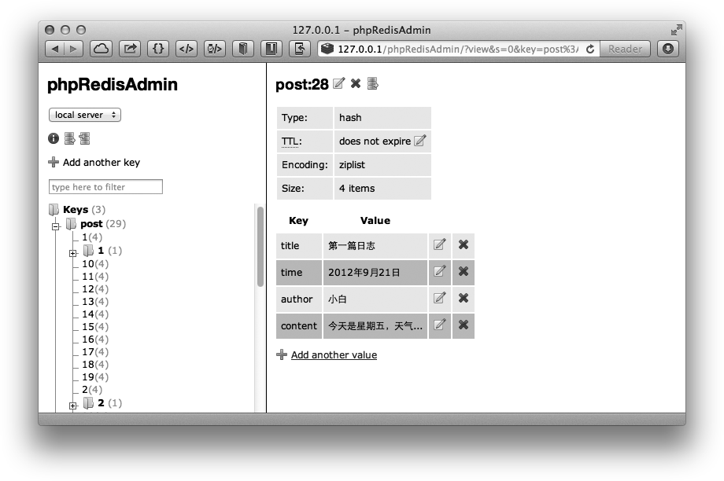

### 9.3.2 phpRedisAdmin

当Redis 中的键较多时，使用redis-cli管理数据并不是很方便，就如同管理MySQL时有人喜欢使用phpMyAdmin一样，Redis同样有一个PHP开发的网页端管理工具phpRedis Admin。phpRedisAdmin支持以树形结构查看键列表，编辑键值，导入/导出数据库数据，查看数据库信息和查看键信息等功能。

#### 1．安装phpRedisAdmin

安装phpRedisAdmin的方法如下：

```shell
git clone [https://github.com/ErikDubbelboer/phpRedisAdmin.git](https://github.com/ErikDubbelboer/phpRedisAdmin.git)
cd phpRedisAdmin

```

phpRedisAdmin依赖PHP的Redis客户端Predis，所以还需要执行下面两个命令下载Predis：

```shell
git submodule init
git submodule update

```

#### 2．配置数据库连接

下载完phpRedisAdmin后需要配置 Redis 的连接信息。默认 phpRedisAdmin会连接到127.0.0.1，端口6379，如果需要更改或者添加数据库信息可以编辑includes文件夹中的config.inc. php文件。

#### 3．使用phpRedisAdmin

安装PHP和Web服务器（如Nginx），并将phpRedisAdmin文件夹存放到网站目录中即可访问，如图9-1所示。


<center class="my_markdown"><b class="my_markdown">图9-1 phpRedisAdmin界面</b></center>

phpRedisAdmin自动将Redis的键以“:”分隔并用树形结构显示出来，十分直观。如post:1和post:2两个键都在post树中。

点击一个键后可以查看键的信息，包括键的类型、生存时间及键值，并且可以很方便地编辑，如图9-2所示。


<center class="my_markdown"><b class="my_markdown">图9-2 查看键信息</b></center>

#### 4．性能

phpRedisAdmin在获取键列表时使用的是 `KEYS*` 命令，然后对所有的键使用 `TYPE` 命令来获取其数据类型，所以当键非常多的时候性能并不高（对于一个有一百万个键的Redis数据库，在一台普通个人计算机上使用 `KEYS *` 命令大约会花费几十毫秒）。由于Redis 使用单线程处理命令，所以对生产环境下拥有大数据量的数据库来说不适宜使用phpRedisAdmin管理。

