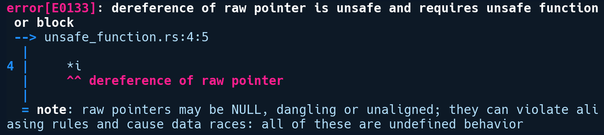
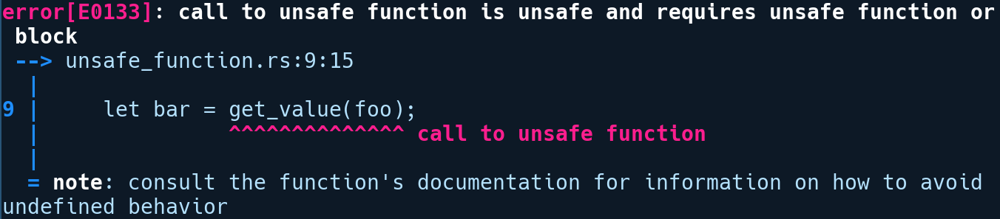
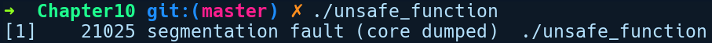

### 10.1.1　不安全的函数和代码块

让我们看看不安全的函数和代码块，先从不安全的函数开始：

```rust
// unsafe_function.rs
fn get_value(i: *const i32) -> i32 {
    *i
}
fn main() {
    let foo = &1024 as *const i32;
    let _bar = get_value(foo);
}
```

我们定义了一个get_value函数，它接收一个指向i32值的指针，该函数只需直接返回指针指向值的解引用即可。在main函数中，我们将变量foo传递给get_value，这是由1024转型为*const i32后引用的i32值。如果我们尝试运行它，将会得到如下错误提示信息：


如前所述，我们需要一个不安全的函数或代码块来解引用原始指针。让我们遵循第一条建议，并在函数前面添加关键字unsafe：

```rust
unsafe fn get_value(i: *const i32) -> i32 {
    *i
}
```

现在，让我们再试一次：


有趣的是我们摆脱了get_value函数中的错误，但是在main函数中执行相关调用时又出现了另一个错误。调用不安全的函数时需要我们将其包装在不安全的代码块中，这是因为除了Rust的不安全函数之外，有的不安全函数也可以在extern代码块中声明，但这是由其他语言构造的函数。这可能返回调用方期望的值，也可能返回完全错误的值。因此，在调用不安全函数时，我们需要用到unsafe代码块。将代码进行修改，以便在不安全的代码块中调用get_value，如下所示：

```rust
fn main() {
    let foo = &1024 as *const i32;
    let bar = unsafe { get_value(foo) };
}
```

unsafe代码块是表达式，所以我们需要删除get_value之后的分号，并将它移动到unsafe代码块之外，从而将get_value的返回值分配给bar。经过这些修改，我们的程序顺利通过编译。

不安全函数的行为和普通函数类似，除了可以在其中执行上述操作，将函数声明为不安全的会让它不能像普通函数那样被调用。但是我们可以通过另一种方式构造get_value函数：

```rust
fn get_value(i: *const i32) -> i32 {
    unsafe {
        *i
    }
}
```

上述代码看上去和前面的类似，但包含一个重大的变化。我们将关键字unsafe从函数签名前面移动到了其内部的不安全代码块。该函数现在执行相同的不安全操作，但是被包装到一个看起来像普通安全函数的函数内部。现在，我们可以调用此函数，但不需要在调用端使用unsafe代码块。这种技术通常用来提供看上去安全的程序库接口，即使它们在内部会执行一些不安全的操作。显然，如果你这样做，那么应该特别留意不安全代码块的正确性。标准库中有相当多的API采用了这种将不安全的操作隐藏在unsafe代码块的范式，同时在表面上提供安全的API。例如，String类型的insert方法，给定索引idx处插入一个字符ch，其定义如下所示：

```rust
pub fn insert(&mut self, idx: usize, ch: char) {
    assert!(self.is_char_boundary(idx));
    let mut bits = [0; 4];
    let bits = ch.encode_utf8(&mut bits).as_bytes();
    unsafe {
        self.insert_bytes(idx, bits);
    }
}
```

首先，如果传递给它的idx位于UTF-8编码的代码点序列的开头或结尾，它会执行断言。然后，它将传递给它的ch编码为字节序列。最后，它在一个不安全的代码块中调用不安全的方法insert_bytes，并传入idx和bits。

标准库中有很多这样的API，并且具有类似的实现，它们在内部依赖于不安全的代码块，要么需要提升性能，要么需要对值的各个部分进行可变访问，这是因为所有权规则会对上述操作有所限制。

现在，如果我们调用前面片段中的get_value函数，并使用一个数字作为参数，然后将其转换为指针，那么你可以猜测将会发生什么：

```rust
unsafe_function(4 as *const i32);
```

运行上述代码后，得到以下输出结果：


这是一个很明显的分段错误提示信息。从上述信息得出的结论是，即使在表面看上去很安全，不安全的函数也可以在用户提供错误的值时被忽视或刻意误用。因此，如果需要从程序库中公开不安全的API，那么其中操作的安全性取决于用户提供的参数，开发者应该清楚地说明这一点，以确保它们没有传递无效值并将函数标记为不安全的（unsafe），而不是在内部使用不安全的代码块（unsafe{}）。

不安全的代码块后面的安全包装器函数不应该真正暴露给调用方，而是将实现细节隐藏于程序库中，就像许多标准库API的实现那样。如果你不能确定在不安全的代码周围构造了安全的包装器，那么应该将该函数标记为不安全的。

