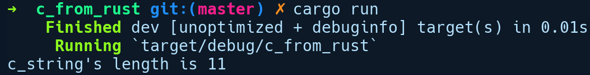

### 10.2　在Rust中调用C代码

首先，我们将探讨在Rust中调用C代码的示例。我们将创建一个新的二进制软件包，并从中调用在单独的C文件中定义的C函数。让我们通过运行cargo new c_from_rust命令来创建一个新项目。在该项目目录下，我们将添加C源代码，即mystrlen.c文件，其中包含如下代码：

```rust
// c_from_rust/mystrlen.c
unsigned int mystrlen(char *str) {
    unsigned int c;
    for (c = 0; *str != '\0'; c++, *str++);
    return c;
}
```

其中包含一个简单的函数mystrlen，该函数会返回传递给它的字符串长度。我们希望从Rust调用mystrlen，为此需要将此C源代码编译为静态库。在接下来的内容中有一个示例，其中我们会将动态库链接到共享库。我们将在Cargo.toml文件中将cc软件包作为依赖项构建：

```rust
# c_from_rust/Cargo.toml
[build-dependencies]
cc = "1.0"
```

通过正确的链接器标志，cc软件包完成了将C源代码编译和链接为二进制文件的所有繁重工作。为了声明我们的构建命令，需要在软件包根目录下添加一个build.rs文件，其中包含以下内容：

```rust
// c_from_rust/build.rs
fn main() {
    cc::Build::new().file("mystrlen.c")
                    .static_flag(true)
                    .compile("mystrlen");
}
```

我们创建了一个新的构建实例，并在将静态对象文件的名称传递给compile方法之前传递了C源文件名，同时将静态标记设置为true。在编译任何项目文件之前，Cargo会运行build.rs中的相关内容。从bulid.rs运行代码时，cc软件包会指定在C程序库中附加传统的lib前缀，因此编译生成的静态程序库位于target/debug/build/c_from_rust-5c739ceca32833c2/　out/libmystrlen.a。

现在，我们还需要告诉Rust存在mystrlen函数。这是通过extern代码来完成的，因为可以在其中指定来自其他语言的元素。我们的main.rs文件如下所示：

```rust
// c_from_rust/src/main.rs
use std::os::raw::{c_char, c_uint};
use std::ffi::CString;
extern "C" {
    fn mystrlen(str: *const c_char) -> c_uint;
}
fn main() {
    let c_string = CString::new("C From Rust").expect("failed");
    let count = unsafe {
        mystrlen(c_string.as_ptr())
    };
    println!("c_string's length is {}", count);
}
```

我们导入了一些来自std::os::raw模块的内容，其中包含与原始C类型兼容的类型，并且名称接近于它们的C语言中的对应的内容名称。对于数字类型，类型前面的单个字母表示该类型是无符号的。例如，无符号整数定义为c_uint。在我们的extern模块的mystrlen声明中，将一个*const c_char作为输入参数，它等效于C语言中的char *，并返回一个c_uint作为输出。我们还从std::ffi模块导入了CString类型，因为我们需要一个与C语言兼容的字符串传递给mystrlen函数。std::ffi模块包含很多实用程序和类型，可以轻松地进行跨语言交互。

如你所见，在extern代码块中，其关键字后面包含一个字符串"C"。这个"C"用于指定我们希望编译器的代码生成器是C ABI（cdecl），以便函数调用完全遵循C语言的函数调用方式。应用程序二进制接口（Application Binary Interface，ABI）基本上是一组规则和约定，用于指定类型和函数在底层如何表示和操作。该函数调用约定是ABI规范的一个方面。这与API对程序库用户的意义非常相似。在函数的上下文中，API用于指定可以从程序库调用的函数，而ABI用于指定调用函数的底层机制。调用约定规定了诸如函数参数是存储在寄存器中，还是存储在堆栈中，以及调用者是否应该在函数返回时清除寄存器/堆栈状态或者调用者等其他细节。我们也可以忽略指定它，因为cdecl是Rust对在extern模块中声明的元素的默认ABI。cdecl是一个调用约定，大多数C编译器都使用它进行函数调用。Rust还支持其他ABI，例如fastcall、win64等，这需要根据你所针对的平台而选择，并将其放在extern代码块之后。

在main函数中，我们使用了std::ffi模块中特定版本的CString字符串，因为C语言中的字符串是以空字符结尾的，而Rust中的字符串不是。CString会执行所有相关的检查，为我们提供一个与C语言兼容的版本的字符串，这使我们的字符串中间不包含空字符，并且确保字符串是以空字符结尾的。ffi模块主要包含两种字符串类型。

+ std::ffi::CStr表示一个类似于&str的借用C字符串。它可以引用在C语言中创建的字符串。
+ std::ffi::CString表示与外部C函数兼容并且包含所有权的字符串。它通常用于将字符串从Rust代码传递到外部C函数。

因为我们想要将一个字符串从Rust端传递到我们刚刚定义的函数，所以这里使用了CString类型。接下来，我们在一个不安全的代码块中调用mystrlen，将c_string作为指针传入。然后我们将输出字符串长度。现在，我们需要做的就是运行cargo run 命令。以下是上述程序的输出结果：


cc软件包能够自动识别需要调用的C编译器。我们的例子中，在Ubuntu上会自动调用GCC来链接C程序库。现在，这里需要做一些改进。首先，我们必须在一个不安全的代码块中调用该函数是很尴尬的，因为我们知道这个操作是安全的。而且该C程序实现是合理的，至少对于这个小功能是如此的。其次，如果CString创建失败，我们会感到沮丧。为了解决这个问题，我们可以创建一个安全的包装器函数。对最简单的形式来说，这只是意味着创建一个在不安全的代码内调用外部函数的函数：

```rust
fn safe_mystrlen(str: &str) -> Option<u32> {
    let c_string = match CString::new(str) {
        Ok(c) => c,
        Err(_) => return None
    };
    unsafe {
        Some(mystrlen(c_string.as_ptr()))
    }
}
```

现在我们的safe_mystrlen函数会返回Option，如果CString创建失败，则返回None，然后调用包含在不安全代码块中的mystrlen，它会返回Some。调用safe_mystrlen函数就像调用其他Rust函数一样。如果可能，建议为外部函数构造安全的包装器，注意不安全代码块中发生的所有异常都需要正确处理，以便程序库的用户不会在其代码中执行不安全的操作。

