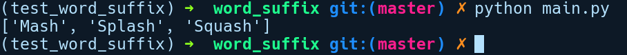

### 10.5　使用PyO3构造原生Python扩展

在本节中，我们将探讨如何使用Python调用Rust代码。Python社区一直是原生模块的重度用户，例如NumPy、Lxml、OpenCV等，并且其中大多数的底层实现都是由C/C++完成的。使用Rust作为原生C/C++模块的替代方案，对许多Python项目的性能和安全性都是一个主要优势。为了方便演示，我们将创建一个在Rust中实现的原生Python模块。其中会采用PyO3，这是一个非常流行的项目，它为Python解析器提供Rust绑定，并隐藏了所有底层细节，从而提供非常直观的API。该项目在GitHub上。它支持Python 2和 Python 3版本。PyO3是快速演进的版本，撰写本书时它只支持夜间版Rust，所以我们将使用特定版本的PyO3，即0.4.1版本，以及特定夜间版的Rust编译器。

让我们通过运行cargo new word_suffix --lib命令创建一个新项目。该程序库会暴露一个名为word_suffix的Python模块，它包含一个函数find_words，接收以逗号分隔的单词字符串，然后返回该文本中以给定后缀结尾的所有单词。一旦构建了该模块，我们就可以像普通的Python模块那样导入此模块。

在进行代码实现之前，我们需要为此项目切换到特定夜间版的Rust编译器，即rustc 1.30.0-nightly（33b923fd4 2018-08-18）。我们可以通过在当前目录（word_suffix/）中运行rustup override set nightly-2018-08-19 来覆盖编译器以使用特定的夜间版。

首先，我们将在Cargo.toml文件中指定依赖项：

```rust
# word_suffix/Cargo.toml
[package]
name = "word_suffix"
version = "0.1.0"
authors = ["Rahul Sharma <creativcoders@gmail.com>"]
[dependencies]
pyo3 = "0.4"
[lib]
crate-type = ["cdylib"]
```

这里我们将pyo3作为唯一的依赖项予以添加。如你所见，在[lib]部分中，我们将crate-type指定为cdylib，这意味着生成的程序库类似于C共享库（Linux中的.so），Python已经知道该如何调用它。现在，让我们在lib.rs中添加代码实现：

```rust
// word_suffix/src/lib.rs
//!在Rust中演示一个Python模块，
//!用于提取以逗号分隔的单词串中指定后缀结尾的单词
#[macro_use]
extern crate pyo3;
use pyo3::prelude::*;
/// 这是一个用Rust实现的Python模块
#[pymodinit]
fn word_suffix(_py: Python, module: &PyModule) -> PyResult<()> {
    module.add_function(wrap_function!(find_words))?;
    Ok(())
}
#[pyfunction]
fn find_words(src: &str, suffix: &str) -> PyResult<Vec<String>> {
    let mut v = vec![];
    let filtered = src.split(",").filter_map(|s| {
        let trimmed = s.trim();
        if trimmed.ends_with(&suffix) {
            Some(trimmed.to_owned())
        } else {
            None
        }
    });
    for s in filtered {
        v.push(s);
    }
    Ok(v)
}
```

首先，我们导入了pyo3软件包，以及prelude模块与Python相关的所有类型。然后，我们定义了一个word_suffix函数，并用#[pymodinit]属性注释它。这就构成了我们的Python模块，可以向其中导入任意后缀为.py 的文件。该函数会接收两个参数，第1个参数是Python，这是pyo3中大多数Python相关操作所需的标记类型，用于指定特定操作修改Python解析器的状态。第2个参数是PyModule实例，它表示一个Python模块对象。通过这个实例，我们将调用add_function函数，从而将find_words函数封装到wrap_function!宏中。wrap_function!宏对提供的Rust函数进行一些操作，将其转换为Python兼容的函数。

接下来是find_words函数，它是该程序的重点。我们使用#[pyfunction]属性对其进行包装，它会对函数的参数和返回类型执行转换，以便与Python函数兼容。find_words函数的代码实现非常简单。首先，创建一个vec集合，v用于保存已过滤的单词列表。然后，通过拆分“,”来过滤src字符串，之后对其进行过滤和映射操作。Split(",")调用会返回一个迭代器，我们在该迭代器上调用filter_map方法，此方法接收一个包含拆分字符s的闭包作为参数。首先通过调用s.trim()将s中的所有空格删除，然后检查它是否以我们提供的字符为后缀结束。如果是这样，它将会转换成一个包含所有权的String，并包装到Some中返回；否则，它会返回None。最后迭代器遍历访问所有已过滤的单词（如果有的话），将它们推送到v中然后返回。

解释过上述代码之后，就该构建Python模块了。为此，我们有pyo3-pack，它是来自pyo3项目的另一款工具，可以自动化完成构造原生Python模块的整个过程。此工具还能将构建的软件包发布到Python软件包索引（Python Package Index，PyPI）网站上。为了安装pyo3-pack，需要执行cargo install pyo3-pack命令。现在，我们可以将软件包生成为Python的wheel格式（.whl），之后可以使用pyo3-pack develp对其进行本地安装。在此之前，我们需要Python处于虚拟环境，因为pyo3-pack develop命令需要。

可以通过运行如下代码来创建我们的虚拟环境：

```rust
virtualenv -p /usr/bin/python3.5 test_word_suffix
```

这里我们使用的是Python 3.5。此后需要运行如下代码来激活运行环境：

```rust
source test_word_suffix/bin/activate
```

如果你没有安装pip3或者virtualenv，那么可以运行下列代码来安装它们：

```rust
sudo apt-get install python3-pip
sudo pip3 install virtualenv
```

接下来可以使用的pyo3-pack develop分别为Python 2和Python 3，构建wheel文件，并在虚拟环境中对其进行本地安装。

我们可以在word_suffix目录中创建一个简单的main.py文件，并导入该模块，以便查看是否可以使用该模块：

```rust
# word_suffix/main.py
import word_suffix
print(word_suffix.find_words("Baz,Jazz,Mash,Splash,Squash", "sh"))
```

执行python main.py命令之后，我们得到以下输出结果：


结果看上去还不错，不过这是一个非常简单的例子。对于复杂的用例，你还需要了解更多的细节。要了解与之有关的详情，可以访问pyo3网站上的帮助信息。

