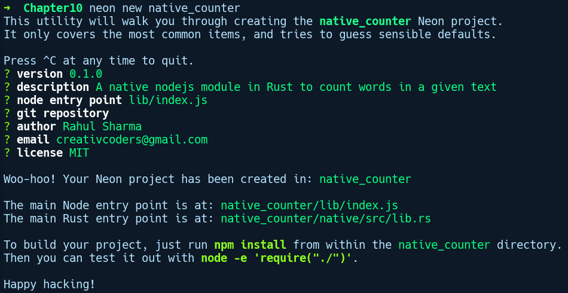

### 10.6　在Rust中为Node.js创建原生扩展

有时，Node.js运行时其上的JavaScript性能并不一定能满足用户需要，因此开发者可以使用其他低级语言来创建原生的Node.js模块。通常，C/C++会被用作实现这些原生模块的编程语言。Rust也可以通过我们在C语言和Python中看到的FFI抽象来创建原生的Node.js模块。在本节中，我们将探讨这些FFI抽象的高级包装器，它被称为neon项目，这是由Mozilla基金会的Dave Herman创建的。

neon项目包含一组工具和胶水代码，能够帮助Node.js开发者提高开发效率，允许他们在Rust中编写原生的Node.js模块，并在他们的JavaScript代码中无缝集成。该项目的部分程序是由JavaScript构建的：在neon-cli软件包中有一个名为neon的命令行工具，还有一个JavaScript兼容库，以及一个Rust端兼容库。Node.js本身对加载原生模块提供了良好的支持，并且neon会使用上述相同的支持技术。

在接下来的示例中，我们将在Rust中构建一个Node.js模块作为npm软件包，公开一个可以计算一大块文本中给定单词出现次数的函数。然后，我们将导入此软件包，并在main.js文件中测试上述公开的函数。此示例需要安装Node.js（v11.0.0）及其软件包管理器npm（6.4.1）。如果你没有安装Node.js和npm，还需要搭建相应的运行环境。

安装完成后，需要运行以下命令使用npm安装neon-cli：

```rust
npm install --global neon-cli
```

由于我们希望全局可以使用此工具在任何地方创建新项目，因此传递了--global标记给它。neon-cli工具用于创建包含neon支持框架的Node.js项目。安装完成后，我们通过运行neon new native_counter来创建项目，它会提示项目的基本信息，如下图所示：


这是此命令为我们创建的目录结构：

```rust
native_counter tree
.
├── lib
│   └── index.js
├── native
│   ├── build.rs
│   ├── Cargo.toml
│   └── src
│       └── lib.rs
├── package.json
└── README.md
```

neon为我们创建的项目结构与通常使用lib目录和package.json的npm软件包结构相同。除了Node.js软件包结构之外，它还为我们在原生目录中创建了一个cargo项目，其中包含以下初始代码。让我们来看看这个目录中的内容是什么，先从Cargo.toml文件开始：

```rust
# native_counter/native/Cargo.toml
[package]
name = "native_counter"
version = "0.1.0"
authors = ["Rahul Sharma <creativcoders@gmail.com>"]
license = "MIT"
build = "build.rs"
exclude = ["artifacts.json", "index.node"]
[lib]
name = "native_counter"
crate-type = ["dylib"]
[build-dependencies]
neon-build = "0.2.0"
[dependencies]
neon = "0.2.0"
```

值得注意的是[lib]部分，它将软件包的类型指定为dylib，这意味着我们需要使用Rust创建一个共享程序库。在项目根目录下还有一个自动生成的build.rs文件，它可以通过调用其中的neon_build::setup()来完成一些初始环境配置。接下来，我们将删除lib.rs文件中的现有代码并添加以下代码：

```rust
// native_counter/native/src/lib.rs
#[macro_use]
extern crate neon;
use neon::prelude::*;
fn count_words(mut cx: FunctionContext) -> JsResult<JsNumber> {
    let text = cx.argument::<JsString>(0)?.value();
    let word = cx.argument::<JsString>(1)?.value();
    Ok(cx.number(text.split(" ").filter(|s| s == &word).count() as f64))
}
register_module!(mut m, {
    m.export_function("count_words", count_words)?;
    Ok(())
});
```

首先，我们导入了neon软件包，然后导入了prelude模块中的宏和所有元素。接下来，我们定义了一个函数count_words，它会接收一个FunctionContext实例作为参数。它包含JavaScript中被调用的活动函数的相关信息，例如参数列表、参数长度、this绑定，以及其他细节。我们希望调用方将两个参数传递给count_words函数——首先是文本，其次是文本中要搜索的单词。我们可通过调用cx实例上的参数方法并将相应的索引传递给它来提取这些值，还使用turbofish运算符来要求它给出JsString类型的值。在返回的JsString实例上，我们调用value方法以获取Rust的String值。

在完成参数提取之后，我们使用空格对文本进行分割，并在迭代器链上调用count()方法以在统计匹配单词出现的次数之前过滤包含给定单词的文本块：

```rust
text.split(" ").filter(|s| s == &word).count()
```

count()方法会返回usize。但是其会将uszie转换为f64，因为在cx上的number方法上绑定的是Into<f64>特征。上述操作完成后，将通过调用cx.number()来包装该表达式，它创建了一个兼容JavaScript的JsNumber类型。count_words方法返回一个JsResult<JsNumber>类型，因为访问参数可能会失败，并且即使返回正确的JavaScript类型也可能会失败。JsResult类型中的错误变体表示从JavaScript端抛出的任意异常。

接下来将使用register_module!宏注册count_words函数。此宏会获取ModuleContext实例的可变引用m。在此实例中，我们通过调用export_function函数导出函数，将函数名称作为字符串传递，将实际的函数类型作为第二个参数传递。

以下是我们更新index.js文件后的内容：

```rust
// native_counter/lib/index.js
var word_counter = require('../native');
module.exports = word_counter.count_words;
```

由于index.js是npm的根入口，我们需要引用上述原生模块，并且必须使用module.exports直接在根目录下导出函数。接下来就可以使用如下代码构建我们的模块：

```rust
neon build
```

构建完成后，我们可以通过在native_counter目录下创建一个简单的main.js文件来测试它，其中包含以下代码：

```rust
// native_counter/main.js
var count_words_func = require('.');
var wc = count_words_func("A test text to test native module", "test");
console.log(wc);
```

我们将通过运行如下代码来执行此文件：

```rust
node main.js
```

它给我们的输出结果是2。现在我们探讨Rust与其他语言交互的精彩之旅就结束了。事实证明，Rust在这种交互中非常流畅。在其他语言不能识别Rust的复杂数据类型的情况下交互存在粗糙的边界，但这是可以理解的，因为每种语言的具体实现存在不同。

