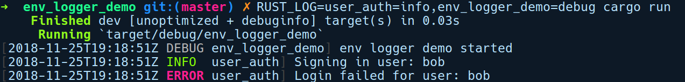

### 11.5.2　env_logger

env_logger是一个简单的日志记录实现，它允许你通过环境变量RUST_LOG将日志记录输出到stdout或stderr。此环境变量的值是逗号分隔的记录器字符串，对应模块名称和日志级别。为了演示env_logger的应用，我们将通过运行cargo new env_logger_demo命令并指定log、env_logger及我们在上一小节创建的user_auth库的依赖关系来创建一个新的二进制软件包。以下是我们的Cargo.toml文件：

```rust
# env_logger_demo/Cargo.toml
[dependencies]
env_logger = "0.6.0"
user_auth = { path = "../user_auth" }
log = { version = "0.4.6", features = ["release_max_level_error",
"max_level_trace"] }
```

以下是我们的main.rs文件：

```rust
// env_logger_demo/src/main.rs
use log::debug;
use user_auth::User;
fn main() {
    env_logger::init();
    debug!("env logger demo started");
    let user = User::new("bob", "super_sekret");
    user.sign_in("super_secret");
    user.sign_in("super_sekret");
}
```

我们创建了User实例并调用sign_in方法，将我们的密码作为参数传入。第1次尝试登录失败，将记录为一个错误事件。我们可以通过设置RSUT_LOG环境变量来运行它，然后运行cargo run命令：

```rust
RUST_LOG=user_auth=info,env_logger_demo=info cargo run
```

我们将user_auth软件包的日志记录级别设置为info及以上级别，而将来自env_logger_demo软件包的日志记录设为debug及以上级别。

运行程序后得到以下输出结果：


RUST_LOG接受RUST_LOG=path::to_module=log_level[,]模式，其中path::to_module用于指定记录器，并且应该是以软件包名称为基础的任何模块的路径。log_level是日志软件包中定义的任何日志级别。最后的[,]表示我们可以将这些记录器规范中的任意一个用逗号进行分隔。

运行上述程序的另一种方法是使用标准库env模块中的set_var方法在代码中设置环境变量：

```rust
std::env::set_var("RUST_LOG", "user_auth=info,env_logger_demo=info cargo
run");
env_logger::init();
```

这将生成与前面代码相同的输出。接下来，我们来看一个更复杂、高度可配置的日志软件包。

