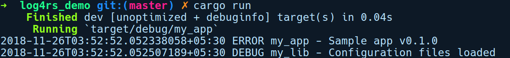

### 11.5.3　log4rs

顾名思义，log4rs软件包的灵感来自Java的Log4j库。此软件包比env_logger强大得多，并允许用户通过YAML文件进行细粒度的记录器配置。

我们将创建两个软件包来演示通过log4rs集成日志记录功能。一个是程序库cargo new my_lib --lib，另一个是我们的二进制软件包cargo new my_app，它会引用my_lib。Cargo工作区目录是log4rs_demo，其中包含上述两个软件包。

我们的my_lib软件包的lib.rs文件包含以下内容：

```rust
// log4rs_demo/my_lib/lib.rs
use log::debug;
pub struct Config;
impl Config {
    pub fn load_global_config() {
        debug!("Configuration files loaded");
    }
}
```

它有一个名为Config的结构体，包含一个名为load_global_config的简单方法，它在debug级别记录日志消息。接下来，我们的my_app软件包中的main.rs文件中将包含以下内容：

```rust
// log4rs_demo/my_app/src/main.rs
use log::error;
use my_lib::Config;
fn main() {
    log4rs::init_file("config/log4rs.yaml", Default::default()).unwrap();
    error!("Sample app v{}", env!("CARGO_PKG_VERSION"));
    Config::load_global_config();
}
```

在上述代码中，我们通过init_file方法初始化log4rs记录器，并将路径传递给log4rs.yaml配置文件。接下来，我们记录了一条简单的错误提示信息，从而输出应用程序版本。然后我们调用load_global_config方法，它会记录另一条消息。以下是log4rs.yaml配置文件中的内容：

```rust
# log4rs_demo/config/log4rs.yaml
refresh_rate: 5 seconds
root:
  level: error
  appenders:
    - stdout
appenders:
  stdout:
    kind: console
  my_lib_append:
    kind: file
    path: "log/my_lib.log"
    encoder:
      pattern: "{d} - {m}{n}"
loggers:
  my_lib:
    level: debug
  appenders:
    - my_lib_append
```

让我们对上述文件进行详细解释。第一行中的refresh_rate指定log4rs在此之后重新加载配置文件以说明对相关文件所做的任何更改的时间间隔。这意味着我们可以修改YAML文件和log4rs中的任何值，从而为我们动态地重新配置日志记录器。然后，我们有根记录器，它是所有记录器的父记录器。我们将日志默认级别指定为错误，将输出源（appenders）设置为stdout，其详细定义在随后的代码行中。

接下来，我们到了输出源部分，输出源表示日志的输出目标。我们指定两个输出源：stdout表示控制台类型，my_lib_append表示一个文件输出端，它包含有关文件路径和后续编码器部分使用的日志模式的信息。

接下来是日志记录器，我们可以根据软件包和模块的级别来定义日志记录器。我们定义了一个名为my_lib的日志记录器，它用于适配my_lib软件包，其日志级别为debug，输出源为my_lib_append。这意味着来自my_lib软件包的任何日志都会转到my_lib.log文件，因为这是由输出源my_lib_append指定的。

通过在log4rs_demo目录下运行cargo run命令，我们得到以下输出结果：


以上是对log4rs的简要介绍。如果你希望了解配置这些日志的更新信息，可以访问帮助文档。

