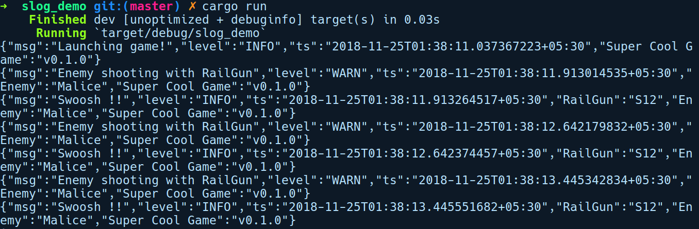

### 11.5.4　使用slog进行结构化日志记录

上述所有软件包都非常有用，是大多数相关用例的理想选择，但它们不支持结构化日志记录。在本小节中，我们将看到如何使用slog软件包将结构化日志记录集成到应用程序中，slog软件包是Rust生态系统中为数不多的、流行的结构化日志记录软件包。对于这个演示，我们将通过运行cargo new slog_demo命令创建一个新项目，它会模拟一个射击游戏。

在我们的Cargo.toml文件中需要以下依赖项：

```rust
# slog_demo/Cargo.toml
[dependencies]
rand = "0.5.5"
slog = "2.4.1"
slog-async = "2.3.0"
slog-json = "2.2.0"
```

slog 软件包对模块之间存在大量交互的中大型项目非常适合，因为它有助于整合详细日志以进行长期的事件监控。它的工作原理是在应用程序中提供分层和可组合的日志记录配置，并支持语义事件记录。在熟练使用该软件包之前，你需要注意其中两个重要的概念：记录器和排水管（drain）。记录器对象用于记录事件，而排水管是一个抽象，用于指定日志消息的位置以及它们如何送达目标。这可以是你的标准输出、文件，或者网络套接字。排水管类似于C#中的Serilog框架中被称为Sink的东西。我们的示例将基于其动作来模拟简单的游戏实体的游戏事件。这些实体在游戏中具有父子关系，我们可以使用slog软件包中的结构化日志配置很容易地在其中附加分层日志记录功能。当看到代码时，我们将了解到这一点。在根级别，我们有Game实例，可以将其定义为根记录器，以便在我们的日志消息中提供基础上下文，例如游戏名称和版本。因此，我们将创建一个附加到Game实例的根记录器。接下来我们有Player和Enemy类型，它们是Game的子实体。这些会成为根记录器的子记录器。然后，我们为敌人（enemy）和玩家（player）提供武器（weapon），这又成为玩家和敌人记录器的子记录器。如你所见，slog软件包的配置比我们之前看到的软件包更复杂。

除了作为基础的slog软件包之外，我们的示例中还将使用如下软件包。

+ slog-async：提供异步日志记录，将日志记录调用与主线程分离。
+ slog-json：将消息以JSON格式输出到任何写入器（writer）的管道。

本示例中我们将会使用stdout()作为写入器实例。

以下是我们的main.rs文件：

```rust
// slog_demo/main.rs
#[macro_use]
extern crate slog;
mod enemy;
mod player;
mod weapon;
use rand::Rng;
use std::thread;
use slog::Drain;
use slog::Logger;
use slog_async::Async;
use std::time::Duration;
use crate::player::Player;
use crate::enemy::Enemy;
pub trait PlayingCharacter {
    fn shoot(&self);
}
struct Game {
    logger: Logger,
    player: Player,
    enemy: Enemy
}
impl Game {
    fn simulate(&mut self) {
        info!(self.logger, "Launching game!");
        let enemy_or_player: Vec<&dyn PlayingCharacter> = vec![&self.enemy,
&self.player];
        loop {
            let mut rng = rand::thread_rng();
            let a = rng.gen_range(500, 1000);
            thread::sleep(Duration::from_millis(a));
            let player = enemy_or_player[{
                if a % 2 == 0 {1} else {0}
            }];
            player.shoot();
        }
    }
}
```

在上述代码中，我们有一堆use语句，之后是我们的PlayingCharacter特征，这是由我们的Player和Enemy结构体予以实现的。我们的Game结构体有一个simulate方法，它只是简单地执行循环和随机休眠，以便随机地选择玩家或敌人，再调用它们的 shoot 方法。接下来让我们看看main.rs文件：

```rust
// slog_demo/src/main.rs
fn main() {
    let drain = slog_json::Json::new(std::io::stdout()).add_default_keys()
                                                     .build()
                                                     .fuse();
    let async_drain = Async::new(drain).build().fuse();
    let game_info = format!("v{}", env!("CARGO_PKG_VERSION"));
    let root_log_context = o!("Super Cool Game" => game_info);
    let root_logger = Logger::root(async_drain, root_log_context);
    let mut game = Game { logger: root_logger.clone(),
                          player: Player::new(&root_logger, "Bob"),
                          enemy: Enemy::new(&root_logger, "Malice") };
    game.simulate()
}
```

在main函数中，我们首先使用slog_json::Json创建了变量drain，它可以将消息记录为JSON对象；然后将其传递给另一种管道Async，它会将所有日志调用转移到单独的线程。然后，我们通过使用简便的o!宏传递日志消息的初始上下文来创建root_logger。在该宏中，我们只需使用环境变量CARGO_PKG_VERSION输出游戏的名称和版本。接下来，我们的Game结构体会接收根记录器以及enemy和player实例。对于Player和Enemy实例，我们可以传递一个引用给root_logger，使用它们创建其子记录器。然后，我们在game实例上调用simulate方法。

以下是player.rs中的代码：

```rust
// slog_demo/src/player.rs
use slog::Logger;
use weapon::PlasmaCannon;
use PlayingCharacter;
pub struct Player {
    name: String,
    logger: Logger,
    weapon: PlasmaCannon
}
impl Player {
    pub fn new(logger: &Logger, name: &str) -> Self {
        let player_log = logger.new(o!("Player" => format!("{}", name)));
        let weapon_log = player_log.new(o!("PlasmaCannon" => "M435"));
        Self {
            name: name.to_string(),
            logger: player_log,
            weapon: PlasmaCannon(weapon_log),
        }
    }
}
```

在这里，我们的Player上的new方法获取了根记录器，它将自己的上下文添加到o!宏。我们还为weapon创建了一个记录器，并将player的记录器传递给它，它会在其中添加自己的信息，例如武器的ID。最后，我们返回经过配置的Player实例：

```rust
impl PlayingCharacter for Player {
    fn shoot(&self) {
        info!(self.logger, "{} shooting with {}", self.name, self.weapon);
        self.weapon.fire();
    }
}
```

我们还为Player实现了PlayingCharacter特征。

接下来是enemy.rs文件，它与我们在player.rs中声明的内容大致相同：

```rust
// slog_demo/src/enemy.rs
use weapon::RailGun;
use PlayingCharacter;
use slog::Logger;
pub struct Enemy {
    name: String,
    logger: Logger,
    weapon: RailGun
}
impl Enemy {
    pub fn new(logger: &Logger, name: &str) -> Self {
        let enemy_log = logger.new(o!("Enemy" => format!("{}", name)));
        let weapon_log = enemy_log.new(o!("RailGun" => "S12"));
        Self {
            name: name.to_string(),
            logger: enemy_log,
            weapon: RailGun(weapon_log)
        }
    }
}
impl PlayingCharacter for Enemy {
    fn shoot(&self) {
        warn!(self.logger, "{} shooting with {}", self.name, self.weapon);
        self.weapon.fire();
    }
}
```

然后是我们的weapon.rs文件，其中包含enemy和player实例使用的武器：

```rust
// slog_demo/src/weapon.rs
use slog::Logger;
use std::fmt;
#[derive(Debug)]
pub struct PlasmaCannon(pub Logger);
impl PlasmaCannon {
    pub fn fire(&self) {
        info!(self.0, "Pew Pew !!");
    }
}
#[derive(Debug)]
pub struct RailGun(pub Logger);
impl RailGun {
    pub fn fire(&self) {
        info!(self.0, "Swoosh !!");
    }
}
impl fmt::Display for PlasmaCannon {
    fn fmt(&self, f: &mut fmt::Formatter) -> fmt::Result {
        write!(f, stringify!(PlasmaCannon))
    }
}
impl fmt::Display for RailGun {
    fn fmt(&self, f: &mut fmt::Formatter) -> fmt::Result {
        write!(f, stringify!(RailGun))
    }
}
```

这就是我们的模拟游戏所需的一切。现在我们可以通过cargo run命令来运行它。以下是该程序的输出结果：


如你所见，我们的game实体会发送日志消息，然后在slog软件包及其管道的帮助下将其格式化为JSON并输出。与我们之前使用的JSON管道类似，Rust社区为slog这样的软件包构造了很多类似的管道。

我们可以通过某个管道直接将日志消息输出到日志聚合服务，该服务知道如何处理JSON数据，并轻松地将它们编入索引以便高效地检索日志。slog的可插拔性和可组合性使其从其他日志记录方案中脱颖而出。通过该示例，我们即将结束Rust日志记录之旅。但是，还有很多其他更有趣的日志框架可供你探索。

