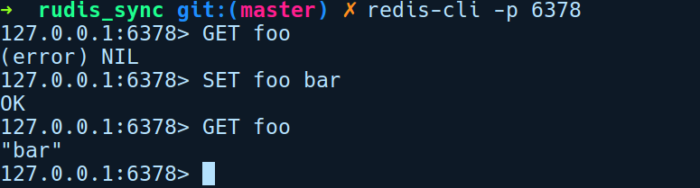
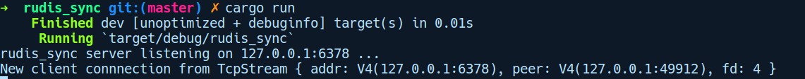
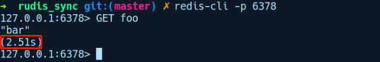

### 构建同步Redis服务器

为了让这个例子浅显易懂，我们的Redis 复制版将是一个非常小的RESP协议子集，并且只能处理SET和GET调用。我们将使用Redis官方软件包附带的官方redis-cli对我们的服务器进行查询。要使用redis-cli，我们可以通过运行apt-get install redis-server命令在Ubuntu系统上安装它。

让我们通过运行cargo new rudis_sync命令创建一个新项目，并在我们的Cargo.toml文件中添加如下依赖项：

```rust
rudis_sync/Cargo.toml
[dependencies]
lazy_static = "1.2.0"
resp = { git = "https://github.com/creativcoder/resp" }
```

我们将项目命名为rudis_sync，并且会用到以下两个软件包。

+ lazy_static：将使用它来存储我们的内存数据库。
+ resp：这是托管在我们的GitHub版本库上的resp的复刻。我们将使用它来解析来自客户端的字节流。

为了让实现更容易理解，rudis_sync包含非常少的错误处理集成。完成代码测试后，我们鼓励你集成更好的错误处理策略。

让我们先从main.rs文件中的内容开始：

```rust
// rudis_sync/src/main.rs
use lazy_static::lazy_static;
use resp::Decoder;
use std::collections::HashMap;
use std::env;
use std::io::{BufReader, Write};
use std::net::Shutdown;
use std::net::{TcpListener, TcpStream};
use std::sync::Mutex;
use std::thread;
mod commands;
use crate::commands::process_client_request;
type STORE = Mutex<HashMap<String, String>>;
lazy_static! {
    static ref RUDIS_DB: STORE = Mutex::new(HashMap::new());
}
fn main() {
    let addr = env::args()
        .skip(1)
        .next()
        .unwrap_or("127.0.0.1:6378".to_owned());
    let listener = TcpListener::bind(&addr).unwrap();
    println!("rudis_sync listening on {} ...", addr);
    for stream in listener.incoming() {
        let stream = stream.unwrap();
        println!("New connection from: {:?}", stream);
        handle_client(stream);
    }
}
```

我们有一堆导入代码，然后是一个在lazy_static!宏中声明的内存RUDIS_DB，其类型为HashMap。我们使用它作为内存数据库来存储客户端发送的键/值对。在main函数中，我们使用用户提供的参数在addr中创建一个监听地址，或者使用127.0.0.0:6378作为默认值。然后，通过调用关联的bind方法创建一个TcpListener实例，并传递addr。

这将创建一个TCP侦听套接字。稍后，我们在listener上调用incoming方法，然后返回新客户端连接的迭代器。针对TcpStream类型（客户端套接字）的每个客户端连接steam，我们调用handle_client方法传入stream。

在同一文件中，handle_client函数负责解析从客户端发送的查询，这些查询将是GET或SET查询之一：

```rust
// rudis_sync/src/main.rs
fn handle_client(stream: TcpStream) {
    let mut stream = BufReader::new(stream);
    let decoder = Decoder::new(&mut stream).decode();
    match decoder {
        Ok(v) => {
            let reply = process_client_request(v);
            stream.get_mut().write_all(&reply).unwrap();
        }
        Err(e) => {
            println!("Invalid command: {:?}", e);
            let _ = stream.get_mut().shutdown(Shutdown::Both);
        }
    };
}
```

handle_client函数在steam变量中接收客户端TcpStream套接字。我们将客户端stream包装到BufReader中，然后将其作为可变引用传递给resp软件包的Decoder::new方法。Decoder会从stream中读取字节以创建RESP的Value类型。然后有一个匹配代码块来检查我们的解码是否成功。如果失败，将输出一条错误提示信息，并通过调用shutdown()关闭套接字，然后使用Shutdown::Both值关闭客户端套接字连接的读取和写入部分。shutdown方法需要一个可变引用，所以在此之前调用get_mut()。在实际的实现中，用户显然需要优雅地处理此错误。

如果解码成功，将会调用process_client_request，它会返回reply来响应客户端的请求。

我们通过在客户端stream上调用write_all将reply写入客户端。process_client_request函数在command.rs中的定义如下所示：

```rust
// rudis_sync/src/commands.rs
use crate::RUDIS_DB;
use resp::Value;
pub fn process_client_request(decoded_msg: Value) -> Vec<u8> {
    let reply = if let Value::Array(v) = decoded_msg {
        match &v[0] {
            Value::Bulk(ref s) if s == "GET" || s == "get" =>
handle_get(v),
            Value::Bulk(ref s) if s == "SET" || s == "set" =>
handle_set(v),
            other => unimplemented!("{:?} is not supported as of now",
other),
        }
    } else {
        Err(Value::Error("Invalid Command".to_string()))
    };
    match reply {
        Ok(r) | Err(r) => r.encode(),
    }
}
```

此函数获取已解码的Value，并将其与已解析的查询进行匹配。在上述的实现中，我们希望客户端发送一系列字符串数字，以便我们能够适配Value的变体Value::Array，使用if let语句并将数组存储到v中。如果在if分支中对Array值进行匹配，那么将获取该数组并匹配v中的第一个条目，这将是我们的命令类型，即GET或SET。这也是一个Value::Bulk变体，它将命令包装成字符串。

我们将对内部字符串的引用视为s，并且仅当字符串包含的值为GET或SET时才匹配。在值为GET的情况下，我们调用handle_get，传递数组v；在值为SET的情况下，我们调用handle_set。在else分支中，我们只使用Invalid Command作为描述信息向客户端发送Value::Error作为回复。

两个分支返回的值将分配给变量reply，然后匹配内部类型r，并通过调用其上的encode方法转换为Vec<u8>，最后从函数返回。

我们的handle_set和handle_get函数在同一文件中定义如下：

```rust
// rudis_sync/src/commands.rs
use crate::RUDIS_DB;
use resp::Value;
pub fn handle_get(v: Vec<Value>) -> Result<Value, Value> {
    let v = v.iter().skip(1).collect::<Vec<_>>();
    if v.is_empty() {
        return Err(Value::Error("Expected 1 argument for GET
command".to_string()))
    }
    let db_ref = RUDIS_DB.lock().unwrap();
    let reply = if let Value::Bulk(ref s) = &v[0] {
        db_ref.get(s).map(|e|
Value::Bulk(e.to_string())).unwrap_or(Value::Null)
    } else {
        Value::Null
    };
    Ok(reply)
}
pub fn handle_set(v: Vec<Value>) -> Result<Value, Value> {
    let v = v.iter().skip(1).collect::<Vec<_>>();
    if v.is_empty() || v.len() < 2 {
        return Err(Value::Error("Expected 2 arguments for SET
command".to_string()))
    }
    match (&v[0], &v[1]) {
        (Value::Bulk(k), Value::Bulk(v)) => {
            let _ = RUDIS_DB
                .lock()
                .unwrap()
                .insert(k.to_string(), v.to_string());
        }
        _ => unimplemented!("SET not implemented for {:?}", v),
    }
    Ok(Value::String("OK".to_string()))
}
```

在handle_get()中，我们首先检查GET命令在查询中是否包含相应的键，并在查询失败时显示错误提示信息。接下来匹配v[0]，这是GET命令的关键，并检查它是否存在于我们的数据库中。如果它存在，我们使用映射组合器将其包装到Value::Bulk，否则我们返回一个Value::NULL：

```rust
db_ref.get(s).map(|e| Value::Bulk(e.to_string())).unwrap_or(Value::Null)
```

然后我们将它存储在变量reply中，并将其作为Result类型返回，即Ok(reply)。

类似的事情还会在handle_set中发生，如果没有为SET命令提供足够的参数，就会退出程序。接下来，我们使用&v[0]和&v[1]匹配相应的键和值，并将其插入RUDIS_DB中。作为SET查询的确认，我们用OK进行回复。

回到process_client_request函数，一旦我们创建了回复字节，就会匹配Result类型，并通过调用encode()将它们转换为Vec<u8>，然后将其写入客户端。经过上述解释，接下来该使用官方的redis-cli工具对客户端进行测试。我们将通过调用redis-cli -p 6378来运行它：


在上述会话中，我们使用rudis_sync的预期回复执行了一些GET和SET查询。另外，以下是rudis_server新连接的输出日志：


但我们服务器的问题在于，用户必须等待初始客户端完成服务。为了证明这一点，将在处理新客户端连接的for循环中引入一些延迟：

```rust
for stream in listener.incoming() {
    let stream = stream.unwrap();
    println!("New connection from: {:?}", stream);
    handle_client(stream);
    thread::sleep(Duration::from_millis(3000));
}
```

sleep调用用于模拟处理请求过程中的延迟。为了查看延迟，我们几乎同时启动两个客户端，其中一个客户端发送SET请求，另一个客户端使用同一密钥发送GET请求。这是我们的第1个客户端，它执行SET请求：


这是我们的第2个客户端，它使用同一密钥对foo执行GET请求：


如你所见，第2个客户端必须等待接近3秒才能获得第2个GET回复。

由于其性质，当需要同时处理超过10000个客户端请求时，同步模式会出现瓶颈，每个客户端会占用不同的处理时间。要解决这个问题，通常需要生成一个线程来处理每个客户端连接。每当建立新的客户端连接时，我们生成一个新线程从主线程转移handle_client调用，从而允许主线程接收其他客户端连接。我们可以通过在main函数中修改一行代码来实现这一点，如下所示：

```rust
for stream in listener.incoming() {
    let stream = stream.unwrap();
    println!("New connection from: {:?}", stream);
    thread::spawn(|| handle_client(stream));
}
```

这消除了服务器的阻塞性质，但每次收到新的客户端连接时会产生构造新线程的开销。首先，产生新线程需要一些开销，其次，线程之间的上下文切换增加了另外的开销。

如你所见，我们的rudid_sync服务器能够按照预期工作，但它很快就会遇到我们的硬件能够处理线程数量的瓶颈。这种处理连接的线程模型运作良好，直到互联网开始普及，越来越多的用户接入互联网成为常态。而今天的情况有所不同，我们需要能够处理数百万个请求的高效服务器。事实证明，我们可以在更基础的层面解决客户端日益增加的问题，即采用非阻塞套接字，接下来让我们探讨它们。

