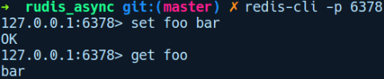

### 12.3.2　构建异步的Redis服务器

现在我们已经了解了Rust生态系统提供的异步I/O解决方案，现在是时候重新审视前面的Redis服务器实现了。我们将使用tokio和futures软件包将rudis_sync服务器移植到支持异步的版本。与任何异步代码一样，我们刚开始接触futures和tokio会有一些不适应，并且可能需要一段时间才能习惯其API。但是，这里我们尽量用简单、易懂的示例进行说明。让我们通过运行cargo new rudis_async来创建一个新项目，并在Cargo.toml文件中添加以下依赖项：

```rust
# rudis_async/Cargo.toml
[dependencies]
tokio = "0.1.13"
futures = "0.1.25"
lazy_static = "1.2.0"
resp = { git = "https://github.com/creativcoder/resp" }
tokio-codec = "0.1.1"
bytes = "0.4.11"
```

这里我们会用到的一系列软件包如下所示。

+ futures：为处理异步代码提供更清晰的抽象。
+ tokio：封装mio并提供一个运行异步代码的运行时。
+ lazy_static：允许我们创建一个可修改的动态全局变量。
+ resp：一个可以解析Redis协议消息的软件包。
+ tokio-codec：它允许用户将来自网络的字节流转换为给定类型，并根据指定的编码解码器将其解析为明确的消息。编码解码器将字节流转换为tokio生态系统中被称为帧（frame）的明文消息。
+ bytes：与tokio编码解码器一起使用，可以有效地将字节流转换为给定的帧。

我们在main.rs中的初始代码遵循类似的结构：

```rust
// rudis_async/src/main.rs
mod codec;
use crate::codec::RespCodec;
use lazy_static::lazy_static;
use std::collections::HashMap;
use std::net::SocketAddr;
use std::sync::Mutex;
use tokio::net::TcpListener;
use tokio::net::TcpStream;
use tokio::prelude::*;
use tokio_codec::Decoder;
use std::env;
mod commands;
use crate::commands::process_client_request;
lazy_static! {
    static ref RUDIS_DB: Mutex<HashMap<String, String>> =
Mutex::new(HashMap::new());
}
```

我们在lazy_static!宏中有一堆导入的软件包和相同的RUDIS_DB。然后来看我们的main函数：

```rust
// rudis_async/main.rs
fn main() -> Result<(), Box<std::error::Error>> {
    let addr = env::args()
        .skip(1)
        .next()
        .unwrap_or("127.0.0.1:6378".to_owned());
    let addr = addr.parse::<SocketAddr>()?;
    let listener = TcpListener::bind(&addr)?;
    println!("rudis_async listening on: {}", addr);
    let server_future = listener
        .incoming()
        .map_err(|e| println!("failed to accept socket; error = {:?}", e))
        .for_each(handle_client);
    tokio::run(server_future);
    Ok(())
}
```

我们解析作为参数传入的字符串或使用默认地址127.0.0.1:6378，然后使用addr创建一个新的TcpListener实例。这会在listener中返回一个future。通过在其上调用incoming方法，接收一个闭包，之后调用for_each，并在其上调用handle_client方法，从而将上述元素链接为一个future。它会存放在server_future中。最后我们调用tokio::run并将server_future传递给它。

这将创建一个tokio主任务，并用于调度future的执行。在同一文件中，我们的handle_ client函数定义如下所示：

```rust
// rudis_async/src/main.rs
fn handle_client(client: TcpStream) -> Result<(), ()> {
    let (tx, rx) = RespCodec.framed(client).split();
    let reply = rx.and_then(process_client_request);
    let task = tx.send_all(reply).then(|res| {
        if let Err(e) = res {
            eprintln!("failed to process connection; error = {:?}", e);
        }
        Ok(())
    });
    tokio::spawn(task);
    Ok(())
}
```

在handle_client中，我们首先将TcpStream分成writer(tx)和reader(rx)两部分，通过调用RespCodec的framed方法并将client连接作为参数传递，之后根据上述结果调用RudisFrame的framed方法将流转换为帧的future。接下来，我们在其上调用split方法，这会将帧分别转换为Stream和Sink的future，从而为我们提供了tx和rx，用于读取和写入客户端套接字。不过我们阅读至此，得到了解码的消息。当我们向tx写入任何内容时，写入的内容是已编码的字节序列。

在rx上，我们调用and_then方法，并将process_client_request函数作为参数传入，该函数将future解析为已解码的帧。然后我们使用另一半写入器tx，调用send_all进行回复。之后通过调用tokio::spawn生成future任务。

在我们的codec.rs文件中，我们定义了RudisFrame，其中实现了tokio-codec软件包中的Encoder和Decoder特征：

```rust
// rudis_async/src/codec.rs
use std::io;
use bytes::BytesMut;
use tokio_codec::{Decoder, Encoder};
use resp::{Value, Decoder as RespDecoder};
use std::io::BufReader;
use std::str;
pub struct RespCodec;
impl Encoder for RespCodec {
    type Item = Vec<u8>;
    type Error = io::Error;
    fn encode(&mut self, msg: Vec<u8>, buf: &mut BytesMut) ->
io::Result<()> {
        buf.reserve(msg.len());
        buf.extend(msg);
        Ok(())
    }
}
impl Decoder for RespCodec {
    type Item = Value;
    type Error = io::Error;
    fn decode(&mut self, buf: &mut BytesMut) -> io::Result<Option<Value>> {
        let s = if let Some(n) = buf.iter().rposition(|b| *b == b'\n') {
            let client_query = buf.split_to(n + 1);
            match str::from_utf8(&client_query.as_ref()) {
                Ok(s) => s.to_string(),
                Err(_) => return Err(io::Error::new(io::ErrorKind::Other,
"invalid string")),
            }
        } else {
            return Ok(None);
        };
        if let Ok(v) = RespDecoder::new(&mut
BufReader::new(s.as_bytes())).decode() {
            Ok(Some(v))
        } else {
            Ok(None)
        }
    }
}
```

Decoder实现规定如何将传入的字节解析为resp::Value类型，而Encoder特征指定如何将resp::Value编码为客户端的字节流。

我们的comman.rs文件实现与之前的相同，所以我们将跳过它。接下来，让我们通过运行cargo run命令来启动我们的新服务器：


对于官方的redis-cli客户端，可以通过运行以下命令来连接到我们的服务器：

```rust
$ redis-cli -p 6378
```

这是针对rudis_async服务器运行redis-cli的会话：


