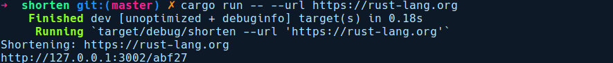
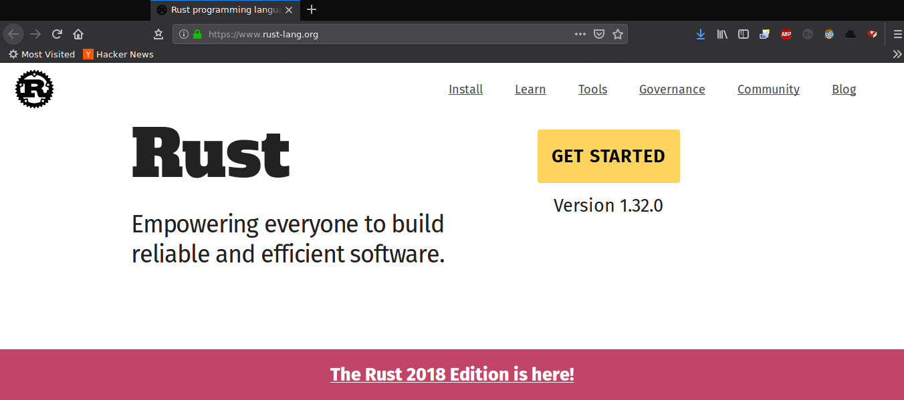

### 13.2.2　作为客户端的hyper——构建一个URL短网址客户端

现在我们已经准备好URL缩短服务，接下来让我们来探讨一下hyper的客户端。虽然可以构建一个可以用来缩短URL的Web UI，但我们会为了保持简单而构建一个CLI工具，CLI可以用于传递任何需要缩短的URL。作为响应，我们将从hyperurl服务器获取缩短的URL。

虽然建议使用hyper来构建复杂的Web应用程序，但每次需要创建处理程序服务时，注册并在运行时实例中运行它，都会涉及很多配置。在构建较小的工具（例如需要发送一些GET请求的CLI应用程序）时，所有这些步骤都会变得过于繁复。幸运的是，hyper上有一个方便的包装器，其名为reqwest，它抽象了hyper的客户端API。顾名思义，它的灵感来自Python的Requests库。

让我们通过运行cargo new shorten命令来创建一个新的项目，其Cargo.toml文件中的依赖项如下所示：

```rust
# shorten/Cargo.toml
[dependencies]
quicli = "0.4"
structopt = "0.2"
reqwest = "0.9"
serde = "1"
```

为了构建CLI工具，我们将使用quicli框架，它是一系列有助于构建CLI工具的高质量软件包。structopt软件包与quicli搭配使用，而serde软件包会被structopt软件包调用来生成派生宏。要向我们的hyperurl服务器发送POST请求，将会使用reqwest软件包。

我们的main.rs文件中包含以下代码：

```rust
// shorten/src/main.rs
use quicli::prelude::*;
use structopt::StructOpt;
const CONN_ADDR: &str = "127.0.0.1:3002";
/// 这是一个使用hyperurl来缩短网址的小型CLI工具
/// url短网址服务
#[derive(Debug, StructOpt)]
struct Cli {
    /// 要缩短的url
    #[structopt(long = "url", short = "u")]
    url: String,
    // 为该CLI工具配置日志 #[structopt(flatten)]
    #[structopt(flatten)]
    verbosity: Verbosity,
}
fn main() -> CliResult {
    let args = Cli::from_args();
    println!("Shortening: {}", args.url);
    let client = reqwest::Client::new();
    let mut res = client
        .post(&format!("http://{}/shorten", CONN_ADDR))
        .body(args.url)
        .send()?;
    let a: String = res.text().unwrap();
    println!("http://{}", a);
    Ok(())
}
```

在hyperurl服务器仍在运行的情况下，我们将打开一个新的终端窗口，并通过cargo run -- --url https://rust-lang.org命令调用短网址服务：


让我们转到带有短网址的浏览器，即http://127.0.0.1:3002/abf27。


在探索了 hyper 之后，让我们继续深入了解相关的知识。在13.2.3小节中，我们将探讨actix-web，这是一个基于actix软件包中的actor模型实现的快速Web应用程序框架。首先让我们讨论一下为何需要Web框架。

