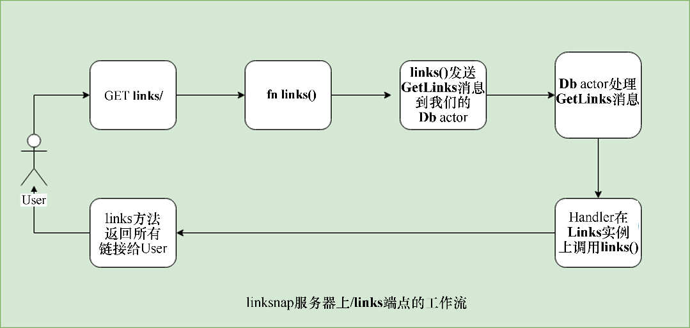

### 13.4　使用actix-web构建一个书签API

我们将创建一个REST API服务器，它允许我们存储希望稍后阅读的任何博客或网站的网址链接。我们将服务器命名为linksnap再通过运行cargo new linksnap命令创建一个新项目。在这个实现中，我们不会使用数据库来存储发送给API的任何链接，而是使用内存中的HashMap来存储我们的条目。这意味着我们的服务器重新启动时，所有存储的书签都将被删除。在第14章时，我们将为linksnap集成数据库，这将允许我们保存书签。

在linksnap/目录下面，我们的Cargo.toml文件中包含以下内容：

```rust
# linksnap/Cargo.toml
[dependencies]
actix = "0.7"
actix-web = "0.7"
futures = "0.1"
env_logger = "0.5"
bytes = "0.4"
serde = "1.0.80"
serde_json = "1.0.33"
serde_derive = "1.0.80"
url = "1.7.2"
log = "0.4.6"
chrono = "0.4.6"
```

我们将在API服务器中实现以下端点。

+ /links是一个GET方法，用于检索存储在服务器上的所有链接的列表。
+ /add是一个POST方法，用于存储链接的条目并返回一个类型的LinkId作为响应。这可以用于向服务器添加链接。
+ /rn是DELETE方法，用于删除给定LinkId的链接。

我们将服务器实现分为3个模块。

+ links：此模块提供Links和Link类型，分别表示一个链接和链接的集合。
+ route_handlers：该模块包含所有的路由处理程序。
+ state：该模块包含一个actor的实现，以及它可以在我们的Db结构体上接收的所有消息。

在/links端点上，我们的应用程序从用户请求到actor的示例流程如下所示：


让我们通过查看main.rs文件中的内容来完成相应的实现：

```rust
// linksnap/src/main.rs
mod links;
mod route_handlers;
mod state;
use std::env;
use log::info;
use crate::state::State;
use crate::route_handlers::{index, links, add_link, rm_link};
use actix_web::middleware::Logger;
use actix_web::{http, server, App};
fn init_env() {
    env::set_var("RUST_LOG", "linksnap=info");
    env::set_var("RUST_BACKTRACE", "1");
    env_logger::init();
    info!("Starting http server: 127.0.0.1:8080");
}
fn main() {
    init_env();
    let system = actix::System::new("linksnap");
    let state = State::init();
    let web_app = move || {
        App::with_state(state.clone())
            .middleware(Logger::default())
            .route("/", http::Method::GET, index)
            .route("/links", http::Method::GET, links)
            .route("/add", http::Method::POST, add_link)
            .route("/rm", http::Method::DELETE, rm_link)
    };
    server::new(web_app).bind("127.0.0.1:8080").unwrap().start();
    let _ = system.run();
}
```

在main函数中，我们首先调用init_env，它用于配置我们的运行环境，以便从服务器获取日志，启用RUST_BACKTRACE变量以输出任何错误的详细跟踪信息，并通过调用env_logger::init()来初始化我们的记录器。然后我们创建System actor，它是actor模型中所有actor的父级actor。然后通过调用State::init()创建我们的服务器状态并将其存储到state中。这将我们的内存数据库actor类型封装到state.rs的Db中。稍后我们会对它进行详细说明。

然后通过在闭包中调用App::with_state创建App实例，并传递应用程序状态的副本。在state上的clone调用在这里非常重要，因为我们需要跨多个actix工作线程保持单个共享状态。actix-web在内部生成多个线程从而使用新的App实例来处理请求，state上的每个调用都具有自己的应用程序状态副本。如果我们不共享对单个实际对象的引用，那么每个App都将拥有自己的HashMap条目副本，这不是我们想要的。

接下来，我们通过传递一个Logger，将App与middleware方法链接起来，当客户端单击前面配置的某个端点时将对任何请求进行日志记录。然后我们添加了一系列route方法调用。route方法将接收字符串形式的HTTP路径、HTTP方法，及将HttpRequest映射到HttpResponse的handler函数。稍后我们将讨论这类handler函数。

将App实例配置并存储到web_app中后，我们将其传递给server::new()，然后将其绑定到字符串形式的地址"127.0.0.1:8080"。然后将调用start在新的Arbiter示例中启动应用程序，这是一个新线程。根据actix的说法，Arbiter是一个运行actor的线程，它可以访问事件循环。最后，我们通过调用system.run()来运行系统级actor。run方法在内部自行调用一个tokio运行时并启动所有Arbiter线程。

接下来，我们看一下route_handlers.rs中的路由处理程序。此模块中定义了服务器实现中所有可用的路由：

```rust
// linksnap/src/route_handlers.rs
use actix_web::{Error, HttpRequest, HttpResponse};
use crate::state::{AddLink, GetLinks, RmLink};
use crate::State;
use actix_web::AsyncResponder;
use actix_web::FromRequest;
use actix_web::HttpMessage;
use actix_web::Query;
use futures::Future;
type ResponseFuture = Box<Future<Item = HttpResponse, Error = Error>>;
macro_rules! server_err {
    ($msg:expr) => {
        Err(actix_web::error::ErrorInternalServerError($msg))
    };
}
```

首先，我们引入了一大堆软件包，然后定义了几个辅助类型。ResponseFuture是已包装 Future 的简易类型别名，它会被解析为HttpResponse。然后我们有一个名为server_err!辅助宏，它返回一个带有给定描述的actix_web::error类型。当我们的任意客户端请求处理失败时，将使用此宏作为返回错误的便捷方式。

接下来，我们提供了最简单的路由器处理程序来处理端点“/”上的请求：

```rust
linksnap/src/route_handlers.rs
pub fn index(_req: HttpRequest<State>) -> HttpResponse {
    HttpResponse::from("Welcome to Linksnap API server")
}
```

index函数接收HttpRequest，并简单地返回根据字符串构造的HttpResponse。HttpRequest类型可以通过任何类型进行参数化。默认情况下，它是()。对于我们的路由处理程序，已经通过State类型对其进行了参数化。此状态封装了我们的内存数据库，它被实现为一个actor。

State是Addr<Db>的包装器，它是一个指向Db actor的地址。这是一个指向内存数据库的引用。我们将通过它发送消息给内存数据库，以便对其执行插入、删除或获取链接等操作。稍后将会对这些API进行详细介绍。让我们看看同一文件中的其他处理程序：

```rust
// linksnap/src/route_handlers.rs
pub fn add_link(req: HttpRequest<State>) -> ResponseFuture {
    req.json()
        .from_err()
        .and_then(move |link: AddLink| {
            let state = req.state().get();
            state.send(link).from_err().and_then(|e| match e {
                Ok(_) => Ok(HttpResponse::Ok().finish()),
                Err(_) => server_err!("Failed to add link"),
            })
        })
        .responder()
}
```

我们使用add_link函数处理添加链接的POST请求。这个处理程序需要以JSON为主体的如下格式：

```rust
{
    title: "Title of the link or bookmark",
    url: "The URL of the link"
}
```

在该函数中，我们首先通过调用 req.json()获取 JSON 格式的请求体，这将返回一个future。然后我们使用from_err方法将源自json方法的任意错误映射到actix兼容的错误。json方法可以从请求的有效载荷中提取类型化的信息，从而返回JsonBody<T>的future。这个T由方法链中的and_then推断为AddLink，我们获取解析后的值并将其发送给Db actor。向actor发送消息可能会失败，因此如果发生这种情况，将再次匹配返回的值。当值为Ok时，我们用空的HTTP响应予以回复，否则将使用server_err!宏传递错误信息的描述。

接下来将介绍“/links”端点：

```rust
// linksnap/src/route_handlers.rs
pub fn links(req: HttpRequest<State>) -> ResponseFuture {
    let state = &req.state().get();
    state
        .send(GetLinks)
        .from_err()
        .and_then(|res| match res {
            Ok(res) => Ok(HttpResponse::Ok().body(res)),
            Err(_) => server_err!("Failed to retrieve links"),
        })
        .responder()
}
```

links处理程序只是简单地向Db actor发送GetLinks消息，之后返回收到的响应，并使用body方法将其返回客户端。接下来将介绍我们的rm_link处理程序，其定义如下所示：

```rust
// linksnap/src/route_handlers.rs
pub fn rm_link(req: HttpRequest<State>) -> ResponseFuture {
    let params: Query<RmLink> = Query::extract(&req).unwrap();
    let state = &req.state().get();
    state
        .send(RmLink { id: params.id })
        .from_err()
        .and_then(|e| match e {
            Ok(e) => Ok(HttpResponse::Ok().body(format!("{}", e))),
            Err(_) => server_err!("Failed to remove link"),
        })
        .responder()
}
```

要删除某个链接，我们需要传递链接ID（i32）作为查询参数。rm_link方法使用简便的Query::extract将查询参数提取到RmLink类型中，该方法接收HttpRequest实例。接下来，我们获取对Db actor的引用，并通过ID向其发送RmLink消息。我们通过body方法构造HttpResponse返回字符串作为响应。

这是state.rs中的State和Db类型：

```rust
// linksnap/src/state.rs
use actix::Actor;
use actix::SyncContext;
use actix::Message;
use actix::Handler;
use actix_web::{error, Error};
use std::sync::{Arc, Mutex};
use crate::links::Links;
use actix::Addr;
use serde_derive::{Serialize, Deserialize};
use actix::SyncArbiter;
const DB_THREADS: usize = 3;
#[derive(Clone)]
pub struct Db {
    pub inner: Arc<Mutex<Links>>
}
impl Db {
    pub fn new(s: Arc<Mutex<Links>>) -> Db {
        Db { inner: s }
    }
}
impl Actor for Db {
    type Context = SyncContext<Self>;
}
#[derive(Clone)]
pub struct State {
    pub inner: Addr<Db>
}
impl State {
    pub fn init() -> Self {
        let state = Arc::new(Mutex::new(Links::new()));
        let state = SyncArbiter::start(DB_THREADS, move ||
Db::new(state.clone()));
        let state = State {
            inner: state
        };
        state
    }
    pub fn get(&self) -> &Addr<Db> {
        &self.inner
    }
}
```

首先，我们将DB_THREADS的值设为3，这是我们任意选择的。这将获得一个线程池，通过它向内存数据库发送请求。在这种情况下，我们可以使用普通的actor，但是由于会在第14章将它与数据库集成，所以我们选择SyncArbiter线程。

然后是Db结构体定义，它将Links类型包装在线程安全的包装器Arc<Mutex<Links>中。然后我们会在其上实现Actor特征，其中将关联类型Context指定为SyncContext<Self>。

接下来是State结构体定义，它是一个Addr<Db>，即Db actor实例的句柄。我们在State上有两个方法——init用于创建一个新的State实例，get返回对Db actor句柄的引用。

最后，我们有一系列的消息类型，它们将发送到Db actor。Db是一种actor并且会接收如下3类消息。

GetLinks：这是由/links路由处理程序发送的，用于检索存储在服务器上的所有链接。它的定义如下所示：

```rust
// linksnap/src/state.rs
pub struct GetLinks;
impl Message for GetLinks {
    type Result = Result<String, Error>;
}
impl Handler<GetLinks> for Db {
    type Result = Result<String, Error>;
    fn handle(&mut self, _new_link: GetLinks, _: &mut Self::Context) ->
Self::Result {
        Ok(self.inner.lock().unwrap().links())
    }
}
```

首先是GetLinks消息，它从/links路由处理程序发送到Db actor。为了使它成为一个actor消息，我们将为它实现Message特征。Message特征定义了一个关联类型Result，它是从消息处理程序返回的类型。接下来，我们通过针对Db actor的GetLinks消息进行参数化，实现Handler特征。

```rust
// linksnap/src/state.rs
pub struct GetLinks;
impl Message for GetLinks {
    type Result = Result<String, Error>;
}
impl Handler<GetLinks> for Db {
    type Result = Result<String, Error>;
    fn handle(&mut self, _new_link: GetLinks, _: &mut Self::Context) ->
Self::Result {
        Ok(self.inner.lock().unwrap().links())
    }
}
```

我们为它实现了Message特征，它返回所有链接的字符串作为响应。

AddLink：这是由客户端发送的任何新链接上的/add路由处理程序发送的。它的定义如下所示：

```rust
// linksnap/src/state.rs
#[derive(Debug, Serialize, Deserialize)]
pub struct AddLink {
    pub title: String,
    pub url: String
}
impl Message for AddLink {
    type Result = Result<(), Error>;
}
impl Handler<AddLink> for Db {
    type Result = Result<(), Error>;
    fn handle(&mut self, new_link: AddLink, _: &mut Self::Context) ->
Self::Result {
        let mut db_ref = self.inner.lock().unwrap();
        db_ref.add_link(new_link);
        Ok(())
    }
}
```

AddLink类型会执行双重任务。通过实现Serialize和Deserialize特征，它可以从add_link路由中传入json响应主体中提取。其次，它还实现了Message特征，我们可以将它发送给相应的Db actor。

RmLink：这是由/rm路由处理程序发送的。它的定义如下所示：

```rust
// linksnap/src/state.rs
#[derive(Serialize, Deserialize)]
pub struct RmLink {
    pub id: LinkId,
}
impl Message for RmLink {
    type Result = Result<usize, Error>;
}
impl Handler<RmLink> for Db {
    type Result = Result<usize, Error>;
    fn handle(&mut self, link: RmLink, _: &mut Self::Context) ->
Self::Result {
        let db_ref = self.get_conn()?;
        Link::rm_link(link.id, db_ref.deref())
            .map_err(|_| error::ErrorInternalServerError("Failed to remove
links"))
    }
}
```

这是希望删除链接条目时发送的消息。它接收RmLink消息并转发。

我们可以使用以下curl命令插入一个链接：

```rust
curl --header "Content-Type: application/json" \
 --request POST \
 --data '{"title":"rust blog","url":"https://rust-lang.org"}' \
 127.0.0.1:8080/add
```

为了查看插入的链接，我们可以执行以下命令：

```rust
curl 127.0.0.1:8080/links
```

要删除某个给定ID的链接，我们可以使用curl发送DELETE请求：

```rust
curl -X DELETE 127.0.0.1:8080/rm?id=1
```

