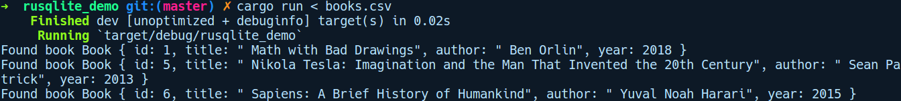

### 14.2　SQLite

SQLite是一个轻量级的嵌入式数据库。它不需要使用专门的数据库管理系统管理数据。SQLite创建的数据库是以文件或者内存数据库的形式存在的，用户无须连接到外部远程端点或建立本地套接字连接就可以使用它的数据库。与传统的客户端-服务器数据库引擎（如MySQL 或 PostgreSQL）相比，它为不同的目标用户服务，并且是应用程序需要一个安全且高效的可检索方式在本地存储数据的用例的首选解决方案。Android操作系统是SQLite的重度用户，允许移动应用为其程序内的用户存储首选项或配置。它也被很多桌面应用程序所采用，用于存储具有持久性保证的任何类型的状态。

Rust 社区为我们提供了一些连接到 SQLite 数据库并与之交互的选项。我们将使用rusqlite软件包，该软件包支持的SQLite的版本是3.6.8及以上。它的API不能被视为ORM，但可以被看作ORM提供的中间抽象，因为这有助于隐藏实际SQLite API的诸多细节。与许多其他关系型数据库系统相比，SQLite的类型系统是动态的。这意味着列没有类型，但每个值却包含类型。从技术上来说，SQLite将存储类与数据类型分开，但这只是一个实现细节，并且我们可根据实际情况只考虑类型。

rusqlite软件提供了FromSql和ToSql特征，用于在SQLite和Rust类型之间转换对象。它还为大多数标准库类型和基元提供了开箱即用的以下实现：

| 描述 | SQLite | Rust |
| :-----  | :-----  | :-----  | :-----  | :-----  |
| 空值 | NULL | rusqlite::types::Null |
| 1、2、3、4、6或者8位有符号整数 | INTEGER | i32（可能会被截断）和i64 |
| 8位IEEE浮点数 | REAL | f64 |
| UTF-8，UTF-16BE或UTF-16LE字符串 | TEXT | String和&str |
| 位字符串 | BLOB | Vec<u8>和&[u8] |

了解过rusqlite软件包的基础知识之后，让我们来看看它的实际应用。

我们将通过运行cargo new rusqlite_demo命令创建一个新项目。程序将从标准输入中获取正确格式化的逗号分隔值（Comma Separated Values，CSV）书籍（books）表，将其存储到SQLite中，然后使用过滤器SQL查询检索数据的子集。首先，让我们构建新建表和删除表的查询字符串，以及我们的Book结构体，它将存储从查询中检索到的数据：

```rust
// rusqlite_demo/src/main.rs
use std::io;
use std::io::BufRead;
use rusqlite::Error;
use rusqlite::{Connection, NO_PARAMS};
const CREATE_TABLE: &str = "CREATE TABLE books
                            (id INTEGER PRIMARY KEY,
                            title TEXT NOT NULL,
                            author TEXT NOT NULL,
                            year INTEGER NOT NULL)";
const DROP_TABLE: &str = "DROP TABLE IF EXISTS books";
#[derive(Debug)]
struct Book {
    id: u32,
    title: String,
    author: String,
    year: u16
}
```

我们定义了两个常量CREATE_TABLE和DROP_TABLE，它们分别包含用于创建和删除books表的原始SQL查询。然后我们定义了Book结构体，其中包含如下字段。

+ id：作为主键，可以将插入books表的书籍进行区分。
+ title：书籍的标题。
+ author：书籍的作者。
+ year：书籍的出版日期。

接下来，让我们看看main函数：

```rust
// rusqlite_demo/src/main.rs
fn main() {
    let conn = Connection::open("./books").unwrap();
    init_database(&conn);
    insert(&conn);
    query(&conn);
}
```

首先，我们通过调用Connection::open打开与SQLite数据库的连接，并提供一个路径"./books"，以便在当前目录中创建数据库。接下来，我们调用init_database()，将引用传递给conn，其定义如下所示：

```rust
fn init_database(conn: &Connection) {
    conn.execute(CREATE_TABLE, NO_PARAMS).unwrap();
}
```

然后我们调用insert方法，并将conn传递给它。最后，我们调用query方法，以便对books表执行查询操作。

以下是我们的insert函数定义：

```rust
fn insert(conn: &Connection) {
    let stdin = io::stdin();
    let lines = stdin.lock().lines();
    for line in lines {
        let elems = line.unwrap();
        let elems: Vec<&str> = elems.split(",").collect();
        if elems.len() == 4 {
            let _ = conn.execute(
                "INSERT INTO books (id, title, author, year) VALUES (?1,
?2, ?3, ?4)",
                &[&elems[0], &elems[1], &elems[2], &elems[3]],
            );
        }
    }
}
```

在insert函数中，我们首先获取stdin上的锁并迭代访问这些行。每一行都由逗号分隔。接下来，我们在conn上调用execute方法，传入一个insert查询字符串。在查询字符串中，我们使用?1、?2等模板变量，其对应的值取自elems。如果收集的元素数量达到4时，我们使用原始SQL查询插入该书籍，并从elems中为模板变量提供相应的值。

接下来，我们的query函数的定义如下所示：

```rust
fn query(conn: &Connection) {
    let mut stmt = conn
        .prepare("SELECT id, title, author, year FROM books WHERE year >=
?1")
        .unwrap();
    let movie_iter = stmt
        .query_map(&[&2013], |row| Book {
            id: row.get(0),
            title: row.get(1),
            author: row.get(2),
            year: row.get(3),
        })
        .unwrap();
    for movie in movie_iter.filter_map(extract_ok) {
        println!("Found book {:?}", movie);
    }
}
```

query函数接收conn，然后会在其上调用prepare方法，并传入原始的SQL查询字符串。在这里，我们对超过给定年份的书籍进行了过滤，同时将此查询存储到stmt中。接下来，我们在此类型上调用query_map，传入仅包含数字2013的数组的引用，该数字表示我们要过滤的年份。如你所见，API在这里有点难以理解。query_map的第2个参数是Row类型的闭包。在闭包内部，我们从row实例中提取相应的字段，并从中构造一个Book实例。这将返回一个迭代器，并将其存储到movie_iter中。最后会遍历movie_iter，使用extract_ok辅助方法过滤任何不匹配的值。它的定义如下所示：

```rust
fn extract_ok(p: Result<Book, Error>) -> Option<Book> {
    if p.is_ok() {
        Some(p.unwrap())
    } else {
        None
    }
}
```

然后，我们输出books。其完整代码如下所示：

```rust
// rusqlite_demo/src/main.rs
use std::io;
use std::io::BufRead;
use rusqlite::Error;
use rusqlite::{Connection, NO_PARAMS};
const CREATE_TABLE: &str = "CREATE TABLE IF NOT EXISTS books
                            (id INTEGER PRIMARY KEY,
                            title TEXT NOT NULL,
                            author TEXT NOT NULL,
                            year INTEGER NOT NULL)";
#[derive(Debug)]
struct Book {
    id: u32,
    title: String,
    author: String,
    year: u16,
}
fn extract_ok(p: Result<Book, Error>) -> Option<Book> {
    if p.is_ok() {
        Some(p.unwrap())
    } else {
        None
    }
}
fn insert(conn: &Connection) {
    let stdin = io::stdin();
    let lines = stdin.lock().lines();
    for line in lines {
        let elems = line.unwrap();
        let elems: Vec<&str> = elems.split(",").collect();
        if elems.len() > 2 {
            let _ = conn.execute(
                "INSERT INTO books (id, title, author, year) VALUES (?1,
?2, ?3, ?4)",
                &[&elems[0], &elems[1], &elems[2], &elems[3]],
            );
        }
    }
}
fn init_database(conn: &Connection) {
    conn.execute(CREATE_TABLE, NO_PARAMS).unwrap();
}
fn query(conn: &Connection) {
    let mut stmt = conn
        .prepare("SELECT id, title, author, year FROM books WHERE year >=
?1")
        .unwrap();
    let movie_iter = stmt
        .query_map(&[&2013], |row| Book {
            id: row.get(0),
            title: row.get(1),
            author: row.get(2),
            year: row.get(3),
        })
        .unwrap();
    for movie in movie_iter.filter_map(extract_ok) {
        println!("Found book {:?}", movie);
    }
}
fn main() {
    let conn = Connection::open("./books").unwrap();
    init_database(&conn);
    insert(&conn);
    query(&conn);
}
```

在同一目录下还有一个books.cvs文件，我们可以通过如下命令来运行它：

```rust
cargo run < books.csv
```

这是程序运行时的输出：


这与现实世界中典型的以数据库作为后台支撑的应用程序相去甚远，其只是为了演示该软件包的用法。实际的应用程序不会从标准输入读取数据，而查询例程将具有更好的错误处理方式。

这是一个简短的演示，用以说明如何在Rust中通过rusqlite软件包使用SQLite数据库。其 API并不是强类型的，但目前它是我们唯一的解决方案。接下来，我们将探讨SQLite的大哥，即PostgreSQL数据库管理系统。

