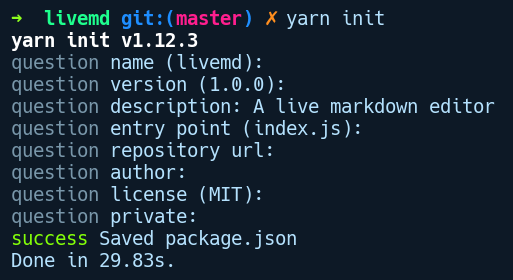
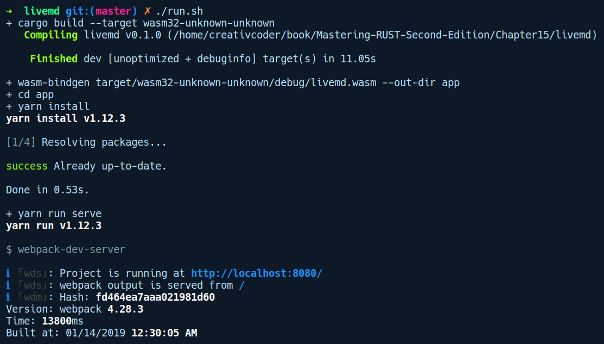
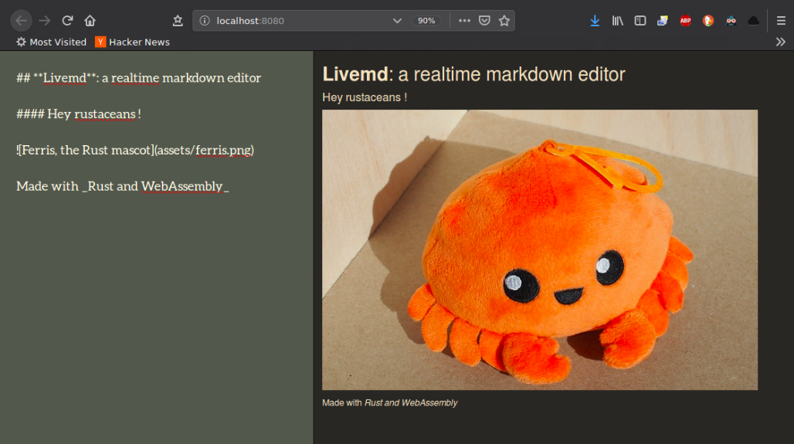

### 15.4.1　wasm-bindgen

wasm-bindgen是由GitHub上的rust-wasm团队开发的一款软件包。它支持Rust代码调用 JavaScript 代码，反之亦然。基于该软件包，已经构建了很多其他更高级的程序库，例如web-sys和js-sys软件包。

JavaScript本身就是欧洲计算机制造商协会（European Computer Manufacturers Association，ECMA）标准定义的内容，但相关标准没有规定它在Web上的工作方式。JavaScript可以支持多种宿主，Web恰好是其中之一。web-sys软件包允许访问Web上的所有JavaScript API，即DOM API，例如Window、Navigator及EventListener等。js-sys软件包提供ECMA标准规范中指定的所有基本的JavaScript对象，即函数、对象及数字等。

由于WebAssembly仅支持数字类型，因此wasm-bindgen软件包生成适配元素以便用户能够在JavaScript中使用原生的Rust类型。例如，Rust中的结构体表示为JavaScript端的对象，而Promise对象可以在Rust端作为Future访问。它通过在函数定义上使用#[wasm-bindgen]属性来完成所有这些操作。

为了探索wasm-bindgen以及它如何与JavaScript交互，我们将构建一些实用的程序。接下来将构建一个在线markdown编辑器应用程序，它允许用户编写markdown并预览经过渲染后的HTML页面。不过在正式开始之前，需要安装为我们生成适配元素的wasm-bindgen-cli工具，从而允许我们方便地使用其中公开的Rust函数。我们可以通过运行如下命令安装它：

```rust
cargo install wasm-bindgen-cli
```

接下来，让我们通过运行cargo new livemd命令创建一个项目，相关的Cargo.toml文件内容如下所示：

```rust
[package]
name = "livemd"
version = "0.1.0"
authors = ["Rahul Sharma <creativcoders@gmail.com>"]
edition = "2018"
[lib]
crate-type = ["cdylib"]
[dependencies]
wasm-bindgen = "0.2.29"
comrak = "0.4.0"
```

我们将软件包命名为livemd，程序库是cdylib类型，并且公开了一个C语言接口，因为WebAssembly接收一个目标宽泛的动态C程序库接口，大多数语言都可以编译到该接口。接下来将在我们的项目根目录下创建一个run.sh脚本，以便构建和运行我们的项目，并在每次使用cargo-watch检测到代码发生任何更改时重新运行它。以下是run.sh文件的内容：

```rust
#!/bin/sh
set -ex
cargo build --target wasm32-unknown-unknown
wasm-bindgen target/wasm32-unknown-unknown/debug/livemd.wasm --out-dir app
cd app
yarn install
yarn run serve
```

接下来是lib.rs中的markdown转换代码的实现，完整内容如下所示：

```rust
// livemd/src/lib.rs
use wasm_bindgen::prelude::*;
use comrak::{markdown_to_html, ComrakOptions};
#[wasm_bindgen]
pub fn parse(source: &str) -> String {
    markdown_to_html(source, &ComrakOptions::default())
}
```

我们的livemd软件包公开了一个名为parse的函数，它从网页上的textarea标签中获取markdown文本（尚未创建），并通过调用comrak软件包中的markdown_to_html函数返回经过编译的HTML字符串。如你所见，parse函数采用了#[wasm_bindgen]属性进行注释。此属性为各种底层转换生成代码，并且需要将此函数公开给JavaScript。使用此方法，我们不必关心parse函数接收何种类型的字符串。JavaScript中的字符串与Rust中的字符串有所不同。#[wasm_bindgen]属性负责处理这种差异，以及在接收&str 类型字符串之前从JavaScript端转换字符串的底层细节。在撰写本书时，有些类型是wasm-bindgen无法转换的，例如引用或带有生命周期注释的类型定义。

然后我们需要为该软件包生成wasm文件。但在此之前，我们先对应用程序进行一些设置。在同一目录下，我们将创建一个名为app/的目录，并通过运行yarn init命令来初始化项目：


yarn init会创建我们的package.json文件。除了普通的字段之外，我们还会指定脚本（scripts）和开发依赖项（dev-dependencies）：

```rust
{
  "name": "livemd",
  "version": "1.0.0",
  "description": "A live markdown editor",
  "main": "index.js",
  "license": "MIT",
  "scripts": {
    "build": "webpack",
    "serve": "webpack-dev-server"
  },
  "devDependencies": {
    "html-webpack-plugin": "^3.2.0",
    "webpack": "^4.28.3",
    "webpack-cli": "^3.2.0",
    "webpack-dev-server": "^3.1.0"
  }
}
```

我们将使用webpack来启动开发环境下的Web服务器。webpack是一个模块捆绑器。它会接收多个JavaScript源文件，并将它们打包到一个文件中，从而缩小其体积以便在Web上使用。要让webpack能够捆绑JavaScript和wasm生成的代码，我们将在名为web.pack. config.js的文件中创建一个webpack配置文件：

```rust
// livemd/app/webpack.config.js
const path = require('path');
const HtmlWebpackPlugin = require('html-webpack-plugin');
module.exports = {
    entry: './index.js',
    output: {
        path: path.resolve(__dirname, 'dist'),
        filename: 'index.js',
    },
    plugins: [
        new HtmlWebpackPlugin({
            template: "index.html"
        })
    ],
    mode: 'development'
};
```

接下来在同一app/目录中，我们将创建3个文件。

+ index.html——这包含应用程序的UI：

```rust
<!--livemd/app/index.html-->
<!DOCTYPE html>
<html>
<head>
    <title>Livemd: Realtime markdown editor</title>
    <link
href="https://maxcdn.bootstrapcdn.com/bootstrap/3.3.4/css/bootstrap
.min.css" rel="stylesheet">
    <link href="https://fonts.googleapis.com/css?family=Aleo"
rel="stylesheet">
    <link href="styles.css" rel="stylesheet">
</head>
<body class="container-fluid">
    <section class="row">
        <textarea class="col-md-6 container" id="editor">_Write
your text here.._</textarea>
        <div class="col-md-6 container" id="preview"></div>
    </section>
    <script src="index.js" async defer></script>
</body>
</html>
```

我们已经声明了一个带有编辑器ID的HTML元素<textarea>。这将在左侧显示，你可以在此处写下markdown标记。接下来，我们有一个ID值为preview的<div>元素，它将显示实时呈现的HTML页面。

+ style.css——为了让我们的应用程序看起来更美观，这个文件提供了在应用中呈现实时编辑器和预览窗格的基本样式：

```rust
/* livemd/app/styles.css */
html, body, section, .container {
    height: 100%;
}
#editor {
    font-family: 'Aleo', serif;
    font-size: 2rem;
    color: white;
    border: none;
    overflow: auto;
    outline: none;
    resize: none;
    -webkit-box-shadow: none;
    -moz-box-shadow: none;
    box-shadow: none;
    box-shadow: 0px 1px 3px 1px rgba(0, 0, 0, .6);
    background-color: rgb(47,79,79);
}
#preview {
    overflow: auto;
    border: 5px;
    border-left: 1px solid grey;
}
```

+ index.js——这个文件提供了UI和livemd软件包之间的粘合代码：

```rust
// livemd/app/index.js
import('./livemd').then((livemd) => {
    var editor = document.getElementById("editor");
    var preview = document.getElementById("preview");
    var markdownToHtml = function() {
        var markdownText = editor.value;
        html = livemd.parse(markdownText);
        preview.innerHTML = html;
    };
    editor.addEventListener('input', markdownToHtml);
    // 开始解析初始文本
    markdownToHtml();
}).catch(console.error);
```

上述代码导入了livemd模块，该模块返回一个Promise实例。然后我们通过调用then方法链接由此Promise生成的值，该方法会接收一个匿名函数——(livemd) => {}，该函数会接收wasm模块（我们将其命名为livemd）。在此方法中，我们通过ID获取编辑器和预览HTML元素。然后创建一个名为markdownToHtml的函数，它从编辑器元素的属性值中获取文本，并将其从livemd模块传递给parse方法。这会将渲染的HTML文本作为字符串返回。然后我们将preview元素的innerHTML属性设置为此文件。接下来，为了提供用户对编辑器元素中任何文本所做的更改的实时反馈，我们需要调用此函数。可以使用onInput事件处理此任务。对于编辑器元素，我们使用'input'事件调用addEventListener方法，并将此函数作为处理程序传递。最后，我们调用markdownToHtml来启动文本的解析和渲染。

这样我们创建了第1个用Rust构建的Web应用程序，并在JavaScript中运行WebAssembly。


**注意**

这不是一个有效的实现，可以进行很多改进。但是，由于我们正在探讨此工具，因此可以用作演示。


现在，我们需要将软件包编译为 WebAssembly 代码和 wasm 文件，并生成打包后的JavaScript文件。之前已经设置了一个脚本，名为run.sh。这是运行run.sh脚本的输出结果：


run.sh脚本首先通过运行cargo build --target wasm32-unknown-unknown命令来构建livemd软件包。然后，它调用wasm-bindgen工具，该工具会优化wasm文件将其输出到app/目录中。接下来我们在app目录中运行yarn install命令，之后再运行yarn run serve命令，它使用webpack-dev-server插件启动开发环境服务器。

如果在运行-bindgen cli命令时遇到错误，请尝试通过运行以下命令更新livemd/Cargo. toml中的wasm-bindgen依赖项：

```rust
cargo update -p wasm-bindgen
```

我们还需要安装yarn软件包管理器来托管localhost上的网页。这可以通过运行如下命令来完成：

```rust
$ curl -sS https://dl.yarnpkg.com/debian/pubkey.gpg | sudo apt-key add -
$ echo "deb https://dl.yarnpkg.com/debian/ stable main" | sudo tee
/etc/apt/sources.list.d/yarn.list
$ sudo apt-get update && sudo apt-get install yarn
```

从webpack的输出可以看到，开发环境下的服务器运行在http://localhost:8080。让我们通过Web浏览器打开这个网址，以下是浏览器的输出结果：


如你所见，我们在左侧窗格中以markdown格式显示文本，并在HTML中将页面实现实时呈现在右侧。在内部，此页面左侧键入的每一段文本都将转换为HTML文本，该文本由我们创建的livemd模块生成。

我们还可以将livemd软件包发布为npm包。GitHub上的wasm-pack项目提供了构建和发布用Rust编写的已编译为WebAssembly的npm模块所需的各种配置。

