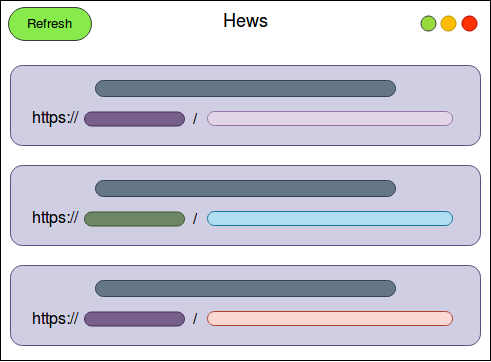

### 16.3　通过gtk-rs构建一个新闻类桌面应用程序

我们将使用gtk程序库构建一个简单的新闻桌面应用程序，该程序从网站上抓取排名前十的热点新闻。“Hacker News”是一个专注于全球数字技术和科技新闻的网站。首先，我们需要创建应用程序的基本框架模型：


在最顶部，我们有应用的标题栏，左侧有一个Refresh按钮，可以按需更新我们的故事（stories）。一个故事（story）代表Hacker News网站上发布的一个新闻条目。标题栏包含位于中间的应用标题和右侧常用的窗口控件。下面是我们的故事滚动显示窗口，我们的故事将作为story小部件垂直呈现。该story小部件由两个部件构成：一个用于显示故事名称和热度的小部件，另一个用于呈现可以通过用户单击在默认浏览器中打开的故事链接，它看上去非常简单。


**注意**

由于我们正在使用绑定到原生C程序库的gtk软件包，因此需要为gtk框架安装开发性C程序库。对于Ubuntu和Debian平台，我们可以通过运行以下命令来安装这些依赖项：

**
`sudo apt-get install libgtk-3-dev`
**


请参阅gtk网站上的文档页面，以便了解在其他平台上设置gtk的相关信息。

首先通过运行cargo new hews命令创建一个新项目。我们创造性地将应用程序命名为Hews，其中的H来自“Hacker”，ews来自“news”。

以下是我们的Cargo.toml文件中的依赖项：

```rust
# hews/Cargo.toml
[dependencies]
gtk = { version = "0.3.0", features = ["v3_18"] }
reqwest = "0.9.5"
serde_json = "1.0.33"
serde_derive = "1.0.82"
serde = "1.0.82"
```

这里是我们引用的一系列程序库。

+ gtk：用于构建应用程序的GUI。我们采用的gtk绑定版本是3.18。
+ reqwest：用于从Hacker News API中获取故事（新闻）。reqwest是hyper程序库的高级包装器。简单起见，我们将使用reqwest的同步API。
+ serde_json：用于将从网络获取的JSON响应无缝转换为强类型的Story结构体。
+ serde、serde_derive：用于提供自动导出内置Rust类型的序列化代码的特征和实现。通过serde_derive的Serialize和Deserialize特征，我们可以将任何原生Rust类型序列化和反序列化为给定的格式。serde_ json依赖于相同的工具将serde_ json::Value类型转换为Rust类型。

要想在我们的应用中显示新的文章，需要向官方黑客新闻API发送HTTP请求来获取它们，该API有详细的说明文档。我们将应用程序分为两个模块。首先是我们的app模块，其中包含所有与UI相关的功能，用于在屏幕上呈现应用程序，并处理来自用户的UI状态更新信息。其次是我们的hackernews模块，它提供用于从网络中获取故事的API。它在一个单独的线程中运行，在网络请求发生时不会阻塞GUI线程，因为这是阻塞I/O的操作。通过黑客新闻API，一个故事表示一个新闻条目，其中包含新闻标题和指向新闻的链接，以及其他属性，例如故事的受欢迎程度和故事的评论列表。


**注意**

为了让此示例简单易懂，我们的应用程序没有提供适当的错误处理代码，并且包含很多unwrap()调用。从错误处理的角度来看，这是一种不好的做法。探讨完演示示例之后，建议你在应用程序中集成更好的错误处理策略。不过先让我们对这些代码进行详细的解析。


首先，我们将在main.rs中查看应用程序的入口点：

```rust
// hews/src/main.rs
mod app;
mod hackernews;
use app::App;
fn main() {
    let (app, rx) = App::new();
    app.launch(rx);
}
```

在main函数中，我们调用了App::new()，它返回一个App实例以及包含mpsc::Receiver的rx。为了让我们的GUI和网络请求分离，hews中的所有状态更新都通过管道异步处理。App实例在内部调用mpsc::channel()，返回tx和rx。它将tx存储在其中，并将其传递给网络线程，从而允许它将任何新故事通知UI。在new方法调用之后，我们在app上调用lunch并传入rx，以便侦听GUI线程中网络线程的事件。

接下来让我们看看app.rs模块中的app模块，该模块用于处理将我们的应用程序呈现在屏幕上所需的大部分操作。


**注意**

要想了解以下小部件的详细信息，可以在参考gtk-rs的官方说明文档，你可以在其中搜索任何小部件，并探索有关属性的更多信息。


首先是我们的App结构体，它是所有GUI的入口点：

```rust
// hews/src/app.rs
pub struct App {
    window: Window,
    header: Header,
    stories: gtk::Box,
    spinner: Spinner,
    tx: Sender<Msg>,
}
```

该结构体包含一系列字段。

+ window：它包含基本的gtk::Window小部件。每个gtk应用程序都以一个窗口开始，然后可以在这个窗口中添加不同布局的子窗口小部件来设计我们的UI。
+ header：这是一个由我们定义并包装成gtk::HeaderBar小部件的结构体，用作应用程序的标题栏。
+ stories：这是一个gtk::Box小部件的容器，将会垂直存储我们的故事。
+ spinner：这是一个gtk::Spinner小部件，它为加载故事提供一个视觉特效提示。
+ tx：这是一个mpsc的Sender，用于将事件从GUI发送到网络线程。消息的类型为Msg，它是一个枚举：

```rust
pub enum Msg {
            NewStory(Story),
            Loading,
            Loaded,
            Refresh,
        }
```

当从hackernews模块中调用fetch_posts方法时，我们的应用程序开始启动并初始化。稍后会看到，“NewStory”是获取新故事时发生的状态，“Loaded”是加载所有故事时发生的状态，“Refresh”是用户想要重新加载故事时的状态。

让我们继续讨论App结构体上的方法，以下是new方法：

```rust
impl App {
    pub fn new() -> (App, Receiver<Msg>) {
        if gtk::init().is_err() {
            println!("Failed to init hews window");
            process::exit(1);
        }
```

new方法首先使用gtk::init启动gtk事件循环。如果程序初始化失败，就退出，并向控制台输出消息：

```rust
let (tx, rx) = channel();
let window = gtk::Window::new(gtk::WindowType::Toplevel);
let sw = ScrolledWindow::new(None, None);
let stories = gtk::Box::new(gtk::Orientation::Vertical, 20);
let spinner = gtk::Spinner::new();
let header = Header::new(stories.clone(), tx.clone());
```

然后，我们创建tx和rx通道端点，用于在网络线程和GUI线程之间进行通信。接下来，我们创建一个窗口，它是一个顶层（Toplevel）窗口。

现在如果调整窗口大小，多个故事可能无法适配应用程序的窗口，因此我们需要一个可滚动的窗口。为此，我们将创建一个ScrolledWindow的实例sw。但是gtk的ScrolledWindow只接受其中一个子元素，而问题在于我们需要存储多个故事。幸运的是，我们可以使用gtk::Box类型，它是用于布局和组织子窗口小部件的通用容器小部件。在这里，我们创建一个gtk::Box实例用于布局Orientation::Vertical方位的stories，以便每个故事以垂直列表的方式呈现。同时我们希望在加载新闻时在滚动小部件的顶部显示一个微调器（spinner），因此我们将创建一个gtk::Spinner小部件，并将其添加到新闻中，以在最顶部呈现它。我们还将创建我们的标题栏并传递stories的引用和tx。标题中还包含刷新按钮和一个鼠标点击处理程序，这需要stories容器清除其中的项目，以便允许我们加载新的故事条目：

```rust
stories.pack_start(&spinner, false, false, 2);
sw.add(&stories);
window.add(&sw);
window.set_default_size(600, 350);
window.set_titlebar(&header.header);
```

接下来我们开始构造小部件。首先，我们将spinner添加到stories容器，然后将stories容器添加到滚动窗体小部件sw，再将其添加到父窗体，还使用set_default_size设置窗口大小。然后用set_titlebar设置它的标题栏，传入我们的header。接下来，我们将信号处理程序附加到窗口：

```rust
window.connect_delete_event(move |_, _| {
    main_quit();
    Inhibit(false)
});
```

如果我们调用main_quit()，这将退出应用程序。Inhibit(false)的返回类型不会阻止信号传播到delete_event的默认处理程序。所有小部件都有一个默认的信号处理程序。gtk程序库中的小部件上的信号处理程序遵循connect_<event>的命名约定，并接收一个将小部件作为其第1个参数和event对象作为其第2个参数的闭包。

接下来，让我们看看App中的launch方法，它是在main.rs中调用的：

```rust
pub fn launch(&self, rx: Receiver<Msg>) {
    self.window.show_all();
    let client = Arc::new(reqwest::Client::new());
    self.fetch_posts(client.clone());
    self.run_event_loop(rx, client);
}
```

首先，我们启用窗口小部件及其子窗口小部件。通过调用show_all方法让它们可见，因为默认情况下gtk中的小部件都是不可见的。然后我们创建HTTP Client并将其包装在Arc中，因为我们希望将其与网络线程共享。接下来，调用fetch_posts传递我们的客户端。最后，我们通过调用run_event_loop运行事件循环，传入rx。fetch_posts方法的定义如下所示：

```rust
fn fetch_posts(&self, client: Arc<Client>) {
    self.spinner.start();
    self.tx.send(Msg::Loading).unwrap();
    let tx_clone = self.tx.clone();
    top_stories(client, 10, &tx_clone);
}
```

它通过调用start方法启动spinner动画，并将Loading消息作为初始状态发送。然后从hackernews模块调用top_stories函数，将10作为故事的数量传递给fetch，并将Sender传递给GUI线程以通知有新的故事。

在调用fectch_posts之后，我们在App上调用run_event_loop方法，其定义如下所示：

```rust
fn run_event_loop(&self, rx: Receiver<Msg>, client: Arc<Client>) {
    let container = self.stories.clone();
    let spinner = self.spinner.clone();
    let header = self.header.clone();
    let tx_clone = self.tx.clone();
    gtk::timeout_add(100, move || {
        match rx.try_recv() {
            Ok(Msg::NewStory(s)) => App::render_story(s, &container),
            Ok(Msg::Loading) => header.disable_refresh(),
            Ok(Msg::Loaded) => {
                spinner.stop();
                header.enable_refresh();
            }
            Ok(Msg::Refresh) => {
                spinner.start();
                spinner.show();
                (&tx_clone).send(Msg::Loading).unwrap();
                top_stories(client.clone(), 10, &tx_clone);
            }
            Err(_) => {}
        }
        gtk::Continue(true)
    });
    gtk::main();
}
```

首先，我们引用了一堆后续会用到的对象。然后，调用gtk::timeout_add，它会每隔100毫秒运行一次给定的闭包。在闭包中，我们使用try_recv()以非阻塞的方式对rx进行轮询，以查看来自网络或GUI线程的事件。当得到NewStory事件时，我们会调用render_story。当收到Laoding消息时，我们会禁用刷新按钮。在收到Loaded消息的情况下，我们停止微调器并启用刷新按钮，以便用户可以再次重新加载故事。最后，在接收到Refresh消息的情况下，将再次启动微调器并将Loading消息发送到GUI线程，然后调用top_stories方法。

我们的render_story方法定义如下所示：

```rust
fn render_story(s: Story, stories: &gtk::Box) {
    let title_with_score = format!("{} ({})", s.title, s.score);
    let label = gtk::Label::new(&*title_with_score);
        let story_url = s.url.unwrap_or("N/A".to_string());
        let link_label = gtk::Label::new(&*story_url);
        let label_markup = format!("<a href=\"{}\">{}</a>", story_url,
story_url);
        link_label.set_markup(&label_markup);
        stories.pack_start(&label, false, false, 2);
        stories.pack_start(&link_label, false, false, 2);
        stories.show_all();
    }
```

在创建两个标签之前，render_story方法会将Story实例s和stories容器小部件作为参数获取title_with_score，其中包含故事标题及其点击率link_label，以及故事的链接。对于link_label，我们将添加一个自定义标记，其中包含带有URL的<a>标记。最后，我们将这两个标签放在stories容器中，并在最后调用show_all，以便让这些标签在屏幕上可见。

之前提到的Header结构体及其方法是App结构体的一部分，其构造如下所示：

```rust
// hews/src/app.rs
#[derive(Clone)]
pub struct Header {
    pub header: HeaderBar,
    pub refresh_btn: Button
}
impl Header {
    pub fn new(story_container: gtk::Box, tx: Sender<Msg>) -> Header {
        let header = HeaderBar::new();
        let refresh_btn = gtk::Button::new_with_label("Refresh");
        refresh_btn.set_sensitive(false);
        header.pack_start(&refresh_btn);
        header.set_title("Hews - popular stories from hacker news");
        header.set_show_close_button(true);
        refresh_btn.connect_clicked(move |_| {
            for i in story_container.get_children().iter().skip(1) {
                story_container.remove(i);
            }
            tx.send(Msg::Refresh).unwrap();
        });
        Header {
            header,
            refresh_btn
        }
    }
    fn disable_refresh(&self) {
        self.refresh_btn.set_label("Loading");
        self.refresh_btn.set_sensitive(false);
    }
    fn enable_refresh(&self) {
        self.refresh_btn.set_label("Refresh");
        self.refresh_btn.set_sensitive(true);
    }
}
```

此结构体包含如下字段。

+ header：表示一个gtk HeaderBar，就像一个水平的gtk Box，用作窗口的标题栏。
+ refresh_btn：一个gtk Button，用于按需重新加载故事。

Header还包含以下3种方法。

+ new：这将创建一个新的Header实例。在new方法内部，我们创建了一个新的gtk HeaderBar，显示其关闭按钮并添加标题。然后，我们创建一个Refresh按钮，并使用connect_clicked方法为其添加一个鼠标点击处理程序，该方法接收一个闭包。在这个闭包中，我们遍历滚动窗口容器的所有子元素，它们将作为story_container传递给该方法。但是会忽略第1个元素，因为它是一个Spinner，我们希望它在多个重新加载过程中显示加载进度。
+ disable_refresh：禁用刷新按钮，将其敏感度（sensitivity）设置为false。
+ enable_refresh：启用刷新按钮，将其敏感度设置为true。

接下来让我们看看hackernews模块，该模块完成了从API端点获取json故事，并使用serde_json将其解析为Story实例的所有繁重工作。以下是hackernews.rs的一部分内容：

```rust
// hews/src/hackernews.rs
use crate::app::Msg;
use serde_json::Value;
use std::sync::mpsc::Sender;
use std::thread;
use serde_derive::Deserialize;
const HN_BASE_URL: &str = "https://hacker-news.firebaseio.com/v0/";
#[derive(Deserialize, Debug)]
pub struct Story {
    pub by: String,
    pub id: u32,
    pub score: u64,
    pub time: u64,
    pub title: String,
    #[serde(rename = "type")]
    pub _type: String,
    pub url: Option<String>,
    pub kids: Option<Value>,
    pub descendents: Option<u64>,
}
```

首先，我们为托管在firebase 上的hackernews API声明了一个基本的URL端点HN_ BASE_URL，而firebase是Google提供的实时数据库。然后我们声明了Story结构体，并用Deserialize和Debug特征属性对其进行注释。Deserialize特征来自serde_derive程序库，它提供了一个派生宏，可以将任意值转化为原生的Rust类型。我们需要它是因为希望能够将来自网络的JSON格式响应解析为Story结构体。

Story结构体包含与stories端点中的json响应相同的字段。此外，在Story结构体的所有字段中，我们有一个名为type的字段。但是，type也是Rust中用于声明类型别名的关键字，并且类型无法作为结构体的字段，因此我们将其命名为_type。不过这不会解析成json响应中名为type的字段。为了解决这个冲突，serde为我们提供了一个字段级属性，允许我们解析值，即在字段上使用#[serde(rename = "type")]属性。重命名的值应该能够与传入的json响应的字段名称中的值匹配。

接下来，让我们看一下这个模块提供的一组方法：

```rust
// hews/src/hackernews.rs
fn fetch_stories_parsed(client: &Client) -> Result<Value, reqwest::Error> {
    let stories_url = format!("{}topstories.json", HN_BASE_URL);
    let body = client.get(&stories_url).send()?.text()?;
    let story_ids: Value = serde_json::from_str(&body).unwrap();
    Ok(story_ids)
}
pub fn top_stories(client: Arc<Client>, count: usize, tx: &Sender<Msg>) {
    let tx_clone = tx.clone();
    thread::spawn(move || {
        let story_ids = fetch_stories_parsed(&client).unwrap();
        let filtered: Vec<&Value> = story_ids.as_array()
                                             .unwrap()
                                             .iter()
                                             .take(count)
                                             .collect();
        let loaded = !filtered.is_empty();
        for id in filtered {
            let id = id.as_u64().unwrap();
            let story_url = format!("{}item/{}.json", HN_BASE_URL, id);
            let story = client.get(&story_url)
                              .send()
                              .unwrap()
                              .text()
                              .unwrap();
            let story: Story = serde_json::from_str(&story).unwrap();
            tx_clone.send(Msg::NewStory(story)).unwrap();
        }
        if loaded {
            tx_clone.send(Msg::Loaded).unwrap();
        }
    });
}
```

该模块唯一公开的公共函数是top_stories。此函数会接收一个Client的引用，它来自reqwest程序库，然后是count参数，用于指定希望检索的新闻条目数目，以及Sender的实例tx，它可以发送类型为Msg的消息，即枚举。tx用于向GUI线程传达网络请求状态的信息。最初，GUI以Msg::Loading状态启动，这会使得刷新按钮保持禁用状态。

在这个函数中，我们首先复制了tx发送者的副本，然后生成一个新线程，并在该线程中使用tx。生成一个新线程是为了在发送网络请求时不会阻塞UI线程。在闭包中，我们调用fetch_stories_parsed()。在该方法中，我们使用format!宏以将id与HN_BASE_URL连接起来的方式构造我们的/top_stories.json 端点。然后我们向构造的端点发出请求以获取所有故事的列表。调用text()方法将响应转换为json字符串。返回的json响应是一个故事ID的列表，每个故事ID都可以用来构造另一组请求，这些故事可以将其详细信息作为另一个json对象提供给我们。然后使用serde_json::from_str(&body)解析此响应。这让我们获得了一个Value枚举值，它是一个包含故事ID列表的、已解析的json数组。

所以，一旦将故事ID存储到story_ids中，我们将通过调用as_array()将它显式转换为数组，然后使用iter()遍历访问它，并通过调用take(count)限制获取的新闻条目数量，之后它返回了一个Vec<Story>：

```rust
let story_ids = fetch_stories_parsed(&client).unwrap();
let filtered: Vec<&Value> = story_ids.as_array()
                                     .unwrap()
                                     .iter()
                                     .take(count)
                                     .collect();
```

接下来，让我们看看过滤后的故事ID是否为空。如果是，那么将变量loaded的值设置为false：

```rust
let loaded = !filtered.is_empty();
```

loaded布尔值用于在加载任何故事时向主GUI线程发送通知。接下来，如果过滤后的列表不为空，我们将遍历过滤后的故事列表，并构建一个story_url：

```rust
for id in filtered {
    let id = id.as_u64().unwrap();
    let story_url = format!("{}item/{}.json", HN_BASE_URL, id);
    let story = client.get(&story_url)
                      .send()
                      .unwrap()
                      .text()
                      .unwrap();
    let story: Story = serde_json::from_str(&story).unwrap();
    tx_clone.send(Msg::NewStory(story)).unwrap();
}
```

我们根据故事的id为每个构造的story_url创建get请求，获取json响应，并使用serde_ json::from_str函数将其解析为Story结构体。

接下来，我们通过使用tx_clone将它包装在Msg::NewStory(story)中并将其发送给GUI线程。

一旦发送完所有故事，就会向GUI线程发送一个Msg::Loaded消息，该消息将启用刷新按钮，以便用户可以再次重新加载故事。

现在是时候在我们的应用程序中读取社区最流行的新闻故事了。在运行cargo run命令之后，我们可以在主窗体上看到新闻条目被拉取和呈现到其中。

单击任何故事链接后，它们将在系统的默认浏览器上打开。现在我们使用很少的代码就在Rust中构建了一个GUI应用程序，接下来让我们看看它还能进行哪些优化。

