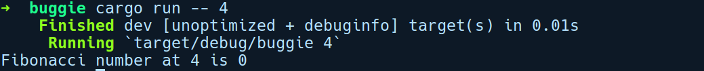

### 17.1.4　一个示例程序——buggie

我们将调试一个程序，以便体验GDB。让我们运行cargo new buggie命令创建一个新项目。我们的程序将只包含一个fibonacci函数，它会接收类型为usize的位置n为参数，然后返回第n个Fibonacci数。此函数假定Fibonacci数的初始值是0和1。以下是完整的程序：

```rust
1 // buggie/src/main.rs
2
3 use std::env;
4
5 pub fn fibonacci(n: u32) -> u32 {
6     let mut a = 0;
7     let mut b = 1;
8     let mut c = 0;
9     for _ in 2..n {
10        let c = a + b;
11        a = b;
12        b = c;
13    }
14    c
15 }
16
17 fn main() {
18     let arg = env::args().skip(1).next().unwrap();
19     let pos = str::parse::<u32>(&arg).unwrap();
20     let nth_fib = fibonacci(pos);
21     println!("Fibonacci number at {} is {}", pos, nth_fib);
22 }
```

让我们来看看这个程序的输出结果：


我们以4作为参数运行该程序，却发现输出的结果是0，但预期的结果应该是3。这说明我们的程序存在bug。虽然我们可以使用println!或dbg!宏轻松地解决这个bug，但是这次我们将使用GDB。

在使用GDB之前，我们需要规划调试会话。这包括查看程序的哪些地方和查看哪些内容。首先，我们将监测main函数的内容，然后进入fibonacci函数。我们将设置两个端点，一个在main函数，另一个在fibonacci函数。

