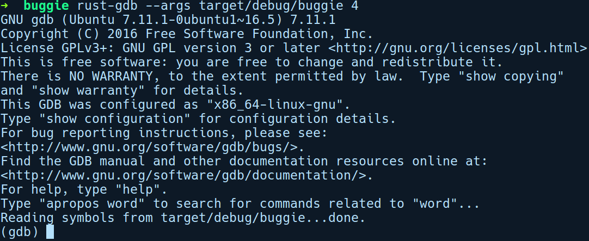
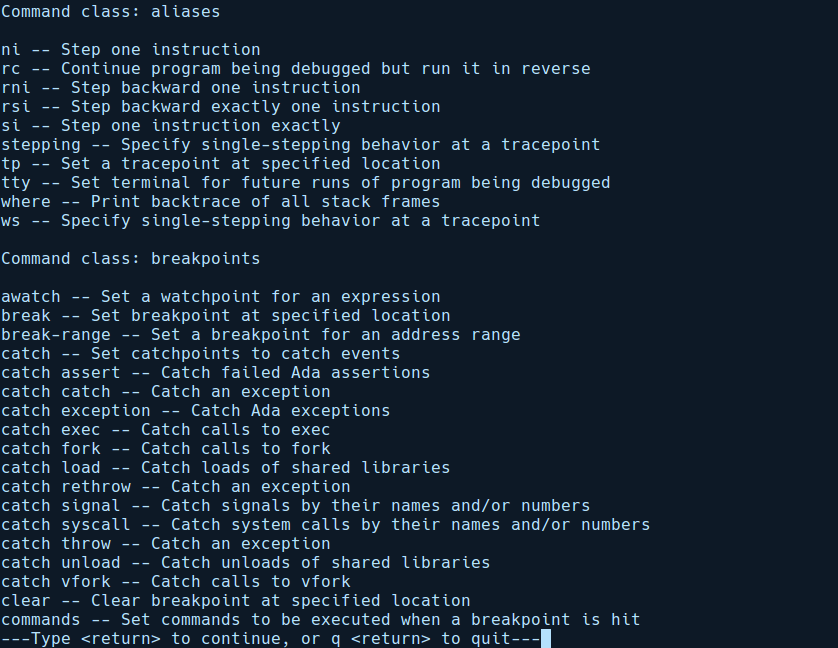
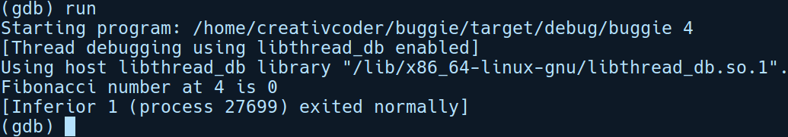
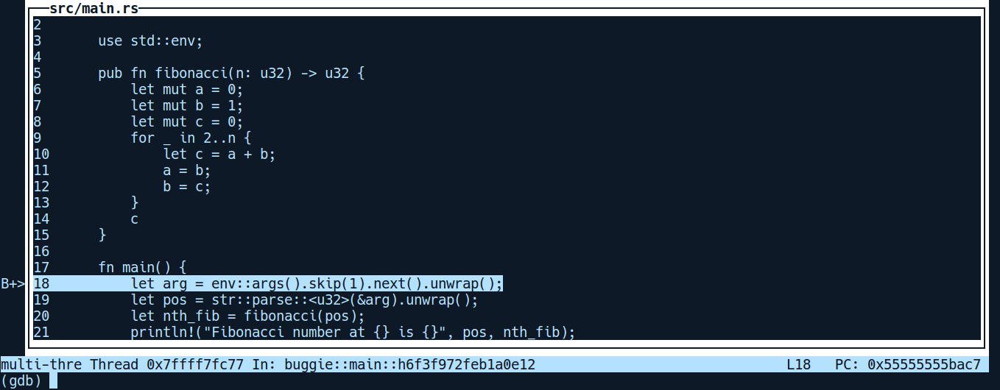
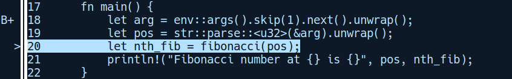
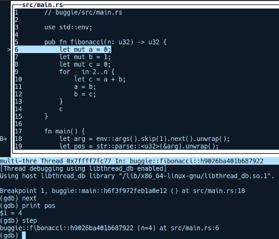
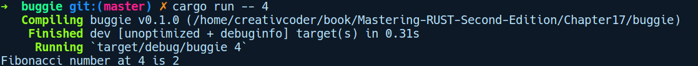

### 17.1.5　GDB基础知识

再次运行我们的程序，这次通过GDB的包装器rust-gdb运行，即rust-gdb --args target/ debug/buggie 4。--args标记用于将参数传递给程序，在这里我们传递的是数字4。以下是GDB的输出结果：


加载我们的程序之后，GDB向我们弹出了一个命令提示符对话框。此时程序还没有运行——它刚被加载。让我们快速了解一下GDB的特性。尝试输入help命令（显示命令的高级特性）和help all命令（显示所有可用命令的帮助信息）：


由上述内容可知，GDB的功能似乎非常强大：这些命令足足有32页。接下来，让我们运行程序，并通过在GDB命令提示符上执行run命令来查看输出结果：


这就是我们的程序在GDB上下文中运行的方式。如你所见，中间部分有第4个Fibonacci数输出相同的错误值0。现在将对此进行调试。让我们通过快捷键“Ctrl+L”清理一下屏幕。然后通过输入字母“q”退出GDB，并通过运行rust-gdb --args target/debug/buggie 4重新开始。

作为调试会话的起点，先看看我们是否将正确的数字传递给了fibonacci函数。我们将在main函数的开头添加一个断点，这是程序的第18行。要在该代码行上添加断点，我们将运行如下代码：

```rust
(gdb) break 18
```

这给我们提供了以下输出结果：

```rust
Breakpoint 1 at 0x9147: file src/main.rs, line 18.
```

GDB在我们请求的同一行代码上设置了一个断点，即第18行。让我们通过运行run来执行程序：

```rust
(gdb) run
```

我们获得了以下输出结果：

```rust
(gdb) run
Starting program: /home/creativcoder/buggie/target/debug/buggie 4
[Thread debugging using libthread_db enabled]
Using host libthread_db library "/lib/x86_64-linux-gnu/libthread_db.so.1".
Breakpoint 1, buggie::main::h8018d7420dbab31b () at src/main.rs:18
18        let arg = env::args().skip(1).next().unwrap();
(gdb)
```

我们的程序在断点处暂停，并等待用户的下一条指令。

你将看到Rust中的符号以其模块为前缀，并以一些随机ID作为后缀，例如buggie::main:: h8018d7420dbab31。现在要查看程序目前的位置，可以通过运行list命令来查看源代码，或者通过运行以下代码采用更直观的TUI模式：

```rust
(gdb) tui enable
```

这会打开GDB并接收一些友好的反馈，而且我们的命令提示符仍然位于底部：


如你所见，TUI提示我们左边有一个断点，第18行有一个B+>符号。我们可以滚动TUI面板中的代码清单来查看程序的完整源代码。


**注意**

如果TUI屏幕显示不正确，则可以单击“refresh”，它将重新绘制面板并列出相关代码。


现在，将逐行执行我们的程序。为此，我们有两个可用的命令：next和step。第1个命令用于逐行执行程序，而第2个命令允许用户在函数内跳转并逐行查看其中的指令。我们希望使用next，它会将我们带到第19行，而不是深入Rust的标准库API调用的细节。运行下列代码：

```rust
(gdb) next
```

在到达fibonacci函数之前，我们还必须再执行两次上述命令，只需按下“Enter”键即可让程序执行最后一条命令。在这种情况下，按下“Enter”键两次将运行接下来的两行代码。现在，我们正好在fibonacci函数调用之前：


在进入fibonacci函数之前，让我们检查一下变量pos的值是0还是别的垃圾值。可以使用print命令执行此操作：

```rust
(gdb) print pos
$1 = 4
(gdb)
```

如你所见，pos的值是正确的。现在我们到了第20行，这是fibonacci函数之前的调用。现在，使用step命令进入fibonacci函数内部：

```rust
(gdb) step
```

现在我们在第6行：


接下来，让我们逐行执行代码。当我们在fibonacci函数中单步执行代码时，可以使用info locals和info args命令查看变量的值：

```rust
(gdb) info locals
iter = Range = {start = 3, end = 4}
c = 0
b = 1
a = 1
(gdb) info args
n = 4
(gdb)
```

上述输出显示了第3次迭代后变量iter的信息。接下来的一行显示了函数中使用的所有其他变量。可以看到在每次迭代中，变量c被重新赋值为0。这是因为我们有“let c=a+b;”语句，它会影响在循环外声明的变量c。Rust 允许你重新声明具有相同名称的变量。在这里我们发现了程序的bug。

我们将通过删除c的重复声明来修复程序的bug。fibonacci函数被修改为如下内容：

```rust
pub fn fibonacci(n: u32) -> u32 {
    let mut a = 0;
    let mut b = 1;
    let mut c = 0;
    for _ in 2..n {
        c = a + b;
        a = b;
        b = c;
    }
    c
}
```

经过上述修改，让我们再次运行程序。这一次，我们将在没有GDB调试器的情况下运行它：


我们现在得到了第四个Fibonacci数的正确输出，即2。以上是使用GDB调试Rust代码的基础知识。

与GDB类似，LLDB是另一个与Rust兼容的调试器。接下来，让我们看看如何将GDB与代码编辑器集成。

