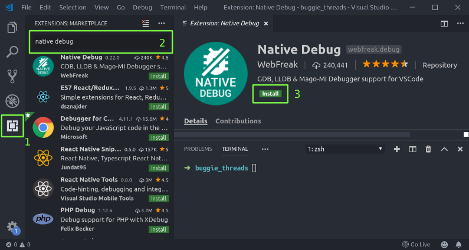
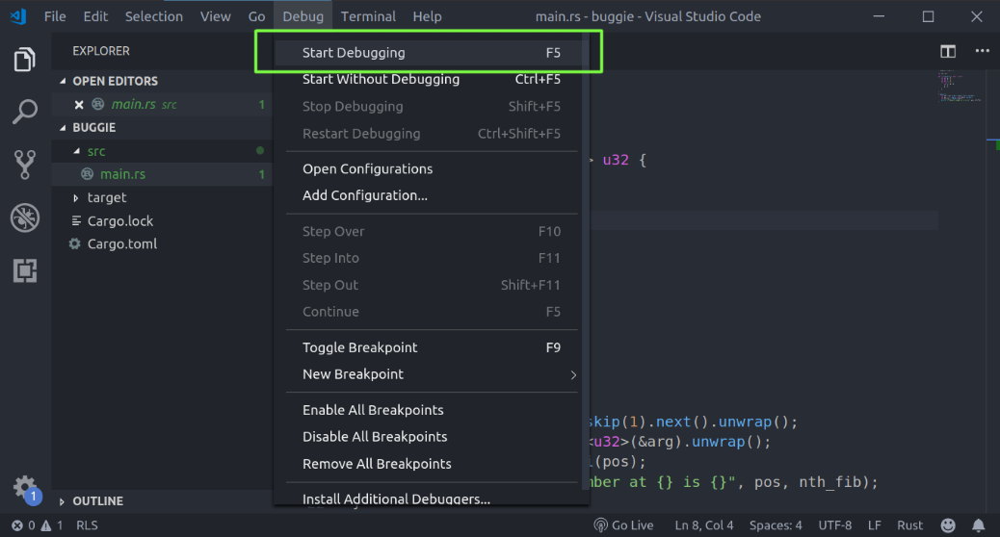
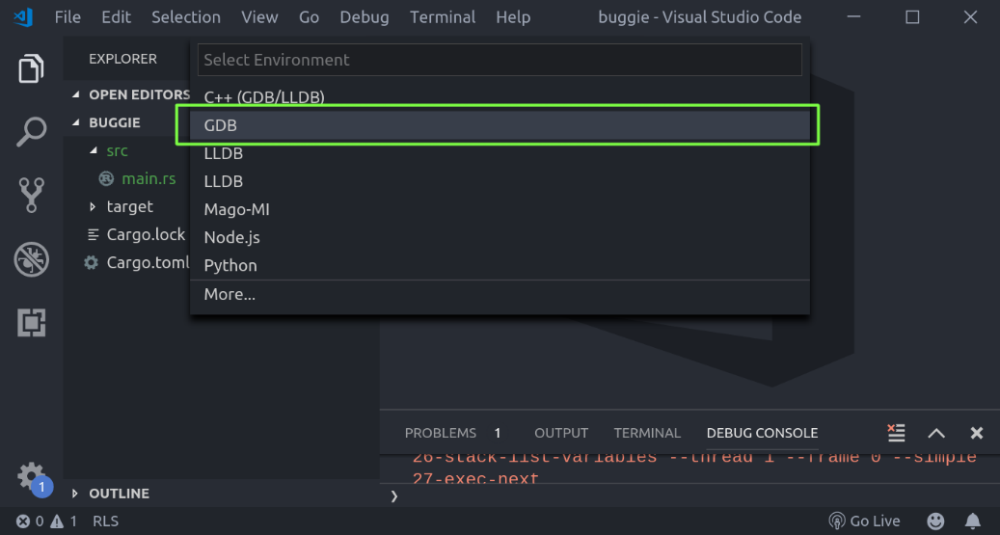
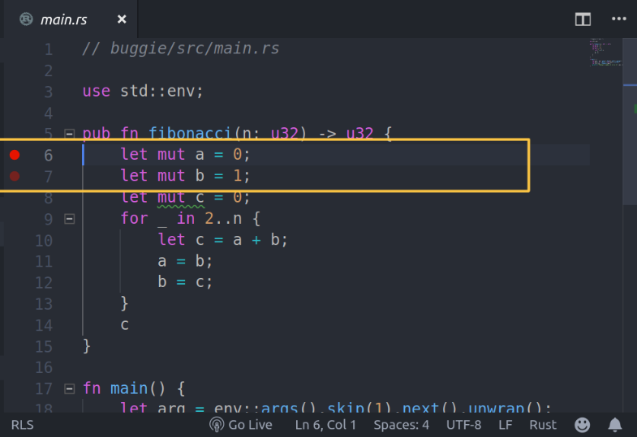
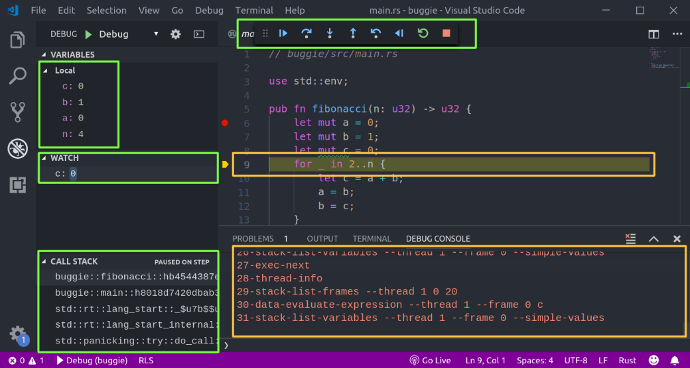
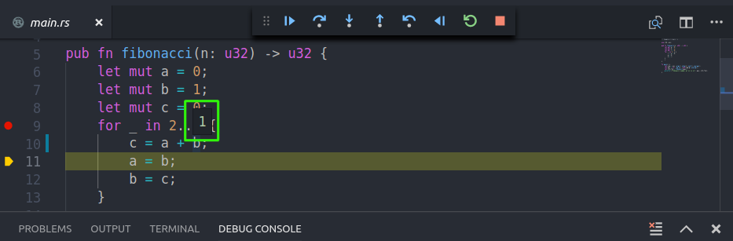

### 17.1.6　在Visual Studio Code中集成GDB

通过命令行使用调试器是调试程序的常用方法。这也是一项重要的技能，因为你很有可能会遇到无法使用高级编码平台的情况。例如，你可能需要调试已在生产环境中运行的程序，使用GDB和LLDB可以将其从编辑器中附加到正在运行的进程，但是可能无法从编辑器中附加到正在运行的程序。

然而，在典型的开发环境设置中，你可以使用代码编辑器或IDE，如果可以立即从编辑器调试程序，而无须离开编辑器，这将会非常方便。通过这种方式将调试器集成到代码编辑器后，你可以获得更顺畅的调试体验和更快的反馈循环。在本小节中，我们将介绍如何将GDB与VS Code集成。

为了在VS Code中配置GDB，我们需要安装Native Debug扩展。打开VS Code编辑器，我们将按下“Ctrl + Shift + P”快捷键并输入install extension命令。或者你可以选择左下角的扩展图标，如下图所示，然后输入“native debug”。通过上述操作，我们将获得Native Debug扩展的页面：


我们将单击“Install”并等待安装完成。安装扩展后，将单击“restart”重新启动VS Code。这将启用任何新安装的扩展。接下来，我们将在VS Code中打开buggie目录，单击顶部的“Debug”菜单，然后选择“Start Debugging”，如下图所示：


这里，我们将被要求选择一种环境，如下所示：


NativeDebug扩展支持GDB和LLDB。我们将从此菜单中选择GDB，这将打开一个新的launch.json配置文件，用于配置此项目的调试会话。它是在同一根目录下创建的，名为.vscode/。如果它没有打开，我们可以手动创建.vscode/目录，其中包含launch.json。我们将使用以下配置填充此launch.json：

```rust
// buggie/.vscode/launch.json
{
    "version": "0.2.0",
    "configurations": [
        {
            "name": "Buggie demo",
            "type": "gdb",
            "request": "launch",
            "target": "target/debug/buggie",
            "cwd": "${workspaceRoot}",
            "arguments": "4",
            "gdbpath": "rust-gdb",
            "printCalls": true
        }
    ]
}
```

launch.json文件配置了GDB和VS Code的关键细节，例如要调用的目标和需要使用的参数。在大多数情况下，其他字段将自动填充。项目特有的一组配置如下所示。

+ 我们在配置中添加了一个名称，即"Buggie demo"。
+ 我们添加了一个指向rust-gdb的变量gdbpath。这将通过rust-gdb包装器启动GDB，它知道如何在Rust中输出复杂的数据类型。
+ 我们将target字段指向需要调试的二进制文件，即target/debug/buggie。

我们将保存此文件，然后在编辑器中为程序添加一个断点。我们可以通过单击VS Code中文件区域的左侧来执行此操作，如下图所示：


在上图中，如果将鼠标指针悬停在左侧，我们将看到一个暗红色标记。可以单击代码的左侧来设置断点，然后对应位置将显示一个红色的光点。完成上述设置后，我们可以按“F5”键在VS Code中启动GDB。当GDB命中我们的断点时，代码编辑器将显示如下内容：


在窗口顶部的中心，我们可以看到调试代码常用的按钮，例如跳过（step over）、进入（step into）及暂停/终止（pause/stop）等。在窗口的左下角，我们可以看到调用堆栈的相关信息。在窗口左侧的中部，我们可以看到监视的任何变量。在前面的代码中，我们对变量c添加了一个监视。

现在程序运行到第9行时暂停了，这样我们就可以将鼠标指针悬停在代码的变量上查看它包含的值，如下图所示：


这将非常有助于我们的调试。这些是将GDB集成到VS Code的基础知识。接下来，让我们简要介绍一下在调试多线程代码时非常有用的另一款调试器：rr调试器。

