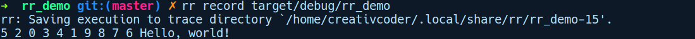
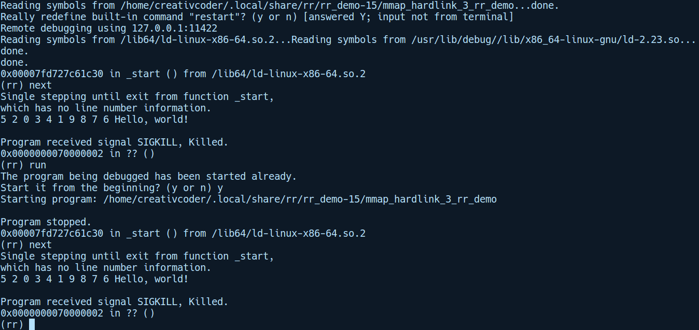

### 17.2　rr调试器简介

除了GDB和LLDB之外，rr是另一款功能强大的调试器，它在调试因存在非确定性而难以调试的多线程代码时效果特别好。通常，在调试多线程代码时，其中某段代码出现bug，但后续在程序执行时调试会话却难以重现。


**注意**

由于多线程代码而产生的错误也被称为heisenbug。


rr 调试器可以为非确定的多线程代码执行可重现的调试会话。它通过记录调试会话来完成此操作，用户可以重播并逐步跟踪来查找问题。它会将程序的跟踪保存到磁盘，其中包含重现程序执行所需的所有信息。

rr调试器的一个不足之处在于，目前它仅为Linux和Intel CPU提供了支持。要在Ubuntu 16.04上设置rr调试器，我们需要下载最新的deb软件包。撰写本文时，rr调试器的版本是5.2.0。下载了deb软件包之后，我们可以通过运行如下代码来安装rr调试器：

```rust
sudo dpkg -i
https://github.com/mozilla/rr/releases/download/5.2.0/rr-5.2.0-Linux-x86_64
.deb
```

注意，上述操作的一个先决条件是已经安装了相关的性能工具。你可以按照如下方式安装它们：

```rust
sudo apt-get install linux-tools-4.15.0-43-generic
```

可以根据需要，将 linux-tools-（版本号）中的版本号替换成与用户本机适配的内核版本号。在Linux上可以使用uname-a命令获取系统内核的版本号。另一个先决条件是将perf_ event_paranoid中的sysctl标志的值由3设置为−1。建议你通过运行如下代码进行临时设置：

```rust
sudo sysctl -w kernel.perf_event_paranoid=-1
```

完成上述配置后，让我们通过运行cargo new rr_demo快速创建一个新项目，并通过rr调试器执行一次调试会话。我们将探讨如何通过rr调试器调试存在非确定性的示例程序。同时会用到rand程序库，因此我们可以通过运行cargo add rand命令将对rand程序库的引用添加到Cargo.toml文件中。我们的main.rs文件包含如下代码：

```rust
// rr_demo/src/main.rs
use rand::prelude::*;
use std::thread;
use std::time::Duration;
fn main() {
    for i in 0..10 {
        thread::spawn(move || {
            let mut rng = rand::thread_rng();
            let y: f64 = rng.gen();
            let a: u64 = rand::thread_rng().gen_range(0, 100);
            thread::sleep(Duration::from_millis(a));
            print!("{} ", i);
        });
    }
    thread::sleep(Duration::from_millis(1000));
    println!("Hello, world!");
}
```

这是一个最简单的存在非确定性的示例程序，它生成10个线程并将它们输出到stdout。为了突出rr调试器的可重现特性，我们将生成线程并随即休眠。

首先，我们需要用rr调试器记录程序的执行。这是通过运行以下代码完成的：

```rust
rr record target/debug/rr_demo
```

上述操作的输出结果如下所示：


在我的计算机上，这会跟踪记录程序执行的过程并将其存储到如下位置：

```rust
rr: Saving execution to trace directory
`/home/creativcoder/.local/share/rr/rr_demo-15`
```

记录文件rr_demo-15可能会以别的名称存储在你的计算机上。我们现在可以通过运行如下代码重现被录制的程序：

```rust
rr replay -d rust-gdb /home/creativcoder/.local/share/rr/rr_demo-15
```

以下是在rr调试器下运行的GDB会话：


如你所见，程序每次都会输出相同的数字序列，因为程序是根据上一次运行中记录的会话执行的。这有助于调试多线程程序，由于其中的线程是无序执行的，因此下一次运行程序时可能无法重现该bug。

