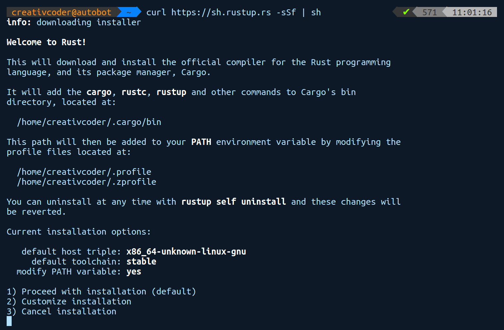
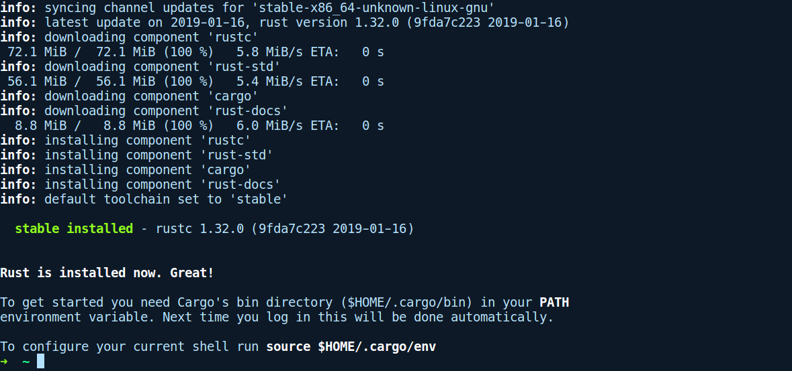

### rustup.rs

rustup是一款在所兼容的平台上安装Rust编译器的工具。为了让不同平台上的开发者能够轻松地下载和使用该语言，Rust团队开发了rustup。它是一个用Rust编写的命令行工具，提供了一种简单的方法来安装编译器的预构建二进制文件，以及构建用于交叉编译的二进制标准库。它还可以安装其他组件，例如Rust源代码、文档、Rust格式化工具（rustfmt）、Rust语言服务器（Rust Language Server，用于IDE的RLS），并且它支持所有操作系统，包括Windows。

根据官方网站的提示，安装工具链的推荐做法是运行以下命令：

```rust
curl https://sh.rustup.rs -sSf | sh
```

默认情况下，安装程序会安装稳定版的Rust编译器、软件包管理器Cargo，以及语言的标准库文档，以便脱机查看。它们会默认安装到~/.cargo目录下。rustup还会更新环境变量PATH以指向此目录。

以下是在Ubuntu 16.04上运行上述命令的输出结果：


如果你需要对安装进行任何更改，那么可以选择2）。不过默认配置对我们来说没有任何问题，因此我们将继续选择1），以下是安装成功后的输出结果：


rustup还包含其他功能，例如将工具链更新到最新版本，这可以通过运行rustup update命令来完成，还可以通过运行rustup self update 命令来更新自身的版本。它还提供了针对特定目录的工具链配置。默认情况下工具链会设置成全局安装，在这种情况下安装的是稳定版的工具链。你可以通过运行rustup show命令查看默认设置。如果你想为某个项目使用最新的夜间版工具链，可以通过运行rustup override set nightly命令告知rustup针对特定目录切换到夜间版的工具链。如果由于某种原因想使用较旧版本的工具链或者对工具链进行降级（例如 2016-06-03的夜间版），那么可以通过运行rustup install nightly-2016-06-03命令，然后使用override子命令来达到目的。


**注意**

本书中的所有代码示例和项目都基于编译器rustc 1.32.0（9fda7c223 2019-01-16）。


现在，你应该拥有编译和运行Rust程序所需的一切。让我们开始探索Rust之旅吧！

