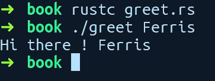
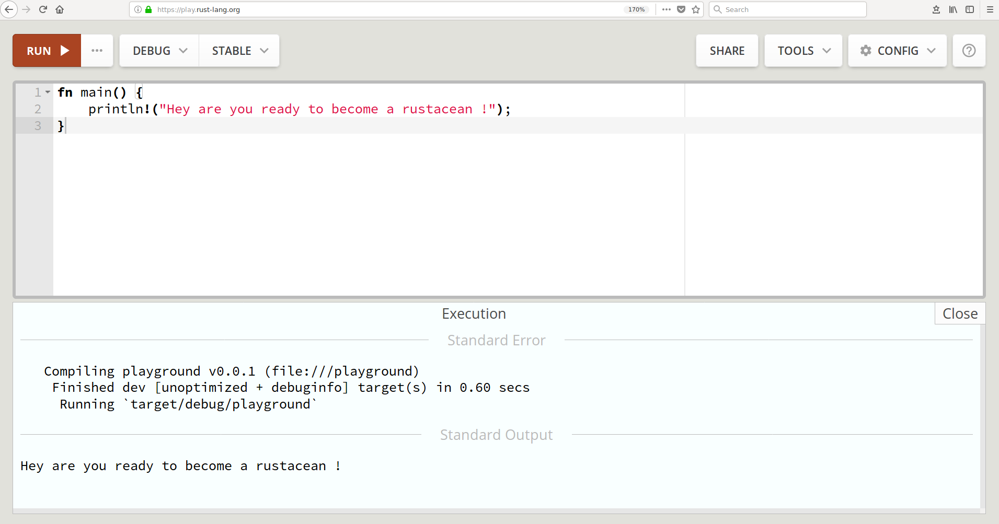

### 1.3　Rust简介

对于基本的语言功能，Rust不会偏离你在其他语言中习惯的内容；在较高层面，Rust程序会被组织成模块的形式，根模块会包含一个main()函数。对于二进制可执行项目，根模块通常是一个main.rs文件，而对于程序库，根模块通常是一个lib.rs文件。在模块中，你可以定义函数、导入程序库、定义类型、创建常量、编写测试和宏，甚至创建嵌套模块。我们将进行上述所有操作，但是让我们先从基础开始。接下来将介绍一个简单的Rust程序：

```rust
// greet.rs
1． use std::env;
2．
3. fn main() {
4．    let name = env::args().skip(1).next();
5．    match name {
6．       Some(n) => println!("Hi there ! {}", n),
7．       None => panic!("Didn't receive any name ?")
8．    }
9． }
```

让我们编译并运行该程序。将上述代码存储成名为greet.rs的文件，并使用该文件名运行rustc，然后将你的名字作为参数传递给它。这里传递的名称是Rust的非官方吉祥物Ferris，并在计算机上得到以下输出结果：


很明显，它的输出结果与预期的一致。让我们逐行解释一下该程序。

在第1行中，我们从std库导入一个名为env的模块，std是Rust的标准库。在第3行代码中，我们可以看到常见的main函数。然后在第4行中，我们调用env模块中的函数args()，它会返回传递给程序的参数的迭代器（序列）。因为第一个参数包含程序名，我们希望跳过它，所以我们调用skip并传入一个数字，该数字表示我们希望跳过的元素数目（1）。因为Rust中的迭代器是惰性的，并且不会进行预先计算，我们必须显式要求它给出下一个元素，所以接下来会调用next()，它会返回一个名为Option的枚举类型。Option既可以是Some(value)，也可以是None变量，因为用户可能忘记提供参数。

在第5行中，我们在变量名上使用Rust提供的math表达式特性，并检查它是Some(n)值还是None值。match和if else语句的构造类似，但功能更强大。在第6行中，当它是Some(n)时，我们调用println!()，并传入内部字符串变量n（这在使用match表达式时会自动声明），之后向用户展示输出结果。println!调用并非一个函数，而是一个宏（它们都是以!结尾）。最后，在第7行中，如果它是一个枚举类型的None变量，那么将会调用panic!()（另外一个宏），这将中止程序运行，并向用户输出一条错误提示信息。

println!宏会接收一个字符串，该字符串包含一个用"{}"表示的元素占位符。这些字符串被称为格式化字符串，而字符串中的"{}"被称为格式化声明符。要输出简单的类型（例如基元类型），可以使用"{}"格式化声明符，而对于其他类型，可以使用"{:?}"格式化声明符。当然，与之有关的细节还有很多。当println!遇到一个格式化声明符，即"{}"，以及相应的替换值时，它会在该值上调用一个方法，并返回该值的字符串形式。这种方法是特征的一部分。对于"{}"格式化声明符，它会调用一个来自Display特征的方法，对于"{:?}"，它会调用一个来自Debug特征的方法。后者主要用于调试，而前者用于显示数据类型的可读形式的输出。它有点类似Java中的toString()方法。在开发过程中，通常需要输出数据类型以进行调试。使用"{:?}"格式化声明符时，上述方法在类型上是不可用的，我们需要在类型上添加#[derive(Debug)]属性来获取这些方法。后续的章节将会详细介绍这些属性，不过在接下来的代码示例中就会看到它。我们将在第9章中重温println!宏的应用。

在本章中，手动运行rustc并不意味着你在实际开发工作中也必须这么做。在后文中，我们将使用Rust的软件包管理器来构建和运行程序。除了在本地运行编译器之外，另一个可用于运行代码示例的工具是名为Rust Playground的官方在线编译器，以下是计算机上的截图：


Rust Playground还支持导入外部库，并可在运行示例程序时使用。

在前面的示例中，我们对基本的Rust程序进行了概述，但没有深入了解所有细节和语法。在接下来的章节中，我们将分别解释该语言的特性和语法。下面的解释可为你提供足够的知识储备，以便你可以快速地启动并运行编写的Rust程序，而无须详尽地浏览所有用例。简单起见，每个部分还包含对相关内容的引用，以更详细地解释这些概念。此外，Rust文档页面和内置的搜索功能将帮助你了解详细信息。建议你主动搜索后文中介绍的任意概念，这将有助于你获得正在学习的相关概念的更多背景信息。

本章中的所有代码示例都可以在本书的GitHub版本库（PacktPublishing/Mastering- RUST-Second-Edition）中找到。对于本章，它们在“Chapter 1, Getting Started with Rust Directory”目录下——本书后文的代码示例将遵循相同的约定。


**注意**

某些代码文件是刻意提供的，它们无法编译，因此你可以在编译器的帮助下自行修复。


接下来，让我们从Rust的基元类型开始。

