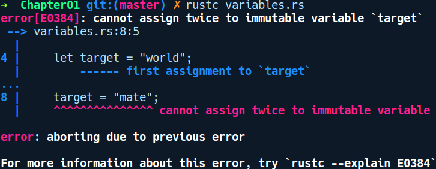

### 1.3.2　变量声明和不可变性

变量允许我们存储一个值，以便可以在后续的代码中轻松地引用它。在Rust中，我们使用关键字let来声明变量。这在本节开头的greet.rs示例中已经展示了这一点。在诸如C或Python等主流的命令式语言中，不能阻止你为初始化后的变量重新分配其他值。Rust通过在默认情况下让变量不可变而另辟蹊径，也就是说，在初始化变量后，你无法为变量分配其他值。如果稍后需要将变量指向其他变量（同一类型），则需要在其前面加上关键字mut。Rust要求你明确地表达自己的意图。

考虑如下代码：

```rust
// variables.rs
fn main() {
    let target = "world";
    let mut greeting = "Hello";
    println!("{}, {}", greeting, target);
    greeting = "How are you doing";
    target = "mate";
    println!("{}, {}", greeting, target);
}
```

我们声明了两个变量，即target和greeting。target是一个不可变的绑定变量，而greeting前面有一个关键字mut，这使它成为一个可变的绑定变量。但是，如果我们运行此程序，则会出现以下错误提示信息：


从上述错误提示信息可以看出，Rust不允许你再次为target分配值。为了让该程序通过编译，我们需要在let语句中的target之前加上关键字mut，然后再次编译和运行它。以下是程序运行后的输出结果：

```rust
$ rustc variables.rs
$ ./variables
Hello, world
How are you doing, mate
```

let语句不仅是为变量分配值，也是Rust中的模式匹配语句。在第7章中，我们将详细介绍它。接下来我们将讨论函数。

