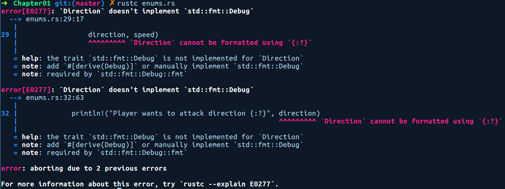

### 1.3.9　自定义数据类型

自定义类型，顾名思义，是由用户定义的类型。自定义类型可以由几种类型组成。它们可以是基元类型的包装器，也可以是多个自定义类型的组合。它们有3种形式：结构体、枚举及联合，或者被称为struct、enum及union。它们允许你更轻松地表示自己的数据。自定义类型的命名规则遵循驼峰命名法（CamelCase）。Rust的结构体和枚举功能比C语言的结构体和枚举功能更强大，而Rust的联合非常类似于C语言的联合，主要用于与C语言代码库交互。我们将在本节中介绍结构体和枚举，将在第7章中详细介绍联合。

#### 结构体

在Rust中，结构体的声明形式有3种。其中最简单的是单元结构体（unit struct），它使用关键字struct进行声明，随后是其名称，并用分号作为结尾。以下代码示例定义了一个单元结构体：

```rust
// unit_struct.rs
struct Dummy;
fn main() {
    let value = Dummy;
}
```

我们在上述代码中定义了一个名为Dummy的单元结构体。在main函数中，我们可以仅使用其名称初始化此类型。value现在包含一个Dummy实例，并且值为0。单元结构体在运行时不占用任何空间，因为没有与之关联的数据。用到单元结构体的情况非常少。它们可用于对没有与之关联的数据或状态进行实体建模；也可用于表示错误类型，结构体本身足以表述错误，而不需要对其进行描述；还可用于表示状态机实现过程中的状态。接下来，让我们看看结构体的第2种形式。

结构体的第2种形式是元组结构体（tuple struct），它具有关联数据。其中的每个字段都没有命名，而是根据它们在定义中的位置进行引用。假定你正在编写用于图形应用程序的颜色转换/计算库，并希望在代码中表示RGB颜色值。可以用以下代码表示Color类型和相关元素：

```rust
// tuple_struct.rs
struct Color(u8, u8, u8);
fn main() {
    let white = Color(255, 255, 255);
    //可以通过索引访问它们
    let red = white.0;
    let green = white.1;
    let blue = white.2;
    println!("Red value: {}", red);
    println!("Green value: {}", green);
    println!("Blue value: {}\n", blue);
    let orange = Color(255, 165, 0);
    //你也可以直接解构字段
    let Color(r, g, b) = orange;
    println!("R: {}, G: {}, B: {} (orange)", r, g, b);
    //也可以在解构时忽略字段
    let Color(r, _, b) = orange;
}
```

在上述代码中，Color(u8, u8, u8)是创建和存储到变量white的元组结构体。然后，我们使用white.0语法访问white中的单个颜色组件。元组结构体中的字段可以通过variable. <index>这样的语法访问，其中索引会引用结构体中字段的位置，并且是以0开头的。访问结构体中字段的另一种方法是使用let语句对结构体进行解构。后面，我们创建了一个颜色orange（橙色）。随后我们编写了一条let语句，并让Color(r, g, b)位于等号左边，orange位于等号右边。这使得orange中的3个字段分别存储到了变量r、g和b中。系统会自动为我们判定r、g和b的类型。

对于5个以下的属性进行数据建模时，元组结构体是理想的选择。除此之外的任何选择都会妨碍代码的可读性和我们的推理。对于具有3个以上字段的数据类型，建议使用类C语言的结构体，这是第3种形式，也是最常用的形式。请参考如下代码：

```rust
// structs.rs
struct Player {
    name: String,
    iq: u8,
    friends: u8,
    score: u16
}
fn bump_player_score(mut player: Player, score: u16) {
    player.score += 120;
    println!("Updated player stats:");
    println!("Name: {}", player.name);
    println!("IQ: {}", player.iq);
    println!("Friends: {}", player.friends);
    println!("Score: {}", player.score);
}
fn main() {
    let name = "Alice".to_string();
    let player = Player { name,
                          iq: 171,
                          friends: 134,
                          score: 1129 };
    bump_player_score(player, 120);
}
```

在上述代码中，结构体的创建方式与元组结构体的相同，即通过指定关键字struct，随后定义结构体的名称。但是，结构体以花括号开头，并且声明了字段名称。在花括号内，我们可以将字段写成以逗号分隔的“field:type”对。创建结构体的实例也很简单；我们只需编写Player，随后跟一对花括号，花括号中包含以逗号分隔的字段。使用与字段具有相同名称的变量初始化字段时，我们可以使用字段初始化简化（field init shortland）特性，即前面代码中的name字段。然后，我们可以使用struct.field_name语法轻松地访问此前创建的实例中的字段。

在上述代码中，我们还有一个名为bump_player_score的函数，它将结构体Player作为参数。默认情况下，函数参数是不可变的，所以当我们需要修改播放器中的分数（score）时，需要将函数中的参数修改为mut player，以允许我们修改它的任何字段。在结构体上使用关键字mut意味着它的所有字段都是可修改的。

使用结构体而不是元组结构体的优点在于，我们可以按任意顺序初始化字段，还可以为字段提供有意义的名称。此外，结构体的大小只是其每个字段成员大小的总和，如有必要，还包括任意数据对齐填充所需的空间大小。它没有任何额外的元数据尺寸的开销。接下来，让我们来看看枚举。

#### 枚举

当你需要为不同类型的东西建模时，枚举可能是一种好办法。它是使用关键字enum创建的，之后跟着的是枚举名称和一对花括号。在花括号内部，我们可以编写所有可能的类型，即变体。这些变体可以在包含或不包含数据的情况下定义，并且包含的数据可以是任何基元类型、结构体、元组结构体，甚至是枚举类型。

不过，在递归的情况下，例如你有一个枚举Foo和一个引用枚举的变体，则该变体需要在指针类型（Box、Rc等）的后面，以避免类型无限递归定义。因为枚举也可以在堆栈上创建，所以它们需要预先指定大小，而无限的类型定义使它无法在编译时确定大小。现在，我们来看看如何创建一个枚举：

```rust
// enums.rs
enum Direction {
    N,
    E,
    S,
    W
}
enum PlayerAction {
    Move {
        direction: Direction,
        speed: u8
    },
    Wait,
    Attack(Direction)
}
fn main() {
    let simulated_player_action = PlayerAction::Move {
        direction: Direction::N,
        speed: 2,
    };
    match simulated_player_action {
        PlayerAction::Wait => println!("Player wants to wait"),
        PlayerAction::Move { direction, speed } => {
          println!("Player wants to move in direction {:?} with speed {}",
                direction, speed)
        }
        PlayerAction::Attack(direction) => {
            println!("Player wants to attack direction {:?}", direction)
        }
    };
}
```

上述代码定义了两个变体：Direction和PlayerAction。然后我们通过选择任意变体来创建它们的实例，其中变体和枚举名用双冒号分隔，例如Direction::N和PlayerAction::Wait。注意，我们不能使用未初始化的枚举，它必须是变体之一。给定枚举值，要查看枚举实例包含哪些变体，可以使用match表达式进行模式匹配。当我们在枚举上匹配时，我们可以将变量放在PlayerAction::Attack(direction)中的direction等字段中，从而直接解构变体中的内容，反过来，这意味着我们可以在匹配臂中使用它们。

正如你在前面的Direction变体中看到的，我们有一个#[derive(Debug)]注释。这是一个属性，它允许用户在println!()中以{:?}格式输出Direction实例。这是通过名为Debug的特征生成方法来完成的。编译器告诉我们是否缺少Debug，并提供有关修复它的建议，因此我们需要从那里获得该属性：


从函数式程序员的角度看，结构体和枚举也称为代数数据类型（Algebraic Data Type，ADT），因为可以使用代数规则来表示它们能够表达的值的取值区间。例如，枚举被称为求和类型，是因为它可以容纳的值的范围基本上是其变体的取值范围的总和；而结构体被称为乘积类型，是因为它的取值区间是其每个字段取值区间的笛卡儿积。在谈到它们时，我们有时会将它们称为ADT。

