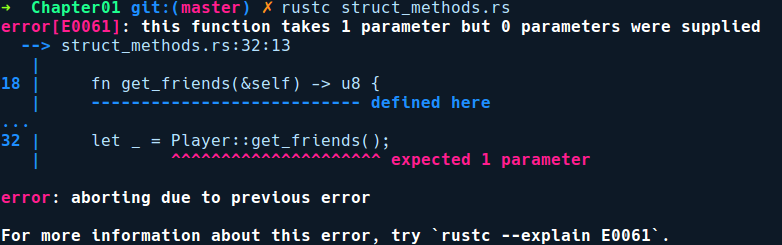

### 1.3.10　类型上的函数和方法

没有行为的类型功能有限，并且通常情况下我们希望类型具有函数或方法，以便我们可以返回它们的实例而不是手动构造它们，或者使我们能够操作自定义类型中的字段。这可以通过impl块来实现，它被视作某个类型提供实现。我们可以为所有自定义类型或包装器类型提供实现。首先，我们来看看如何编写结构体的实现。

#### 结构体上的impl块

我们可以使用两种机制向之前定义的结构体Player中添加行为：一种是类似构造函数的函数，它接收一个名称并为Person中的其余字段设置默认值，另一种是设置Person的friends字段的getter和setter方法。

```rust
// struct_methods.rs
struct Player {
    name: String,
    iq: u8,
    friends: u8
}
impl Player {
    fn with_name(name: &str) -> Player {
        Player {
            name: name.to_string(),
            iq: 100,
            friends: 100
        }
    }
    fn get_friends(&self) -> u8 {
        self.friends
    }
    fn set_friends(&mut self, count: u8) {
        self.friends = count;
    }
}
fn main() {
    let mut player = Player::with_name("Dave");
    player.set_friends(23);
    println!("{}'s friends count: {}", player.name, player.get_friends());
    //另一种调用实例方法的方式
    let _ = Player::get_friends(&player);
}
```

我们指定关键字impl，然后指定我们希望实现方法的类型，后跟一对花括号。在花括号中，我们可以编写两种方法。

+ **关联方法** ：该方法没有self类型作为第1个参数。with_name方法被称为关联方法，因为它没有使用self作为第1个参数。它类似于面向对象编程语言中的静态方法。这些方法在类型自身上即可调用，并且不需要类型的实例来调用。通过在方法名称前加上结构体名称和双冒号来调用关联方法，如下所示：

```rust
   Player::with_name("Dave");
```

+ **实例方法** ：将self作为第1个参数的函数。这里的self类似于Python中的self，并指向实现该方法的实例（这里是Player）。因此，get_friends()方法只能在已创建的结构体实例上调用：

```rust
   let player = Player::with_name("Dave");
   player.get_friends();
```

如果我们使用关联方法的语法调用get_friends，即Player::get_friends()，编译器会给出如下错误提示信息：


这里的错误提示信息具有误导性，但它表明实例方法基本上就是关联方法，self是第1个参数，而instance.foo()是一种语法糖。这意味着我们可以这样调用它：Player::get_friends (&player);。在此调用中，我们给方法传递了一个Player的实例，&self就是&player。

我们可以在类型上实现3种实例方法的变体。

+ self作为第一个参数。在这种情况下，调用此方法将不允许你后续使用该类型。
+ &self作为第一个参数。此方法仅提供对类型实例的读取访问权限。
+ &mut self作为第一个参数。此方法提供对类型实例的可变访问。

我们的set_friends方法是一个&mut self方法，它允许我们修改player中的字段。我们需要在self之前添加运算符&，这表示self在方法存续期间被借用，这正是我们想要的。如果没有&符号，调用者会将所有权移动到方法，这意味着在get_friends方法返回后将取消分配值，我们将不能再使用Player实例。不必担心，我们没有在第5章详细解释所有这些之前，移动和借用这些术语并没有什么特别的含义。

接下来，我们将讨论枚举的实现。

#### impl块和枚举

我们还可以为枚举提供实现。例如，考虑使用Rust构建的支付程序库，它公开了一个名为pay的API：

```rust
// enum_methods.rs
enum PaymentMode {
    Debit,
    Credit,
    Paypal
}
//一些网络支付处理程序
fn pay_by_credit(amt: u64) {
    println!("Processing credit payment of {}", amt);
}
fn pay_by_debit(amt: u64) {
    println!("Processing debit payment of {}", amt);
}
fn paypal_redirect(amt: u64) {
    println!("Redirecting to paypal for amount: {}", amt);
}
impl PaymentMode {
    fn pay(&self, amount: u64) {
        match self {
            PaymentMode::Debit => pay_by_debit(amount),
            PaymentMode::Credit => pay_by_credit(amount),
            PaymentMode::Paypal => paypal_redirect(amount)
        }
    }
}
fn get_saved_payment_mode() -> PaymentMode {
    PaymentMode::Debit
}
fn main() {
    let payment_mode = get_saved_payment_mode();
    payment_mode.pay(512);
}
```

上述代码中有一个名为get_saved_payment_mode的方法，它返回用户保存的付款方式。这些方式可以是信用卡、借记卡或Paypal。最好将其建模为枚举，其中可以添加不同的付款方式作为其变体。然后程序库为我们提供单一的pay()方法，以便用户可以方便地提供支付金额。此方法可以确定枚举中的某个变体，并相应地将方法指派给正确的支付服务供应商，而不会让程序库的用户担心要检查使用哪种付款方式。

枚举也广泛用于状态机，当其与match表达式搭配使用时，它们可使状态转换代码非常简洁。它们还可用于自定义错误类型的建模。当枚举变体没有任何与之关联的数据时，它们可以像C语言的枚举那样使用，其中的变体默认具有以0开头的整数值（isize），但也可以手动标记整数值。这在与外部C程序库交互时很有用。

