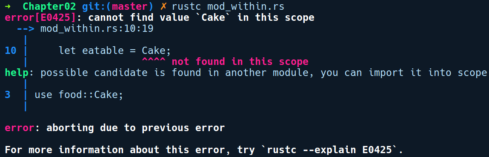
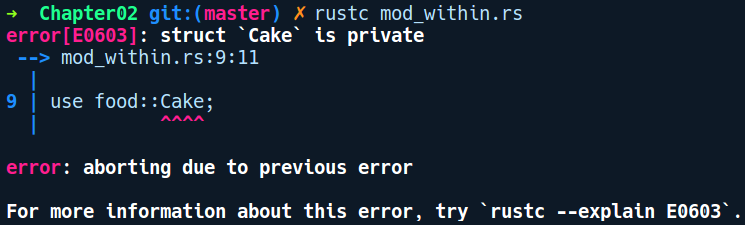

### 2.2.1　嵌套模块

创建模块最简单的方法是在现有模块中使用mod代码块。考虑如下代码：

```rust
// mod_within.rs
mod food {
    struct Cake;
    struct Smoothie;
    struct Pizza;
}
fn main() {
    let eatable = Cake;
}
```

我们创建了一个名为food的内部模块。要在现有模块中创建模块，我们需要使用关键字mod，后跟模块名称food，之后是一对花括号。在花括号内部，我们可以声明任何类型的元素，甚至嵌套模块。在我们的food模块中，我们声明了3种结构：Cake、Smoothie和Pizza。在main函数中，我们使用路径语法food::Cake从food模块创建一个Cake实例。接下来我们对该程序进行编译：


奇怪的是，编译器提示并未发现任何Cake类型的定义。让我们根据编译器的提示将“use food::Cake”添加到代码中：

```rust
// mod_within.rs
mod food {
    struct Cake;
    struct Smoothie;
    struct Pizza;
}
use food::Cake;
fn main() {
    let eatable = Cake;
}
```

我们已经将“use food::Cake”添加到代码中。要使用模块中的任何元素，我们必须添加一个use声明。让我们再试一次：


我们得到另一个错误，提示说Cake是私有的。这为我们提供了关于模块的另一个重要特性，即私密性。默认情况下，模块内的元素是私有的。要使用模块中的任何元素，我们需要将元素纳入作用域。这需要两个步骤：首先，我们需要通过使用关键字pub作为元素的前缀使元素变为公有的；其次，要使用该元素，我们需要添加一个use语句，就像之前使用food::Cake一样。

关键字use之后的内容是模块中的元素路径。使用路径语法指定模块中任何元素的路径，其语法是在元素名称之间使用双冒号（::）。路径语法通常以导入元素的模块名称开头，但它也可用于导入某些类型的单个字段，例如枚举。

让我们将Cake设定为公有的：

```rust
// mod_within.rs
mod food {
    pub struct Cake;
    struct Smoothie;
    struct Pizza;
}
use food::Cake;
fn main() {
    let eatable = Cake;
}
```

我们在Cake结构体之前添加了关键字pub，并通过use food::Cake在root模块中引用它。通过这些修改，我们的代码就能够成功编译。现在似乎并不清楚为什么需要创建这样的嵌套模块，但是当我们在第3章讨论如何编写测试时，将会看到它的具体应用。

