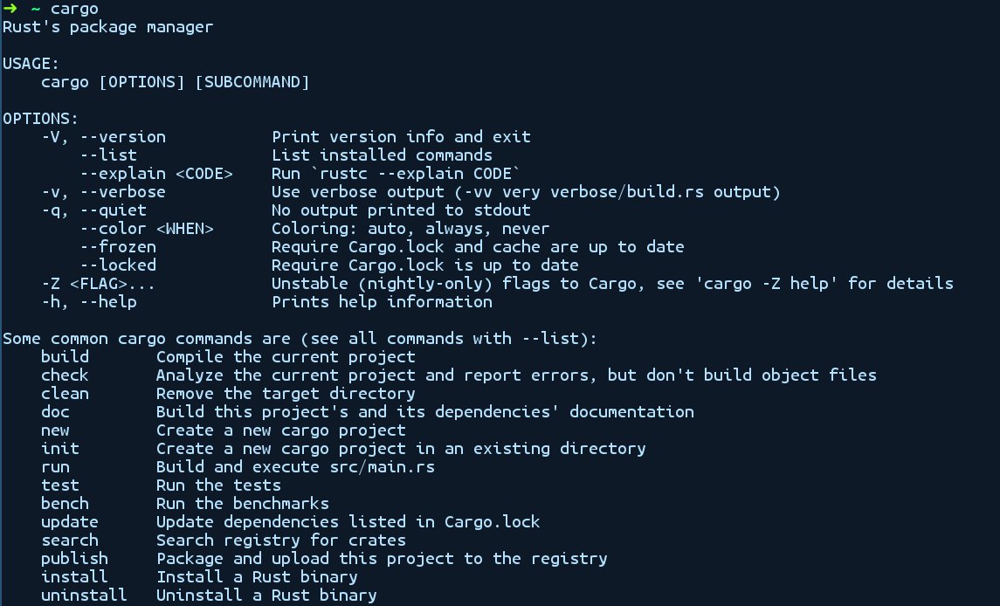

### 2.3　Cargo和程序库

当项目变大时，通常的做法是将代码重构为更小、更易于管理的单元，即模块或程序库。你还需要工具来为项目撰写文档，并说明它应该如何构建，以及相关的依赖项是什么。此外，为了支持开发人员可以与社区共享程序代码库的语言生态系统，采用某类在线注册服务是比较流行的做法。

Cargo是能够帮助你处理上述所有事情的工具，crates.io是托管程序库的主要位置。用Rust编写的程序库被称为crate，crates.io托管它们供开发人员使用。通常，crate有3个来源：本地目录、GitHub之类的在线Git代码库，或者像crates.io这样的托管crate注册服务。Cargo支持上述所有来源的软件包。

让我们来看看Cargo的实际应用。如前文所述，在运行rustup时，应该已经安装了Cargo和rustc。如下为我们可以使用的、可以在没有任何参数的情况下运行cargo的命令：

它显示了一些我们可以使用的常用命令，以及附加标记参数。我们使用子命令new创建一个新的Cargo项目。

