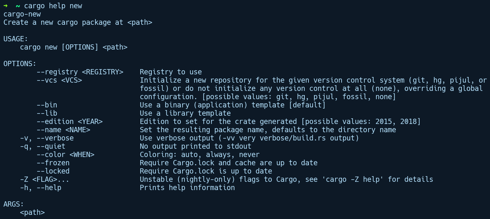
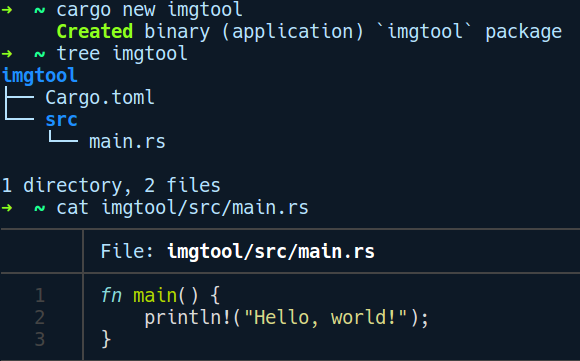

### 2.3.1　新建一个Cargo项目

使用cargo new <name>命令将会新建一个项目，并将name用作项目目录名。我们可以在cargo和任何子命令之间添加help标签来获得与之有关的更多上下文信息，可以通过运行cargo help new命令查看子命令new的帮助文档，如下图所示：


默认情况下，运行cargo new命令会创建一个二进制项目；而创建程序库项目时必须使用--lib参数。让我们执行cargo new imgtool命令，然后介绍一下它创建的目录结构：


Cargo创建了一些基础文件，Cargo.toml和src/main.rs，其中的函数main主要用于输出“Hello World！”。对于二进制crate（可执行文件），Cargo创建了一个文件src/main.rs；对于程序库crate，Cargo会在src目录下创建文件src/lib.rs。

Cargo还可以使用默认值为新项目初始化Git版本库，例如阻止将.gitignore文件签入目标目录，并在Cargo.lock文件中检查二进制crate，同时在程序库crate中忽略它。使用的默认版本控制系统（Version Control System，VCS）是Git，可以通过将--vcs标记参数传递给Cargo(--vcs hg for mercurial)来更改它。目前Cargo支持的版本控制系统包括Git、hg（mercurial）、pijul（用Rust编写的版本控制系统）和fossil。如果我们希望修改默认行为，可以传递--vcs none来只让Cargo在创建项目时不配置任何版本控制系统。

让我们看一下之前创建的imgtool项目对应的Cargo.toml文件。该文件定义了项目的元数据和依赖项，它也被称为项目的清单文件：

```rust
[package]
name = "imgtool"
version = "0.1.0"
authors = ["creativcoders@gmail.com"]
edition = "2018"
[dependencies]
```

这就是新项目最基本的Cargo.toml清单文件。它使用TOML（Tom's Obvious Minimal Language）配置文件格式，TOML是由Tom Preston-Werner创建的配置文件格式。TOML让人联想到标准的.ini文件，但被添加了一种数据类型，这使它成为理想的配置文件格式，并且比YAML或JSON格式更简单。我们暂时保留此文件的最少配置信息，并在后续添加相关的内容。

