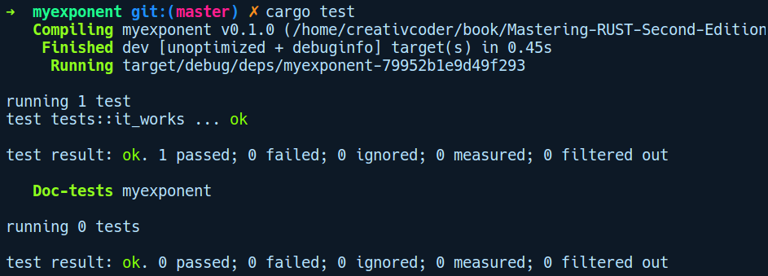
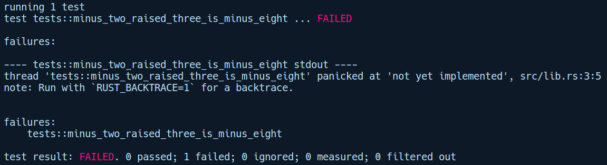
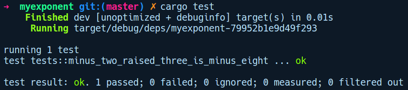

### 2.3.3　使用Cargo执行测试

Cargo还支持运行测试和基准评估。第3章将会深入介绍测试和基准评估。在本小节中，我们将简要介绍如何使用Cargo运行测试。接下来将为一个程序库编写测试。为此，让我们运行cargo new myexponent --lib命令来创建一个程序库：


一个程序库类似于一个二进制项目，两者不同之处在于，我们得到的不是src/main.rs并将其中的main函数作为入口点，而是src/lib.rs，其中有一个简单的测试函数it_works，并附有#[test]注释。我们可以使用cargo test命令立即运行it_works函数，并查看它的结果：


现在，让我们尝试一下Cargo的测试驱动开发（Test Driven Development，TDD）。我们将通过添加一个指数函数（pow函数）来扩展此程序库，程序库的用户可以使用该函数计算给定数字的指数。我们将为这个函数编写一个最初不够完善的测试，然后逐步对它进行优化，直到能够正常运作。这是新的src/lib.rs文件，其中包含没有任何实现的pow函数：

```rust
// myexponent/src/lib.rs
fn pow(base: i64, exponent: usize) > i64 {
    unimplemented!();
}
#[cfg(test)]
mod tests {
    use super::pow;
    #[test]
    fn minus_two_raised_three_is_minus_eight() {
        assert_eq!(pow(-2, 3), -8);
    }
}
```

现在不必担心细节，我们已经实现了一个pow函数，它将i64作为基数，将正指数的类型指定为usize，并返回了一个已经转化为指数的数字。在“mod tests”中，我们有一个名为minus_two_raised_three_is_minus_eight的测试函数，它会执行单个断言。宏assert_eq!将会检查传递给它的两个值的相等性。如果左边的参数等于右边的参数，则断言通过；否则抛出一个错误，编译器会提示测试失败。如果我们执行cargo test，pow函数调用的单元测试显然是失败的，因为我们有一个unimplemented!()宏会被调用：


简而言之，unimplemented!()只是一个方便的宏，用来标记未完成的代码或者你希望稍后实现的代码，但是在希望编译器不出现类型错误的情况下无论如何都要编译它。在编译器内部，这会调用宏panic!并伴随提示信息“not yet implemented”。它可以在你希望实现某个特征的多种方法的情况下使用。例如，你开始实现某个方法，但是还没有打算完成该实现的其他方法。在编译时，如果你只是提供一个空的函数体，那么将会得到未提供其他方法实现的错误提示。对于这些方法，我们可以在其中放置一个unimplemented!()宏，使其通过类型检查器的校验从而顺利编译，并在运行时避免这些错误。我们将在第9章介绍一些具有类似功能的、更简便的宏。

现在，让我们快速地实现pow函数的一个有缺陷的版本来解决此问题，然后再试一次：

```rust
// myexponent/src/lib.rs
pub fn pow(base: i64, exponent: usize) -> i64 {
    let mut res = 1;
    if exponent == 0 {
        return 1;
    }
    for _ in 0..exponent {
        res *= base as i64;
    }
    res
}
```

运行cargo test命令之后得到如下输出结果：


这一次，测试通过了。不过这些都是一些基础的知识。我们将在第3章中详细介绍与测试有关的更多内容。

