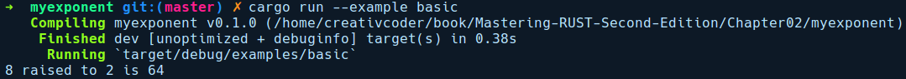

### 2.3.4　使用Cargo运行示例

为了让用户能够快速地使用你开发的软件包，最好提供能够引导用户使用它的代码示例。Cargo标准化了这种方式，这意味着你可以在项目根目录中添加一个包含一个或多个.rs文件的examples/目录，其中的main函数展示了软件包的用法。

可以使用cargo run --examples<file_name>命令运行examples/目录下的代码，其中的文件名不带.rs扩展名。为了证实这一点，我们为myexponent库添加一个examples/目录，其中包含一个名为basic.rs的文件：

```rust
// myexponent/examples/basic.rs
use myexponent::pow;
fn main() {
    println!("8 raised to 2 is {}", pow(8, 2));
}
```

在examples/目录下，我们从myexponent库导入了pow函数。以下是运行cargo run --example basic命令后的输出结果：


