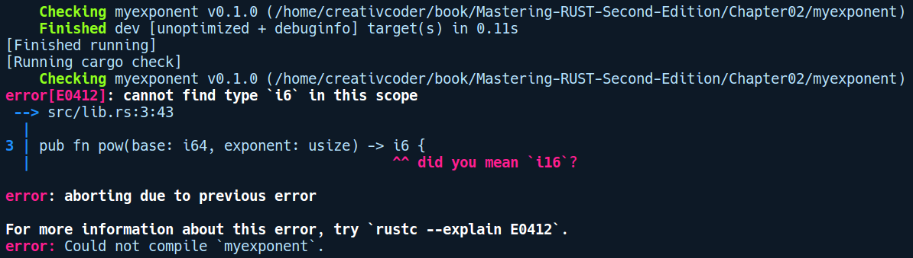

### 2.4.1　子命令和Cargo安装

Cargo的自定义命令属于子命令。这些命令通常来自crates.io、GitHub，或者本地项目目录下的二进制文件，可以通过cargo install <binary crate name>命令安装它们，或者在本地Cargo项目目录下执行cargo install命令。cargo-watch工具就是类似的例子。

#### cargo-watch

cargo-watch可以在代码发生变动后于后台自动构建项目，从而帮助你缩短修复、编译及运行代码的周期。默认情况下，它只会运行Rust的类型检查程序（cargo check命令），并且不会经历代码生成阶段（需要花费时间），所以能够缩短编译时间。也可以使用-x参数提供自定义命令来代替cargo check命令。

我们可以通过运行cargo install cargo-watch命令来安装cargo-watch，然后可以在任何Cargo项目下通过cargo watch命令来运行它。现在，每当我们对项目进行更改后，cargo-watch都会在后台运行cargo check命令并为我们重新编译项目。在下面的代码中，我们产生了一个拼写错误并在后续对它进行了纠正，cargo-watch随后为我们重新编译了该项目：

如果你了解Node.js生态系统中的watchman或nodemon软件包，那么这将是非常相似的开发体验。

#### cargo-edit

cargo-edit子命令用于自动将依赖项添加到你的Cargo.toml文件中。它可以添加所有种类的依赖项，包括开发（dev 模式）依赖项和构建（build 模式）依赖项，还允许你添加任何依赖项的特定版本。它可以通过运行cargo install cargo-edit命令进行安装。该子命令为我们提供了4条命令：cargo add、cargo rm、cargo edit、cargo upgrade。

#### cargo-deb

这是另一款由社区开发的实用子命令，可以创建Debian软件包（扩展名为.deb），以便在Debian Linux上轻松地分发Rust可执行文件。我们可以通过运行cargo install cargo-deb命令来安装它。在本章的末尾我们会使用此工具将imgtool命令行可执行文件打包成.deb格式的软件包。

#### cargo-outdated

此命令可以显示Cargo项目中过时的软件依赖项。它可以通过执行cargo install cargo- outdated命令进行安装。安装完毕之后，你可以在项目目录下执行cargo outdated命令查看过期的程序库（如果有的话）。

这些子命令能够与Cargo无缝协作的原因是社区开发人员使用命名约定创建这些二进制软件包，例如cargo-[cmd]。当你使用cargo install命令安装这些二进制软件包时，Cargo将已安装的二进制软件包暴露给环境变量$PATH，然后你就可以通过cargo <cmd>的形式调用它。这是Cargo扩展社区开发人员开发的子命令的一种简单、有效的方法。Cargo还有许多其他此类扩展。你可以在GitHub上找到所有由社区开发人员开发的子命令列表。

cargo install命令还可以用于安装在Rust中的任何二进制软件包或可执行文件/应用程序。默认情况下，它们是安装在/home/<user>/.cargo/bin/目录下的。我们将使用它来安装imgtool应用程序——这将在本章的末尾进行构建，使得它在系统范围内可用。

