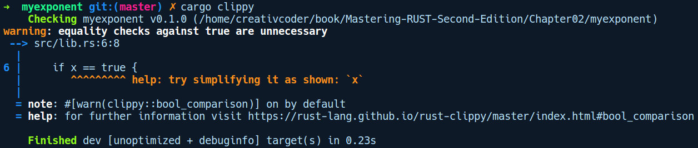

### 2.4.2　使用clippy格式化代码

代码格式化是一种有助于保证程序库的质量，并遵循标准的编码习惯和惯例的实践。Rust生态系统中事实上的代码格式化工具是clippy。它为我们的代码检查出了一大堆问题（撰写本书时大约有291个格式问题），从而确保生成高质量的Rust代码。在本小节中，我们将安装clippy并在libawesome库中试用它，向其中添加一些“拙劣”的代码，然后查看clippy为我们提供的改进建议。在项目中使用clippy有多种方法，但我们将使用cargo clippy子命令的方法，因为这比较简单。clippy可以对代码进行分析，因为它是一个编译器插件，并且可以访问许多编译器的内部API。

要使用clippy，我们需要执行rustup component add clippy命令来安装它。如果你还没有安装它，那么rustup将会为你安装。现在，为了演示clippy如何在我们的代码中指出错误的格式，将在myexponent库中的pow函数内的if条件中添加一些拙劣的代码，如下所示：

```rust
// myexponent/src/lib.rs
fn pow(base: i64, exponent: usize) -> i64 {
    /////////////////// clippy示例的简易代码
    let x = true;
    if x == true {
    }
    ///////////////////
    let mut res = 1;
    ...
}
```

添加这些代码之后，在myexponent目录下执行cargo clippy命令，我们得到以下输出结果：


clippy可发现一个常见的代码冗余样式，即检查布尔值是true还是false。或者我们可以像x= =true那样直接编写前面的if条件。clippy还提供更多的代码检查，其中一些甚至指出了代码中的潜在错误。

