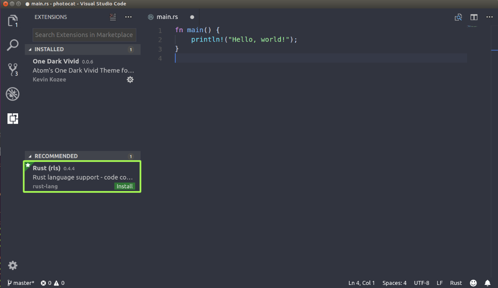
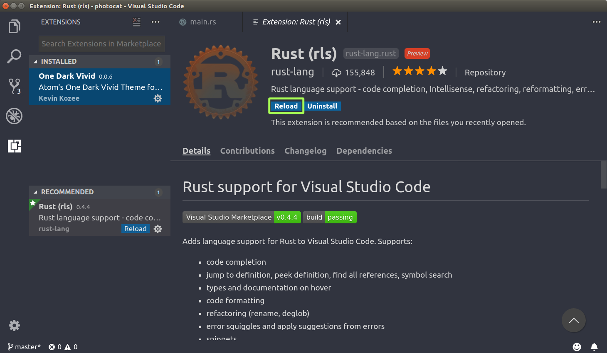
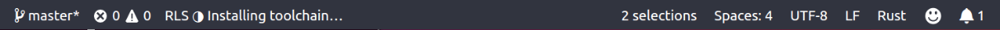
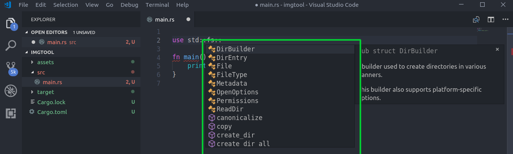
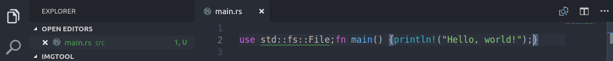
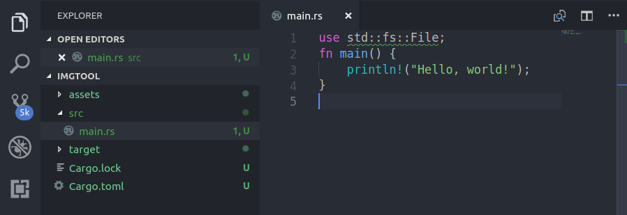

### 2.5　搭建Rust开发环境

Rust为大多数代码编辑器提供了不错的支持，其中包括Vim、Emacs、intelliJ IDEA、Sublime、Atom及Visual Studio Code。这些编辑器能够很好地兼容Cargo。Rust生态系中有很多工具能够增强开发体验，如下。

+ rustfmt：它根据Rust代码样式指南中提及的约定格式化代码。
+ clippy：它会对用户代码中常见的错误和潜在的问题发出警告。clippy 依赖于某些不稳定的编译器插件，所以它适用于夜间版的Rust。通过rustup，你可以轻松地切换到Rust的夜间版。
+ racer：它可以查找Rust标准库，并提供代码自动完成和实现工具提示功能。

在上述编辑器中，最成熟的IDE开发体验是由IntelliJ IDEA和Visual Studio Code（VS Code）提供的。我们将在本节介绍如何配置VS Code开发环境，因为它易于访问并且是轻量级的。对于VS Code，Rust社区有一个名为rls-vscode的扩展，我们将在此处安装它。此扩展由RLS组成，它会用到我们之前内部列出的很多工具。我们将在Ubuntu 16.04系统上安装Visual Studio Code 1.23.1(d0182c341)。

VS Code的安装操作超出了本书涵盖范围，你可能需要查找相关操作系统的应用程序包。

让我们在VS Code中打开在本章开头创建的应用程序imgtool：

```rust
cd imgtool
code .            #在VS Code中打开当前目录
```

打开项目后，VS Code会自动将项目识别为Rust项目，并为我们提供下载VS Code扩展的建议。如下所示：


如果你没有得到提示，那么仍然可以在左上角的搜索栏中输入“Rust”进行搜索。然后我们可以单击“Install”，并在扩展页面上单击“Reload”，这将重新启动VS Code并应用于我们的项目：


下次打开项目中的main.rs文件并开始输入时，将启用扩展程序，并提示你安装Rust所缺少的工具链。你可以单击“Install”，然后下载该工具链。

几分钟后，状态将发生变化，如下所示：


现在我们的准备工作就完成了，如下所示：


注意：因为RLS仍然处于预览版阶段，所以在首次安装时可能会遇到RLS卡住的问题。重新启动VS Code并删除它再次安装RLS，应该能使其正常工作。如果没有奏效，请随时在其GitHub页面上提出问题。

打开我们的imgtool项目之后，让我们看看尝试导入模块时，RLS会如何响应：


如你所见，它为Rust标准库的fs模块中可用的元素提供了自动补全功能。最后，来看看RLS如何为我们处理代码格式化问题。我们将把所有代码放在一行来演示这一点：


保存该文件，然后按快捷键“Ctrl + Shift + I”或者“Ctrl + Shift + P”，并选择格式化文档。单击“Save”之后，会立即对代码执行cargo check命令：


有关其他代码编辑器的更多信息可查询Rust的一个名为areweideyet的网站页面，其中列出了所有可用编辑器的状态和类型，并显示了它们对该语言的支持程度。

接下来，让我们继续完善imgtool应用程序。

