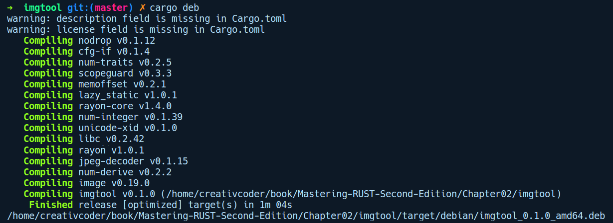

### 2.6　使用Cargo构建imgtool程序

现在我们已经对如何通过Cargo管理项目有了比较全面的了解。为了深入掌握这些概念，我们将练习使用第三方软件包构建一个命令行应用程序。本练习的重点是带领读者熟悉使用第三方软件包构建项目的常见工作流程，因此将跳过大量和编写代码有关的详细信息。但是，建议你深入了解一下代码中用到的API说明文档。

我们将使用一个名为image的软件包，它来自crates.io。该软件包提供了多种用于操作图片的API。我们的命令行程序很简单，它将采用图片文件的路径作为参数，将图片旋转90度，并在每次运行时写回同一文件。

我们将通过cd命令进入之前创建的imgtool目录。首先，需要告诉Cargo我们希望使用image软件包。可以使用cargo add image@0.19.0命令添加0.19.0版本的image软件包。以下是我们更新后的Cargo.toml文件：

```rust
[package]
name = "imgtool"
version = "0.1.0"
authors = ["creativcoder"]
edition = "2018"
[dependencies]
image = "0.19.0"
```

然后调用cargo build命令。这将在最终编译我们的项目之前，从crates.io中提取image软件包，并获取其依赖项。完成上述操作后，我们就可以在main.rs文件中使用它了。对于我们的应用程序，将提供图片路径作为参数。在main.rs中，我们想读取这个图片的路径：

```rust
// imgtool/src/main.rs
use std::env;
use std::path::Path;
fn main() {
    let image_path = env::args().skip(1).next().unwrap();
    let path = Path::new(&image_path);
}
```

首先，我们通过env模块调用argv()函数来读取传递给imgtool的参数。这将返回一个字符串作为图片文件的路径。然后我们采用图片路径并以此创建一个Path实例。接下来是添加来自image软件包的旋转功能。注意，如果你正在运行Rust 2015，那么需要额外添加外部的image软件包，并在main.rs顶部声明，以便用户可以访问image软件包的API。对于Rust 2018，则不需要这些步骤：

```rust
// imgtool/src/main.rs
use std::env;
use std::path::Path;
fn main() {
    let image_path = env::args().skip(1).next().unwrap();
    let path = Path::new(&image_path);
    let img = image::open(path).unwrap();
    let rotated = img.rotate90();
    rotated.save(path).unwrap();
}
```

从image软件包中，我们可以使用open函数打开图片并将其存储到变量img中，让它在img上调用rotate90。这将返回一个旋转后的图片缓冲区，我们只需通过调用save方法并传递路径，将其保存回原始路径即可。前面代码中的大多数函数调用都会返回一个名为Result的包装器值，因此我们可以在Result值上调用unwrap()方法，告知编译器用户不关心函数调用是否失败，假定它已成功执行，我们只想从Result类型中获取包装后的值。第6章将详细介绍Result类型和正确的异常处理方法。此演示示例在项目的assert文件夹下，你将会找到“Ferris the crab”的图片（assets/ferris.png）。在运行代码之前，我们将看到如下图片：


现在可以将这个图片作为参数并运行我们的应用程序。有两种方法可以运行imgtool二进制文件并将图片作为参数传递：

+ 通过执行cargo build命令，然后手动调用二进制文件./target/debug/imgtool和assets/ferris.png。
+ 通过直接运行cargo run -- assets/ferris.png命令。双半字线是Cargo自身参数的结尾标记，其后的内容是传递给可执行程序的（这里是imgtool）。

在运行cargo run -- assets/ferris.png命令之后，我们可以看到Ferris图片已经被翻转：


我们的应用程序已经能够正常运作。现在可以在imgtool目录下运行cargo install命令安装我们的工具，然后在终端上的任何位置使用它。此外，如果你使用的是Ubuntu操作系统，那么你可以使用cargo deb 子命令创建一个deb软件包，以便将其分发给其他用户。运行cargo deb命令会生成.deb文件，如下所示：


接下来将探讨与前面代码相关的更多内容。

+ 通过Rust标准库文档来了解Rust中的unwrap函数和可用的类型。
+ 在标准库文档中查找Path类型，以查看是否可以修改程序但不覆盖文件，而是创建一个新文件，并用_rotated作为新文件的后缀。
+ 使用image软件包文档页面中的搜索栏，并尝试从不同的角度查找其他旋转图片的方法，然后修改代码并使用它们。

